# PantryPilot - Smart Pantry Management System

## Table of Contents
1. [Project Summary](#project-summary)
   - [Technology Stack](#technology-stack)
   - [Website Preview](#website-preview)
   - [Core Features](#core-features)
   - [Future Enhancements](#future-enhancements)
2. [UX Design](#ux-design)
   - [Strategy Plane](#strategy-plane)
   - [Scope Plane](#scope-plane)
   - [Structure Plane](#structure-plane)
   - [Skeleton Plane](#skeleton-plane)

## Project Summary

PantryPilot is a comprehensive full-stack web application designed to help users efficiently manage their pantry inventory, discover recipes based on available ingredients, plan weekly meals, and generate smart shopping lists. The application combines intelligent ingredient tracking with meal planning capabilities to reduce food waste, save money, and streamline cooking experiences.

### Technology Stack
- **Frontend**: HTML5, CSS3, JavaScript (ES6+)
- **Backend**: Django Framework (Python)
- **Database**: PostgreSQL
- **Architecture**: Full-stack web application

### Website Preview

### Core Features

#### 1. Pantry Inventory Management
- **Add/Remove Items**: Simple interface for managing pantry contents
- **Quantity Tracking**: Monitor exact quantities of ingredients
- **Categories**: Organize items by type (spices, grains, proteins, etc.)
- **Search and Filter**: Quickly find specific ingredients

#### 2. Recipe Management System
- **Recipe Search**: Find recipes based on available pantry ingredients
- **Custom Recipe Storage**: Save, edit, and organize personal recipes
- **Cooking Instructions**: Step-by-step cooking guidance
- **Photo Integration**: Add images to recipes for visual reference

#### 3. Meal Planning Tools
- **Weekly Meal Planner**: Plan breakfast, lunch, and dinner for the week
- **Calendar Integration**: Visual calendar interface for meal planning

#### 4. Smart Shopping Lists
- **Auto-Generated Lists**: Create shopping lists based on planned meals
- **Missing Ingredients**: Identify ingredients needed for specific recipes

#### 5. User Interface and Experience
- **Responsive Design**: Works seamlessly on desktop, tablet, and mobile devices
- **Intuitive Navigation**: Easy-to-use interface with logical flow
- **Quick Actions**: Fast access to common tasks (add item, plan meal, create list)
- **Search Functionality**: Global search across ingredients, recipes, and meals
- **Dashboard**: Overview of pantry status, upcoming meal plans, and shopping needs

### Future Enhancements

#### 1. Advanced Pantry Management
- **Expiration Dates**: Track and receive alerts for expiring items
- **Barcode Scanning**: Quick item addition via barcode
- **Receipt Scanning** *(Could-Have Feature)*: Scan uploaded receipts to automatically update pantry items
- **Camera Receipt Scan** *(Could-Have Feature)*: Use mobile camera to scan receipts for instant updates

#### 2. Enhanced Recipe Features
- **Recipe Categories**: Organize recipes by meal type, cuisine, dietary restrictions
- **Ingredient Substitutions**: Suggest alternatives for missing ingredients

#### 3. Advanced Meal Planning
- **Family Preferences**: Account for different family member preferences
- **Portion Planning**: Calculate serving sizes and quantities needed
- **Batch Planning**: Plan multiple weeks in advance

#### 4. Enhanced Shopping Features
- **Store Organization**: Organize lists by store sections (produce, dairy, etc.)
- **Quantity Calculations**: Calculate exact quantities needed
- **Multiple Stores**: Manage different lists for different stores
- **Sharing Capability**: Share shopping lists with family members
- **Cost Tracking**: Monitor estimated and actual costs

#### 5. Nutritional Information System
- **Recipe Nutrition**: Display nutritional facts for each recipe
- **Weekly Nutrition Summary**: Overview of planned weekly nutrition
- **Dietary Tracking**: Track calories, macronutrients, vitamins, and minerals
- **Dietary Restrictions**: Filter recipes by dietary needs (vegetarian, gluten-free, etc.)
- **Health Goals**: Set and monitor nutritional goals

#### 6. Data Management and Insights
- **Usage Analytics**: Track ingredient usage patterns and trends
- **Export Options**: Export data for external use or backup
- **Data Backup**: Secure cloud storage of user data
- **Waste Reporting**: Monitor and report food waste reduction
- **Cost Tracking**: Track grocery spending and budget adherence

## UX Design

### Strategy plane

<details>
    <summary>
    Strategy plane considerations(Expand for details)
    </summary>

### Target Audience

#### Primary Personas

##### Busy Family Manager (35-45 years)
**Profile**: Working parent managing household groceries for family of 3-5
- **Pain Points**: Forgetting what's in pantry, duplicate purchases, meal planning stress
- **Goals**: Save time and money, reduce food waste, feed family well
- **Tech Comfort**: Moderate (uses smartphone apps regularly)
- **Frequency**: Daily pantry checks, weekly meal planning

##### Budget-Conscious Home Cook (30-50 years)
**Profile**: Price-sensitive shopper, enjoys cooking, wants to maximize value
- **Pain Points**: Overspending on groceries, food expiration waste
- **Goals**: Stretch grocery budget, use all purchased ingredients
- **Tech Comfort**: Moderate (uses apps for deals and coupons)
- **Frequency**: Weekly planning, daily pantry monitoring

##### College Student/Young Adult (18-25 years)
**Profile**: Learning to cook independently, limited budget
- **Pain Points**: Food management inexperience, tight budget
- **Goals**: Learn cooking skills, avoid food waste, eat well cheaply
- **Tech Comfort**: Very High (digital native)
- **Frequency**: Learning-based usage, irregular planning

### Secondary Personas

##### Health-Conscious Professional (25-35 years)
**Profile**: Single or couple, career-focused, health and nutrition aware
- **Pain Points**: Limited cooking time, ingredient waste, nutritional tracking
- **Goals**: Eat healthily, maximize ingredient usage, efficient meal prep
- **Tech Comfort**: High (early adopter of productivity apps)
- **Frequency**: Multiple daily interactions, batch meal planning

##### Empty Nester Couple (50-65 years)
**Profile**: Cooking for two, downsizing food purchases
- **Pain Points**: Adjusting portion sizes, avoiding overbuying
- **Goals**: Maintain cooking enjoyment, manage smaller quantities
- **Tech Comfort**: Moderate (selective app adoption)
- **Frequency**: Regular but relaxed usage

### Business Goals

#### Primary Business Objectives
1. **Reduce Food Waste**: Help users track ingredients to minimize food spoilage and environmental impact
2. **Cost Optimization**: Enable smart shopping decisions by avoiding duplicate purchases and maximizing ingredient usage
3. **Time Efficiency**: Streamline meal planning and grocery shopping processes to save users valuable time
4. **User Engagement**: Create an engaging, habit-forming application that users return to regularly

#### Secondary Business Objectives
5. **Health Awareness**: Provide nutritional insights for informed dietary decisions and healthier eating habits
6. **Market Positioning**: Position as a solution for modern household food management
7. **Portfolio Value**: Demonstrate full-stack development capabilities and UX design skills
8. **Scalability**: Build foundation for potential future enhancements or enterprise features

### User Goals

#### Primary User Goals

##### Inventory Management Goals
- **Real-time Tracking**: Maintain accurate, up-to-date inventory of pantry items
- **Quantity Management**: Monitor ingredient quantities and usage patterns
- **Easy Updates**: Simple interface for adding, removing, and updating items
- **Search & Filter**: Quickly find specific ingredients in their pantry
- **Visual Organization**: See pantry contents at a glance with clear categorization

##### Recipe Discovery Goals
- **Ingredient-Based Search**: Find recipes using available pantry ingredients
- **Recipe Variety**: Discover new recipes and cooking ideas
- **Custom Recipe Storage**: Save and organize personal favorite recipes

##### Meal Planning Goals
- **Weekly Planning**: Plan balanced meals for the entire week
- **Visual Calendar**: See meal plans in an organized calendar format
- **Preparation Coordination**: Plan meals considering prep time and complexity

##### Shopping Efficiency Goals
- **Smart Shopping Lists**: Generate lists for missing ingredients
- **Store Organization**: Shopping lists organized by store sections
- **Duplicate Prevention**: Avoid buying items already in pantry

#### Secondary User Goals
- **Nutritional Information**: Access nutritional data for recipes and ingredients
- **Nutritional Balance**: Ensure variety and nutrition across planned meals
- **Learning**: Improve cooking skills and food management knowledge
- **Sharing**: Share favorite recipes and meal plans with family/friends
- **Automation**: Reduce the stress of meal planning decisions
- **Customization**: Adapt the system to personal preferences and dietary needs

</details>

### Scope Plane

<details>
    <summary>Scope plane considerations(Expand for details)</summary>

#### Core User Stories

##### User Authentication Stories (Sprint 1)

- **US001: User Registration**: **AS A** new user **I WANT TO** create an account with email and password **SO THAT I CAN** save my pantry data and access personalized features
- **US002: User Login**: **AS A** returning user **I WANT TO** log into my account **SO THAT I CAN** access my personal pantry
- **US003: User Logout**: **AS A** logged in user **I WANT TO** log out of my account **SO THAT I CAN** secure my data when finished

##### Basic Pantry Management Stories (Sprint 1)

- **US004: Add Pantry Items**: **AS A** logged in user **I WANT TO** add ingredients to my pantry with name and quantity **SO THAT I CAN** track what I have available for cooking
- **US005: View All Pantry Items**: **AS A** logged in user **I WANT TO** see all my pantry items in a list **SO THAT I CAN** quickly review what ingredients I have
- **US006: Edit Pantry Item Quantities**: **AS A** logged in user **I WANT TO** update ingredient quantities **SO THAT I CAN** keep my pantry inventory accurate as I use items
- **US007: Remove Pantry Items**: **AS A** logged in user **I WANT TO** delete items from my pantry **SO THAT I CAN** remove ingredients I no longer have

##### Help and Navigation Stories (Sprint 1)

- **US008: Website Help**: **AS A** new user **I WANT TO** see website help and navigation guidance **SO THAT I CAN** understand how to use PantryPilot effectively
- **US009: Basic Responsive Layout**: **AS A** mobile user **I WANT TO** access basic pantry features on my phone **SO THAT I CAN** manage my pantry while shopping

##### Recipe Discovery Stories (Sprint 2)

- **US010: Search Recipes by Available Ingredients**: **AS A** home cook **I WANT TO** find recipes using ingredients I have in my pantry **SO THAT I CAN** cook meals without additional shopping
- **US011: View Recipe Details**: **AS A** cook **I WANT TO** see detailed recipe information including ingredients, instructions, and prep time **SO THAT I CAN** understand what's needed to make the recipe
- **US012: Filter Recipes by Matching Ingredients**: **AS A** home cook **I WANT TO** filter recipes by how many pantry ingredients they use **SO THAT I CAN** prioritize recipes requiring minimal shopping

##### Recipe Management Stories (Sprint 2)

- **US013: Save Favorite Recipes**: **AS A** cook **I WANT TO** save recipes I like to a favorites list **SO THAT I CAN** easily find them again for future cooking
- **US014: View Saved Recipes**: **AS A** cook **I WANT TO** see all my saved recipes in one place **SO THAT I CAN** browse my personal recipe collection

##### Meal Planning Foundation (Sprint 3)

- **US015: View Weekly Meal Calendar**: **AS A** organized cook **I WANT TO** see a weekly meal calendar interface **SO THAT I CAN** plan my meals for the week ahead
- **US016: Add Meals to Calendar**: **AS A** meal planner **I WANT TO** add specific recipes to calendar days and meal times **SO THAT I CAN** organize my weekly cooking schedule

##### Shopping List Generation (Sprint 4)

- **US017: Generate Shopping Lists from Meal Plans**: **AS A** meal planner **I WANT TO** automatically generate shopping lists based on my planned meals **SO THAT I CAN** buy ingredients needed for my weekly menu
- **US018: Compare Pantry vs Recipe Ingredients**: **AS A** meal planner **I WANT TO** see which recipe ingredients I already have **SO THAT I CAN** only buy what I need
- **US019: View and Edit Shopping Lists**: **AS A** shopper **I WANT TO** view and modify my generated shopping list **SO THAT I CAN** customize it before shopping

##### Advanced Pantry Features (Sprint 5)

- **US020: Search Pantry Items**: **AS A** user with many ingredients **I WANT TO** search my pantry by name **SO THAT I CAN** quickly find specific items
- **US021: Categorize Pantry Items**: **AS A** organized user **I WANT TO** view my pantry items organized by categories (spices, grains, proteins, etc.) **SO THAT I CAN** easily find ingredients by type

##### Enhanced User Experience (Sprint 5)

- **US022: Full Responsive Design**: **AS A** mobile user **I WANT TO** access all PantryPilot features on my phone **SO THAT I CAN** manage pantry, recipes, and meal planning while mobile
- **US023: Remove Saved Recipes**: **AS A** cook **I WANT TO** remove recipes from my favorites list **SO THAT I CAN** keep my saved recipes relevant
- **US024: Enhanced Recipe Search**: **AS A** cook **I WANT TO** search recipes by name, cuisine, or dietary restrictions **SO THAT I CAN** find specific types of meals

#### Future Enhancement Stories (Post-MVP)

##### Personal Recipe Management
- **US025: Create Personal Recipes**: **AS A** cook **I WANT TO** create and save my own recipes **SO THAT I CAN** store my family recipes digitally
- **US026: Edit Personal Recipes**: **AS A** cook **I WANT TO** edit my personal recipes **SO THAT I CAN** improve and update them over time

##### Nutritional Information System
- **US027: View Recipe Nutrition**: **AS A** health-conscious cook **I WANT TO** see nutritional information for recipes **SO THAT I CAN** make informed dietary choices
- **US028: View Ingredient Nutrition**: **AS A** health-conscious user **I WANT TO** access nutritional data for individual ingredients **SO THAT I CAN** understand the nutritional value of my pantry items
- **US029: Weekly Nutrition Summary**: **AS A** health-conscious meal planner **I WANT TO** see a nutritional summary of my planned weekly meals **SO THAT I CAN** ensure balanced nutrition across the week
- **US030: Nutritional Balance Tracking**: **AS A** health-conscious user **I WANT TO** track calories, macronutrients, vitamins, and minerals **SO THAT I CAN** monitor my nutritional intake
- **US031: Dietary Restriction Filtering**: **AS A** user with dietary needs **I WANT TO** filter recipes by dietary restrictions (vegetarian, gluten-free, etc.) **SO THAT I CAN** find recipes that match my dietary requirements

##### Advanced Meal Planning
- **US032: Family Preferences**: **AS A** family cook **I WANT TO** set dietary preferences for family members **SO THAT I CAN** plan meals that work for everyone
- **US033: Batch Meal Planning**: **AS A** organized planner **I WANT TO** plan multiple weeks at once **SO THAT I CAN** prepare for busy periods

##### Advanced Pantry Management
- **US034: Track Expiration Dates**: **AS A** user **I WANT TO** track expiration dates for pantry items **SO THAT I CAN** use ingredients before they spoil
- **US035: Expiration Alerts**: **AS A** user **I WANT TO** receive alerts for expiring items **SO THAT I CAN** prioritize using them

#### Updated Feature Prioritization Matrix

| Feature | Sprint | Priority | User Impact | Development Effort | MVP Status |
|---------|--------|----------|-------------|-------------------|------------|
| User Authentication (US001-US003) | 1 | High | High | Medium | ✅ Must Have |
| Basic Pantry Management (US004-US007) | 1 | High | High | Medium | ✅ Must Have |
| Help & Basic Mobile (US008-US009) | 1 | High | Medium | Low | ✅ Must Have |
| Recipe Discovery (US010-US012) | 2 | High | High | High | ✅ Must Have |
| Recipe Management (US013-US014) | 2 | Medium | Medium | Medium | ✅ Should Have |
| Meal Planning (US015-US016) | 3 | High | High | High | ✅ Must Have |
| Shopping Lists (US017-US019) | 4 | High | High | High | ✅ Must Have |
| Advanced Pantry (US020-US021) | 5 | Medium | High | Medium | ✅ Should Have |
| Enhanced UX (US022-US024) | 5 | Medium | High | Medium | ✅ Should Have |
| Personal Recipes (US025-US026) | Future | Low | Medium | High | ⚠️ Could Have |
| Nutritional Information (US027-US031) | Future | Low | Medium | High | ⚠️ Could Have |
| Advanced Planning (US032-US033) | Future | Low | Low | High | ❌ Won't Have |
| Expiration Tracking (US034-US035) | Future | Low | Low | Medium | ❌ Won't Have |

**Sprint Breakdown:**

**Sprint 1 (Foundation)**: Authentication + Basic Pantry + Help
- Focus: Core user account management and basic pantry CRUD operations
- Deliverable: Users can register, login, and manage basic pantry inventory

**Sprint 2 (Recipe Discovery)**: Recipe Search + Recipe Management  
- Focus: Recipe discovery using pantry ingredients and basic recipe saving
- Deliverable: Users can find recipes based on available ingredients

**Sprint 3 (Planning Foundation)**: Meal Planning
- Focus: Meal calendar foundation and meal scheduling
- Deliverable: Users can plan weekly meals using saved recipes

**Sprint 4 (Shopping Integration)**: Shopping List Generation
- Focus: Generate shopping lists from meal plans with pantry comparison
- Deliverable: Complete meal planning to shopping workflow

**Sprint 5 (Polish & Enhancement)**: Advanced Pantry + Full Responsive + UX Improvements
- Focus: Advanced pantry features, mobile optimization and user experience enhancements
- Deliverable: Production-ready application with full feature set

</details>

### Structure Plane

<details>
    <summary>Structure plane considerations (Expand for details)</summary>

#### Information Architecture

##### Site Map and Navigation Structure

```
PantryPilot (Root)
├── Authentication
│   ├── Registration (/accounts/register/)
│   ├── Login (/accounts/login/)
│   └── Logout (/accounts/logout/)
├── Dashboard (/)
│   ├── Pantry Overview Widget
│   ├── Recent Recipes Widget
│   └── Upcoming Meals Widget
├── Pantry Management (/pantry/)
│   ├── View All Items (/pantry/)
│   ├── Add Item (/pantry/)
│   ├── Edit Item (/pantry/item/<id>/update/)
│   ├── Delete Item (/pantry/item/<id>/delete/)
│   ├── Handle duplicates while adding (/pantry/item/<id>/resolve/)
│   └── Search & Filter (/pantry/?search=<term>&category=<cat>)
├── Recipe Discovery (/recipes/)
│   ├── Recipe Search (/recipes/)
│   ├── Recipe Details (/recipes/<id>/)
│   ├── Saved Recipes (/recipes/saved/)
│   └── Recipe by Ingredients (/recipes/search-by-ingredients/)
├── Meal Planning (/meals/)
│   ├── Weekly Calendar (/meals/)
│   ├── Add Meal (/meals/add/)
│   └── Edit Meal Plan (/meals/<week>/edit/)
├── Shopping Lists (/shopping/)
│   ├── View Lists (/shopping/)
│   ├── Generate from Meals (/shopping/generate/)
│   └── Edit List (/shopping/<id>/edit/)
└── Help & Support (/help/)
    └── Getting Started Guide
```

##### Content Hierarchy and Relationships

**Primary Content Objects:**
- **User**: Authenticates and owns all personal data
- **PantryItem**: Core inventory item with quantity and category
- **Recipe**: External/saved recipes with ingredients and instructions
- **MealPlan**: Weekly calendar entries linking recipes to specific dates/times
- **ShoppingList**: Generated lists based on meal plans vs. pantry comparison

**Content Relationships:**
```
User (1) ──→ (Many) PantryItem
User (1) ──→ (Many) SavedRecipe
User (1) ──→ (Many) MealPlan
User (1) ──→ (Many) ShoppingList

MealPlan (Many) ──→ (1) Recipe
Recipe (Many) ──→ (Many) Ingredient
PantryItem (Many) ──→ (1) Category
ShoppingList (1) ──→ (Many) MealPlan
```

##### Information Grouping Strategy

**Sprint 1 - Foundation Architecture:**
- User authentication and profile management
- Basic pantry CRUD operations with simple list/detail views
- Help documentation and onboarding flows

**Sprint 2 - Recipe Integration:**
- Recipe discovery with external API integration
- Recipe detail views with ingredient matching
- Saved recipes collection management

**Sprint 3 - Planning Architecture:**
- Calendar-based meal planning interface
- Weekly view with meal slots (breakfast/lunch/dinner)
- Recipe-to-meal assignment workflows

**Sprint 4 - Shopping Integration:**
- Shopping list generation algorithms
- Pantry vs. recipe ingredient comparison logic
- List management and editing interfaces

**Sprint 5 - Enhanced Organization:**
- Advanced search and filtering systems
- Category-based organization for pantry items
- Mobile-responsive navigation patterns

#### Interaction Design

##### Core User Workflows

**1. New User Onboarding Flow**
```
Landing Page → Registration → Welcome Tour → Add First Pantry Items → Dashboard
```

**2. Daily Pantry Management Flow**
```
Dashboard → Pantry View → [Add/Edit/Remove Items] → Updated Dashboard
```

**3. Recipe Discovery and Saving Flow**
```
Dashboard → Recipe Search → Filter by Available Ingredients → View Recipe Details → Save to Favorites
```

**4. Weekly Meal Planning Flow**
```
Dashboard → Meal Calendar → Select Day/Meal → Browse Saved Recipes → Assign Recipe → Complete Week
```

**5. Shopping List Generation Flow**
```
Meal Calendar → Generate Shopping List → Review Missing Ingredients → Edit List → Shopping Mode
```

##### Navigation Patterns

**Primary Navigation (Always Visible):**
- Dashboard (Home icon)
- Pantry (Pantry icon)
- Recipes (Recipe book icon)
- Meal Planning (Calendar icon)
- Shopping Lists (Shopping cart icon)

**Secondary Navigation (Contextual):**
- Search functionality (Global header)
- User account menu (Profile dropdown)
- Help/Support (Question mark icon)
- Mobile hamburger menu (Responsive)

**Breadcrumb Navigation:**
- Enabled for deep content paths
- Format: Dashboard > Pantry > Add Item
- Skip for single-level pages

##### Interaction Patterns

**Quick Actions (Dashboard):**
- "Add Pantry Item" floating action button
- "Find Recipes" based on available ingredients
- "Plan Today's Meal" quick calendar access
- "Generate Shopping List" if meals planned

**Search and Filter Interactions:**
- Real-time search with debounced input
- Filter chips for categories, dietary restrictions
- Sort options for alphabetical, date added, quantity
- Clear all filters option

**Form Interactions:**
- Inline validation with immediate feedback
- Auto-save for lengthy forms (meal planning)
- Confirmation dialogs for destructive actions
- Progress indicators for multi-step processes

**Mobile-Specific Interactions:**
- Swipe gestures for delete/edit actions
- Pull-to-refresh for data updates
- Touch-friendly button sizing (44px minimum)
- Bottom navigation for primary actions

##### Progressive Disclosure Strategy

**Dashboard Information Hierarchy:**
```
Level 1: Critical alerts (low stock, expiring items)
Level 2: Quick stats (pantry count, planned meals)
Level 3: Recent activity and recommendations
Level 4: Detailed insights and analytics
```

**Pantry Management Hierarchy:**
```
Level 1: Item name, quantity, basic category
Level 2: Last updated date, usage frequency
Level 3: Detailed nutrition info, expiration dates
Level 4: Purchase history, cost tracking
```

**Recipe Information Hierarchy:**
```
Level 1: Recipe title, image, cook time, difficulty
Level 2: Ingredient list with pantry match indicators
Level 3: Detailed instructions and tips
Level 4: Nutritional information and user reviews
```

##### Error Handling and Feedback

**Error Prevention:**
- Form validation before submission
- Confirmation dialogs for destructive actions
- Auto-save drafts for complex forms
- Offline capability with sync notifications

**Error Recovery:**
- Clear error messages with suggested actions
- Undo functionality for accidental deletions
- Form state preservation after errors
- Alternative paths for failed operations

**Success Feedback:**
- Toast notifications for completed actions
- Visual state changes (checkmarks, color updates)
- Progress indicators for ongoing processes
- Achievement badges for milestones

##### Accessibility Considerations

**Keyboard Navigation:**
- Tab order follows logical content flow
- Skip links for main content areas
- Keyboard shortcuts for frequent actions
- Focus indicators clearly visible

**Screen Reader Support:**
- Semantic HTML structure with proper headings
- Alt text for all images and icons
- ARIA labels for complex interactions
- Live regions for dynamic content updates

**Visual Accessibility:**
- High contrast color schemes
- Scalable text up to 200% zoom
- Clear visual hierarchy with sufficient spacing
- Color-blind friendly design choices

#### Technical Architecture Considerations

##### Django App Structure
```
pantry_pilot/
├── accounts/          # User authentication and profiles
├── pantry/           # Pantry inventory management
├── recipes/          # Recipe discovery and management
├── meals/            # Meal planning functionality
├── shopping/         # Shopping list generation
├── core/             # Shared utilities and base templates
└── static/           # CSS, JavaScript, images
```

##### Database Relationship Design
- User-centric data isolation for privacy
- Optimized queries for dashboard widgets
- Efficient filtering for recipe searches
- Scalable architecture for future features

##### API Integration Points
- External recipe API for discovery
- Potential barcode scanning integration
- Future nutritional data services
- Shopping list sharing capabilities

</details>

### Skeleton Plane

<details>
    <summary>Skeleton plane considerations (Expand for details)</summary>

#### Interface Design and Wireframes

##### Layout Principles

**Grid System:**
- 12-column responsive grid for desktop layouts
- Mobile-first approach with breakpoints at 768px, 992px, and 1200px
- Consistent spacing using 8px baseline grid
- Maximum content width of 1200px with centered alignment

**Navigation Architecture:**
- Fixed top navigation bar with brand logo and primary navigation
- Breadcrumb navigation for deep content paths
- Mobile hamburger menu for responsive navigation
- Persistent user account and logout options in header

##### Core Page Wireframes

**1. Dashboard (Home Page) - Sprint 1**

<figure>
  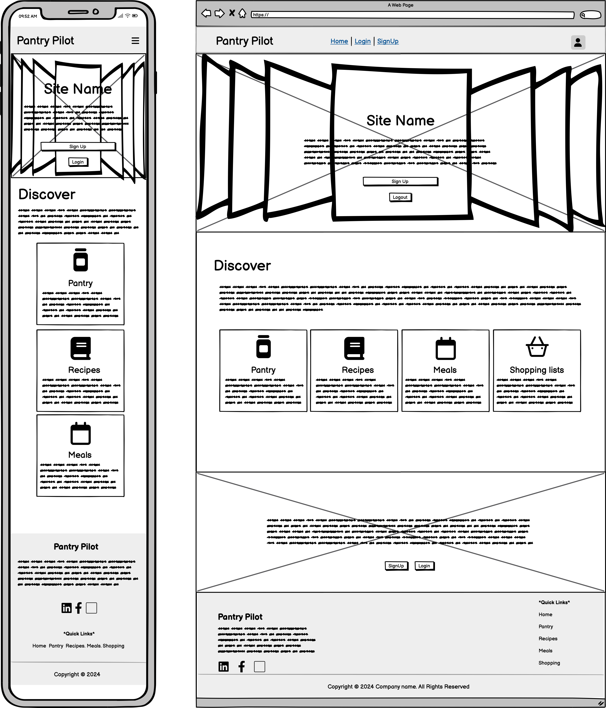
  <figcaption><strong>Figure 1:</strong> Home page view for unauthenticated users introducing site features
  <em>Only for unauthenticated users.</em>
  </figcaption>
</figure>

<figure>
  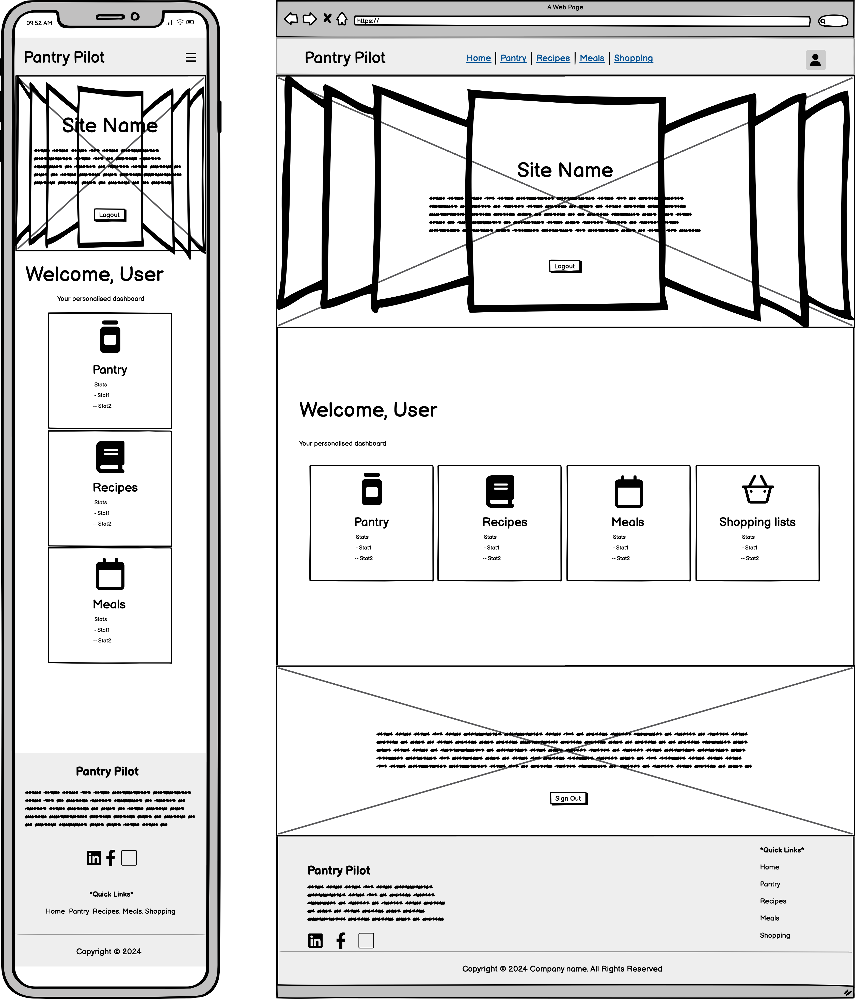
  <figcaption><strong>Figure 1:</strong> Home page view for authenticated users showing dashboard widgets
  <em>Only for authenticated users.</em>
  </figcaption>
</figure>

**2. Sign Up Page - Sprint 1**

<figure>
  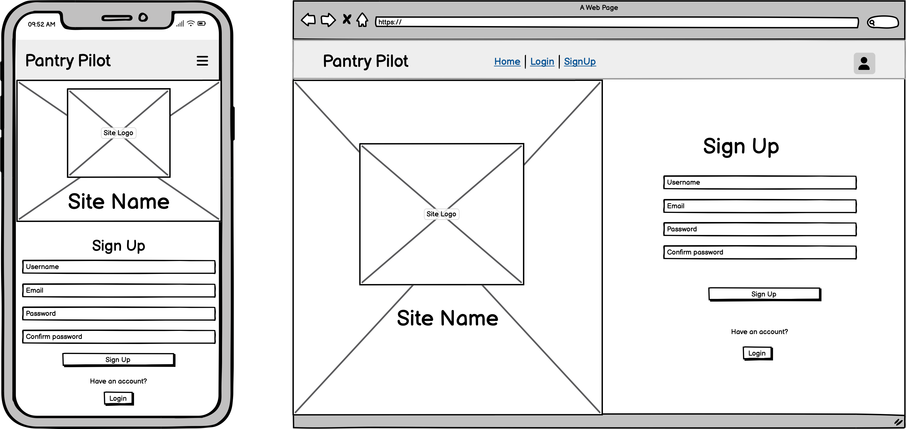
  <figcaption><strong>Figure 1:</strong> Signup page for user registration
  <em>Only for unauthenticated users.</em>
  </figcaption>
</figure>

**2. Login Page - Sprint 1**

<figure>
  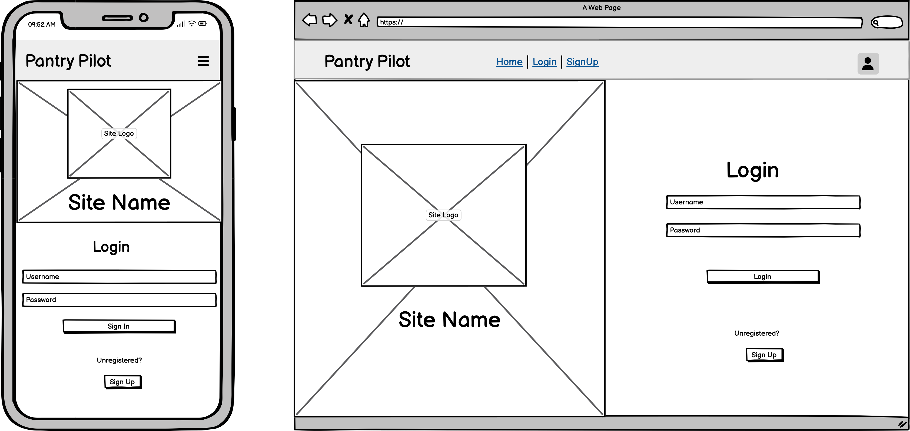
  <figcaption><strong>Figure 1:</strong> Login page for user sign in
  <em>Only for unauthenticated users.</em>
  </figcaption>
</figure>

**2. Logout Page - Sprint 1**

<figure>
  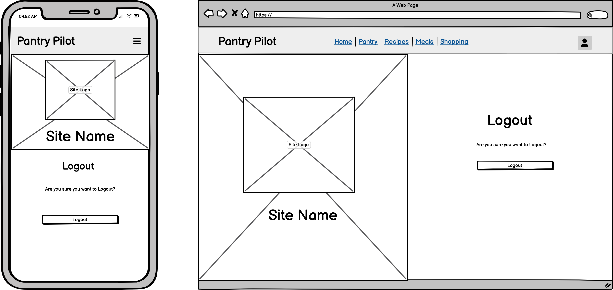
  <figcaption><strong>Figure 1:</strong> Logout page for user sign out
  <em>Only for authenticated users.</em>
  </figcaption>
</figure>

**2. Pantry List View - Sprint 1**

<figure>
  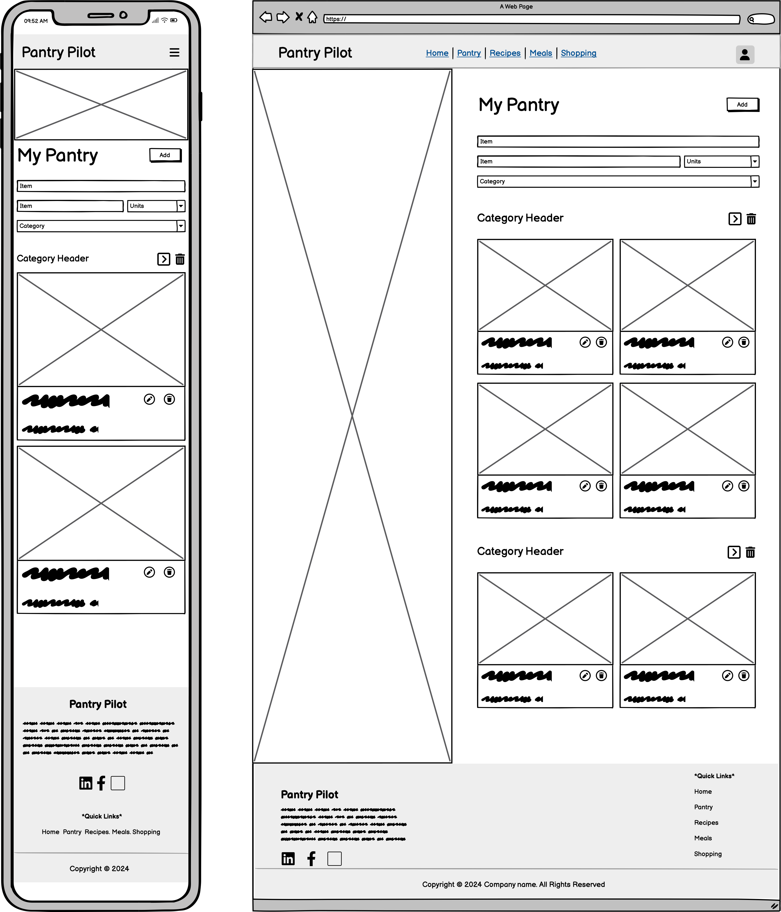
  <figcaption><strong>Figure 1:</strong> Pantry page wireframe showing the inventory management interface with category organization and item cards and Add/Update Form.
  <em>Only available to authenticated users.</em>
  </figcaption>
</figure>

**4. Recipe Search View - Sprint 2**

<figure>
  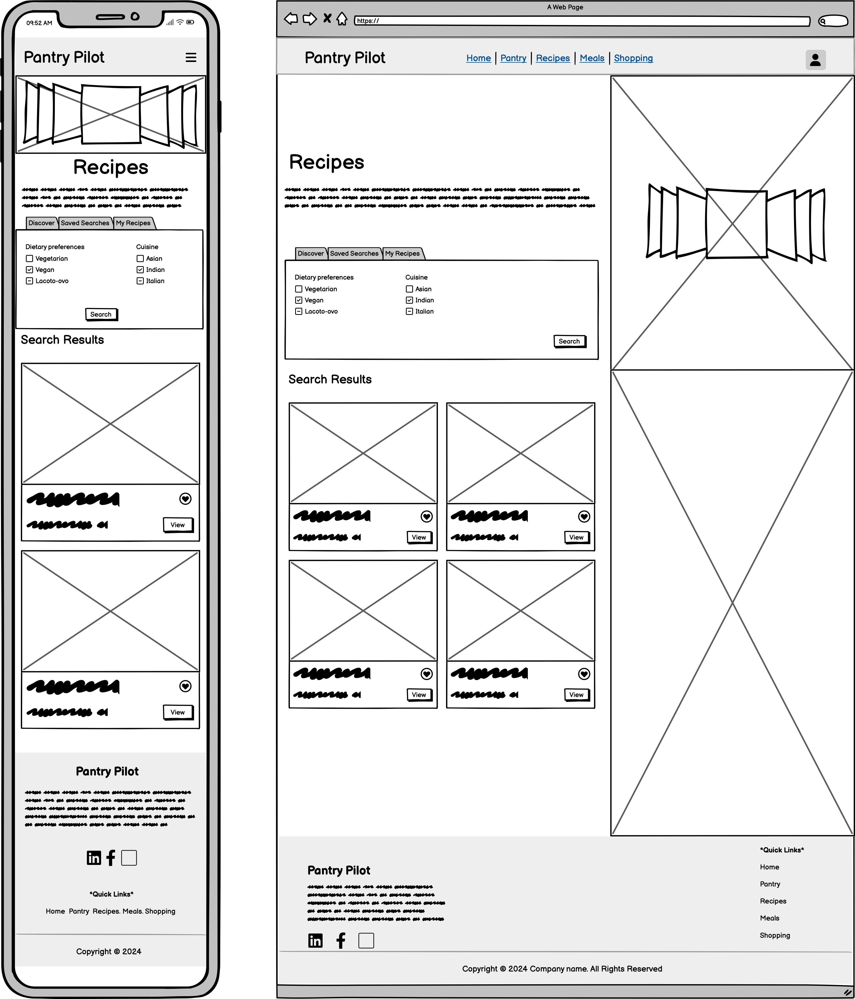
  <figcaption><strong>Figure 1:</strong> Recipe page wireframe showing the recipe search tab and saved recipes tab.
  <em>Only available to authenticated users.</em>
  </figcaption>
</figure>

**5. Recipe Detail View - Sprint 2**

<figure>
  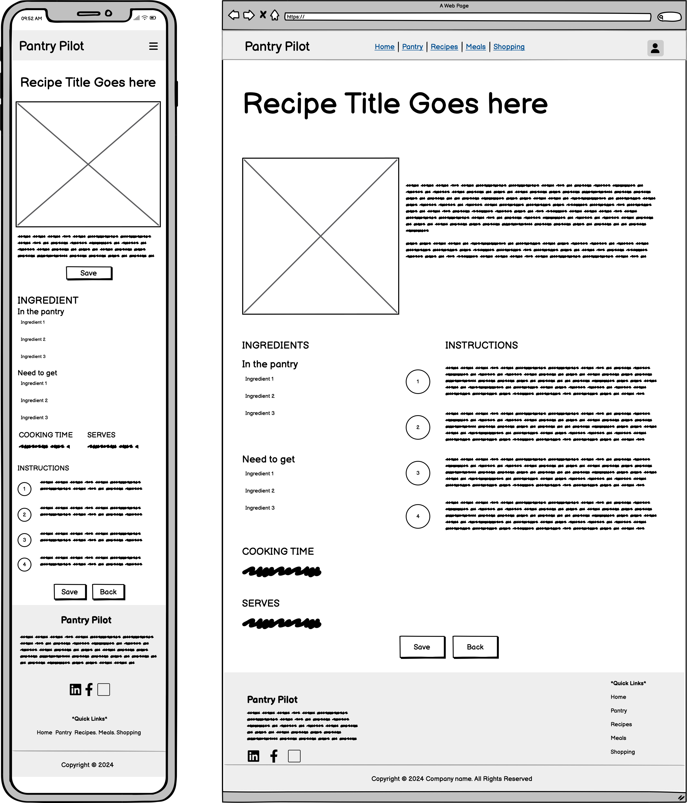
  <figcaption><strong>Figure 1:</strong> Recipe details page wireframe showing the ingredients, cooking instructions and save option for a recipe.
  <em>Only available to authenticated users.</em>
  </figcaption>
</figure>


**6. Weekly Meal Calendar - Sprint 3**

<figure>
  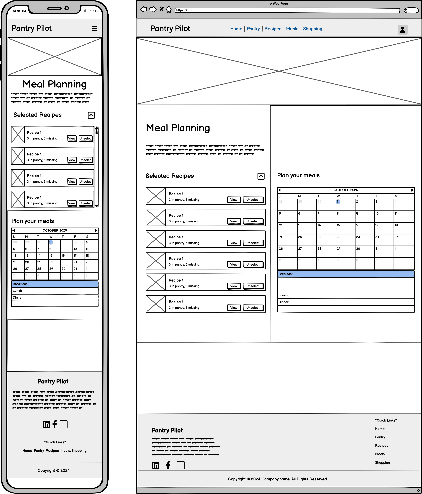
  <figcaption><strong>Figure 1:</strong> Meal planning page wireframe showing the selected recipes and meal planning calendar.
  <em>Only available to authenticated users.</em>
  </figcaption>
</figure>

**7. Shopping List View - Sprint 4**

<figure>
  
  <figcaption><strong>Figure 1:</strong> Shopping lists page wireframe showing the shopping list list view and detail view.
  <em>Only available to authenticated users.</em>
  </figcaption>
</figure>

</details>

### Surface Plane

<details>
    <summary>Surface plane considerations (Expand for details)</summary>

#### Color Palette

**Color Selection Process:**
Color combinations were evaluated using [Colormind.io](http://colormind.io/) to ensure optimal contrast ratios, brand consistency, and accessibility compliance. 

The warm red accent paired with vibrant blue creates a natural, food-focused aesthetic.

<figure>
  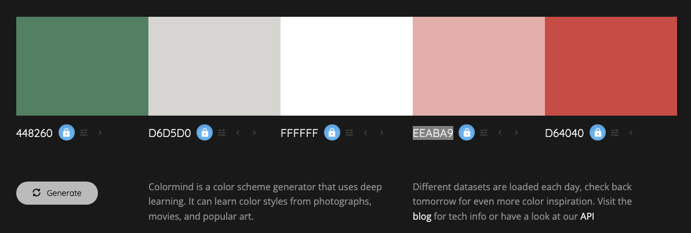
  <figcaption><strong>Figure 3:</strong> Complete color palette for PantryPilot showing primary brand colors, supporting colors.</figcaption>
</figure>

**Color Usage:**
**Primary Colors:**
- **Light Color**: `#FFFFFF` (White) - Primary background and text
- **Accent Color**: `#D64040` - Primary brand color for buttons and highlights
- **Secondary Accent**: `#0DCAF0` - Supporting accent for success states and secondary actions

**Supporting Colors:**
- **Secondary Light**: `#D6D5D0` - Subtle backgrounds and borders
- **Accent Light**: `#EEABA9` - Hover states and light accents

**Color Usage:**
- Primary navigation and key interactive elements use the main accent color
- Secondary buttons use the secondary accent
- Backgrounds maintain high contrast with white and light gray variations
- Color-blind friendly palette ensuring accessibility compliance

#### Typography

**Font Pairing Research:**

Typography combinations were evaluated using [Fontjoy.com](https://fontjoy.com/) to ensure optimal readability, visual hierarchy, and brand personality alignment. 

The serif-dominant approach reinforces the warm, traditional cooking aesthetic while maintaining modern digital usability.

<figure>
  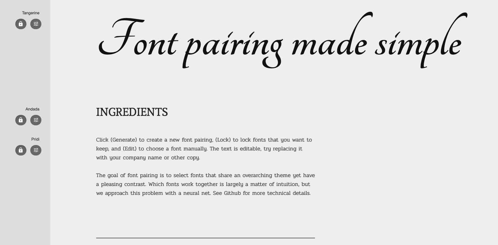
  <figcaption><strong>Figure 2:</strong> Typography hierarchy demonstrating the three-font system used throughout PantryPilot.</figcaption>
</figure>

**Font Stack:**
- **Primary Font**: "Pridi", serif - Body text and general content
- **Accent Font**: "Tangerine", cursive - Brand name and decorative headings  
- **Secondary Accent**: "Andada Pro", serif - Subheadings and emphasis text

**Typography Hierarchy:**
- **Brand/Logo**: Tangerine font for distinctive brand identity
- **Headings**: Andada Pro for clear content hierarchy
- **Body Text**: Pridi for optimal readability
- **Navigation**: Andada Pro with custom sizing using CSS variables

#### Imagery

**Visual Strategy and Selection:**

The imagery for PantryPilot was carefully curated from [Pexels.com](https://pexels.com/) to reinforce the website's core functionality and create an inviting, food-focused atmosphere. The visual strategy emphasizes fresh ingredients, organized kitchen spaces, and the joy of home cooking to align with the application's pantry management and meal planning features.

</details>


## Features

### General features of the site

Each page of the site shares the following features:

#### Favicon
<details>
    <summary>(Expand for details)</summary>

[Favicon.io](https://favicon.io/) was used to create a comprehensive favicon package for the site. 
The PantryPilot logo serves as the base design for all favicon variations, ensuring consistent brand recognition across different devices and platforms.

The favicon package includes:

| Favicon File | Size | Purpose | Image |
|--------------|------|---------|-------|
| `favicon.ico` | 16x16, 32x32 | Standard favicon for browsers |  |
| `favicon-16x16.png` | 16x16 | 16x16 pixel PNG favicon |  |
| `favicon-32x32.png` | 32x32 | 32x32 pixel PNG favicon |  |
| `apple-touch-icon.png` | 180x180 | iOS devices touch icon |  |
| `android-chrome-192x192.png` | 192x192 | Android devices icon |  |
| `android-chrome-512x512.png` | 512x512 | Android devices high-res icon |  |
| `site.webmanifest` | N/A | Web app manifest file for PWA | N/A |

</details>

#### Navbar

<details>
    <summary>(Expand for details)</summary>

The navigation bar provides access to all main application features across every page. 
It features a responsive Bootstrap design that adapts seamlessly to different screen sizes.

**Key Features:**
- **Brand Logo**: PantryPilot logo and name linking to the dashboard
- **Fixed Position**: Stays at the top during scrolling for easy access
- **Responsive Design**: Collapses to hamburger menu on mobile devices
- **Active State Indicators**: Highlights the current page for clear navigation context
- **Nav link transitions**: CSS transitions on navigation links for user feedback
- **Authentication-Aware**: Shows different navigation options based on user login status

**Navigation Links (Authenticated Users):**
- Home - Landing page with user's personalized dashboard
- Pantry - Page for User's pantry inventory management
- Recipes - Recipe discovery and saved recipes
- Meals - Weekly meal planning calendar
- Shopping - Shopping list generation and management
- User Login status - Username display with dropdown menu to logout

<figure>
  
  <figcaption><strong>Figure:</strong> Mobile navbar for authenticated users with full navigation menu</figcaption>
</figure>

<br clear="all">

<figure>
  
  <figcaption><strong>Figure:</strong> Mobile navbar for authenticated users with full navigation menu</figcaption>
</figure>

**Navigation Links (Unauthenticated Users):**
- Home - Landing page with site introduction
- Sign In - User authentication page
- Sign Up - New user registration page

<figure>
  
  <figcaption><strong>Figure:</strong> Desktop navbar for unauthenticated users with authentication links</figcaption>
</figure>

<br clear="all">

<figure>
  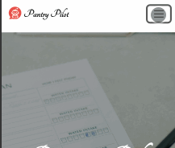
  <figcaption><strong>Figure:</strong> Mobile navbar for unauthenticated users with full navigation menu</figcaption>
</figure>

</details>

#### Footer

<details>
    <summary>(Expand for details)</summary>

#### Footer

The footer provides site information and maintains consistent branding across all pages. 
It features a responsive design that adapts to different screen sizes.

**Key Features:**
- **Brand Identity**: PantryPilot logo text and tagline reinforcing the site's purpose
- **Site Description**: Concise explanation of the platform's value proposition
- **Social Media Links**: Access to site socials - Facebook, YouTube, Twitter, and Instagram home pages
- **Quick Navigation Links**: Easy access to main site features and pages, redirects to authentication pages for unauthorised users
- **Responsive Layout**: Adapts from single-column mobile to multi-column desktop layout
- **Consistent Styling**: Brand accent color background with light text for visual hierarchy
- **Copyright Information**: Legal footer with current year and rights statement

**Responsive Behavior:**
- **Mobile**: Single-column vertical layout with centered content
- **Desktop**: Two-column horizontal layout with left-aligned content
- **Social Icons**: Maintains consistent spacing and accessibility across all screen sizes

<figure>
  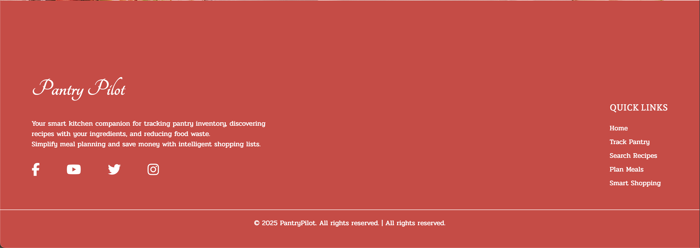
  <figcaption><strong>Figure:</strong> Desktop footer with site details, social media links, and quick navigation menu</figcaption>
</figure>

</details>