# PantryPilot - Smart Pantry Management System

# 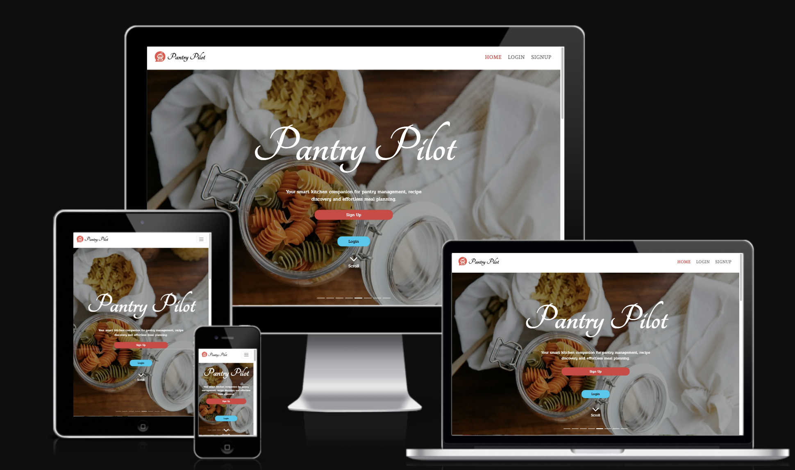

## Table of Contents

1. [Project Summary](#project-summary)
    - [Technology Stack Overview](#technology-stack-overview)
    - [Deployed link](#deployed-link)
    - [Core Features Overview](#core-features-overview)
    - [MVP Limitations](#mvp-limitations)
    - [Future Enhancements](#future-enhancements)
    - [AI assistance within the project](#ai-assistance-within-the-project)
2. [UX Design](#ux-design)
    - [Strategy plane](#strategy-plane)
        - [Target Audience](#target-audience)
        - [Business Goals](#business-goals)
        - [User Goals](#user-goals)
    - [Scope Plane](#scope-plane)
        - [Core User Stories](#core-user-stories)
        - [Future Enhancement Stories (Post-MVP)](#future-enhancement-stories-post-mvp)
        - [Updated Feature Prioritization Matrix](#updated-feature-prioritization-matrix)
    - [Structure Plane](#structure-plane)
        - [Information Architecture](#information-architecture)
            - [Site Map and Navigation Structure](#site-map-and-navigation-structure)
            - [Content Hierarchy and Relationships](#content-hierarchy-and-relationships)
            - [Information Grouping Strategy](#information-grouping-strategy)
        - [Interaction Design](#interaction-design)
        - [Technical Architecture Considerations](#technical-architecture-considerations)
    - [Skeleton Plane](#skeleton-plane)
        - [Interface Design and Wireframes](#interface-design-and-wireframes)
    - [Surface Plane](#surface-plane)
        - [Color Palette](#color-palette)
        - [Typography](#typography)
        - [Imagery](#imagery)
3. [Agile Methodology](#agile-methodology)
    - [Sprint Breakdown](#sprint-breakdown)
    - [GitHub issues for User stories](#github-issues-for-user-stories)
    - [MoSCoW prioritization](#moscow-prioritization)
    - [Github milestones for Sprints](#github-milestones-for-sprints)
    - [Kanban board](#kanban-board)
4. [Entity Relationship Diagram for Database](#entity-relationship-diagram-for-database)
5. [Features](#features)
    - [General features of the site](#general-features-of-the-site)
        - [Favicon](#favicon)
        - [Navbar](#navbar)
        - [Footer](#footer)
        - [Authorized Access Control](#authorized-access-control)
    - [Home Page](#home-page)
    - [Pantry Page](#pantry-page)
    - [Recipes Page](#recipes-page)
    - [Recipe Detail page](#recipe-detail-page)
    - [Meal Planning Page](#meal-planning-page)
    - [Shopping Lists Page](#shopping-lists-page)
    - [Sign Up Page](#sign-up-page)
    - [Sign In Page](#sign-in-page)
    - [Sign Out Page](#sign-out-page)
6. [Technologies used](#technologies-used)
    - [Languages](#languages)
    - [Database](#database)
    - [Frameworks](#frameworks)
    - [Libraries and packages](#libraries-and-packages)
    - [Programs Used](#programs-used)
7. [Deployment](#deployment)
    - [Creating Repository on GitHub](#creating-repository-on-github)
    - [Creating an app on Heroku](#creating-an-app-on-heroku)
    - [Create a database](#create-a-database)
    - [Deploying to Heroku](#deploying-to-heroku)
8. [Testing](#testing)
9. [Credits](#credits)
    - [Code](#code)
    - [Content](#content)
    - [Imagery](#imagery)
    - [Iconography](#iconography)
    - [Typography](#typography)

## Project Summary

PantryPilot is a comprehensive full-stack web application designed to help users efficiently manage their pantry inventory, discover recipes based on available ingredients, plan weekly meals, and generate smart shopping lists. The application combines ingredient tracking with meal planning capabilities to reduce food waste, save money, and streamline cooking experiences.

### Technology Stack Overview
- **Frontend**: HTML5, CSS3, JavaScript 
- **Backend**: Django Framework (Python)
- **Database**: PostgreSQL
- **Architecture**: Full-stack web application

### Deployed link

[Pantry Pilot](https://pantry-pilot-745736b33f31.herokuapp.com/) hosted on Heroku.

### Core Features Overview

#### 1. Pantry Inventory Management
- **Add/Remove Items**: Simple interface for managing pantry contents
- **Quantity Tracking**: Monitor exact quantities of ingredients
- **Categories**: Organize items by type (spices, grains, proteins, etc.)

#### 2. Recipe Management System
- **Recipe Search**: Find recipes based on available pantry ingredients powered by Spoonacular API
- **Save Favorite Recipes Storage**: Save and organize favorite recipes
- **Cooking Instructions**: Step-by-step cooking guidance
- **Photo Integration**:  Recipe images for visual reference

#### 3. Meal Planning Tools
- **Weekly Meal Planner**: Plan breakfast, lunch, and dinner for the week
- **Calendar Integration**: Visual calendar interface for meal planning

#### 4. Smart Shopping Lists
- **Auto-Generated Lists**: Create shopping lists based on planned meals
- **Missing Ingredients**: Identify ingredients needed for specific recipes

#### 5. User Interface and Experience
- **Responsive Design**: Works seamlessly on desktop, tablet, and mobile devices
- **Intuitive Navigation**: Easy-to-use interface with logical flow
- **Quick Actions**: Fast access to common tasks (add item, plan meal, create list)
- **Dashboard**: Overview of pantry status, upcoming meal plans, and shopping needs

### MVP Limitations

- **Spoonacular Free Tier API**: The recipe discovery feature of the website is powered by Spoonacular free tier API plan. Each recipe search or query for recipe details incurs points and the free tier of the Spoonacular API enforces daily request limit of 50 points/day, 1 request/s. It restricts access to certain advanced endpoints (such as detailed nutrition data), and may occasionally return incomplete or delayed responses due to quota exhaustion. As a result, some recipe search or nutrition features may be temporarily unavailable or limited in scope for users when the quota is exceeded.

- **Fairshare distribution of API points**: The MVP does not implement any kind of fair-share distribution of the API points to limit Denial of Service to users.
The points are consumed from a common pool, hence service can be denied to all users when the quota is reached.
This could be overcome by implementing fair-share allocation policies per user based on concurrent user support plans.

- **No caching of API results**: The application does not implement caching of API responses. Concurrent usage and denial of service limitations could be mitigated by implementing caching strategy so that requests are served from cache first. The MVP does however implement saving responses in user sessions so that for a single user unsaved results can be fetched from sessions if available.

- **Sanitization of API responses**: The responses for recipe search and recipe details using the API can include responses with malformed data - for example, malformed image links, links to non-existent images, inconsistent units for recipe ingredients or repeated ingredients for a single recipe. Alternate APIs, thorough testing, analysis and sanitization strategy for the responses from the API is something that could be explored post MVP.

- **Fuzzy ingredient matching**: The MVP uses the RapidFuzz Python library to implement a fuzzy search strategy for ingredient matching between recipes and pantry items. While this approach helps account for typos, alternate spellings, and minor naming differences, it can also introduce ambiguity. Occasionally, ingredients with similar names but different meanings (e.g., "onion" vs. "spring onion") may be incorrectly matched, or true matches may be missed if the similarity score is not high enough. This can result in inaccurate pantry matches, leading to missing or extra items in shopping lists and recipe suggestions.
A possible solution to the limitations of fuzzy matching is to use NLP-based ingredient matching. This approach leverages natural language processing techniques to better understand the meaning and context of ingredient names, rather than relying solely on string similarity.

- **Account for ingredient quantities**: The MVP does not account for quantities of ingredients and pantry items while generating shopping lists for missed ingredients. This feature could be implemented post MVP.

### Future Enhancements

#### 1. Personal Recipe Management
- **Create Personal Recipes**: Create and save your own recipes
- **Edit Personal Recipes**: Edit and update your personal recipes over time

#### 2. Advanced Pantry Management
- **Expiration Dates**: Track and receive alerts for expiring items
- **Barcode Scanning**: Quick item addition via barcode
- **Receipt Scanning**: Scan uploaded receipts to automatically update pantry items
- **Camera Receipt Scan**: Use mobile camera to scan receipts for instant updates

#### 3. Enhanced Recipe Features
- **Recipe Categories**: Organize recipes by meal type, cuisine, dietary restrictions
- **Ingredient Substitutions**: Suggest alternatives for missing ingredients

#### 4. Advanced Meal Planning
- **Family Preferences**: Account for different family member preferences
- **Portion Planning**: Calculate serving sizes and quantities needed
- **Batch Planning**: Plan multiple weeks in advance

#### 5. Enhanced Shopping Features
- **Store Organization**: Organize lists by store sections (produce, dairy, etc.)
- **Quantity Calculations**: Calculate exact quantities needed
- **Multiple Stores**: Manage different lists for different stores
- **Sharing Capability**: Share shopping lists with family members
- **Cost Tracking**: Monitor estimated and actual costs

#### 6. Nutritional Information System
- **Recipe Nutrition**: Display nutritional facts for each recipe
- **Weekly Nutrition Summary**: Overview of planned weekly nutrition
- **Dietary Tracking**: Track calories, macronutrients, vitamins, and minerals
- **Dietary Restrictions**: Filter recipes by dietary needs (vegetarian, gluten-free, etc.)
- **Health Goals**: Set and monitor nutritional goals

#### 7. Data Management and Insights
- **Usage Analytics**: Track ingredient usage patterns and trends
- **Export Options**: Export data for external use or backup
- **Data Backup**: Secure cloud storage of user data
- **Waste Reporting**: Monitor and report food waste reduction
- **Cost Tracking**: Track grocery spending and budget adherence

### AI assistance within the project

This project leveraged advanced AI tools(ChatGPT/Claude AI) to significantly enhance productivity, code quality, and development speed throughout the entire development lifecycle.

#### Development Productivity Enhancement

- **Planning**: AI guidance during the ideation and planning phase of the project to identify target audience, relevant user stories, feature prioritization, sprint planning, information architecture design, interaction design and crude wireframe generation
- **Problem Solving and Debugging**: Rapid solutions for complex technical challenges and implementation roadblocks, debug assistance for bug fixing
- **Code Optimization**: Performance improvement suggestions and refactoring recommendations
- **Documentation**: AI-assisted markup generation for README documentation

#### Code Quality & Testing Enhancement

- **Syntax Validation**: AI tools identified potential syntax errors before runtime testing
- **Performance Analysis**: Suggestions for optimizing implementation for performance
- **Accessibility Compliance**: AI guidance for implementing WCAG accessibility standards

#### Development Speed Improvements

- **API Integration**: Guidance for accelerated implementation of external service connections
- **Accelerated Debugging**: Root-cause bugs faster for accelerated bug fixes
- **Responsive Design**: Efficient development of cross-device compatibility

#### **Knowledge Transfer**
- **Learning Acceleration**: AI tutoring for new technologies and frameworks
- **Best Practice Implementation**: Real-time guidance on industry standards and conventions
- **Technical Research**: Rapid exploration of solutions for complex technical requirements

## UX Design

### Strategy plane

<details>
    <summary>
    Strategy plane considerations(Expand for details)
    </summary>

#### Target Audience

##### Primary Personas

###### Busy Family Manager (35-45 years)
**Profile**: Working parent managing household groceries for family of 3-5
- **Pain Points**: Forgetting what's in pantry, duplicate purchases, meal planning stress
- **Goals**: Save time and money, reduce food waste, feed family well
- **Tech Comfort**: Moderate (uses smartphone apps regularly)
- **Frequency**: Daily pantry checks, weekly meal planning

###### Budget-Conscious Home Cook (30-50 years)
**Profile**: Price-sensitive shopper, enjoys cooking, wants to maximize value
- **Pain Points**: Overspending on groceries, food expiration waste
- **Goals**: Stretch grocery budget, use all purchased ingredients
- **Tech Comfort**: Moderate (uses apps for deals and coupons)
- **Frequency**: Weekly planning, daily pantry monitoring

###### College Student/Young Adult (18-25 years)
**Profile**: Learning to cook independently, limited budget
- **Pain Points**: Food management inexperience, tight budget
- **Goals**: Learn cooking skills, avoid food waste, eat well cheaply
- **Tech Comfort**: Very High (digital native)
- **Frequency**: Learning-based usage, irregular planning

##### Secondary Personas

###### Health-Conscious Professional (25-35 years)
**Profile**: Single or couple, career-focused, health and nutrition aware
- **Pain Points**: Limited cooking time, ingredient waste, nutritional tracking
- **Goals**: Eat healthily, maximize ingredient usage, efficient meal prep
- **Tech Comfort**: High (early adopter of productivity apps)
- **Frequency**: Multiple daily interactions, batch meal planning

###### Empty Nester Couple (50-65 years)
**Profile**: Cooking for two, downsizing food purchases
- **Pain Points**: Adjusting portion sizes, avoiding overbuying
- **Goals**: Maintain cooking enjoyment, manage smaller quantities
- **Tech Comfort**: Moderate (selective app adoption)
- **Frequency**: Regular but relaxed usage

#### Business Goals

##### Primary Business Objectives
1. **Reduce Food Waste**: Help users track ingredients to minimize food spoilage and environmental impact
2. **Cost Optimization**: Enable smart shopping decisions by avoiding duplicate purchases and maximizing ingredient usage
3. **Time Efficiency**: Streamline meal planning and grocery shopping processes to save users valuable time
4. **User Engagement**: Create an engaging, habit-forming application that users return to regularly

##### Secondary Business Objectives
5. **Health Awareness**: Provide nutritional insights for informed dietary decisions and healthier eating habits
6. **Market Positioning**: Position as a solution for modern household food management
7. **Portfolio Value**: Demonstrate full-stack development capabilities and UX design skills
8. **Scalability**: Build foundation for potential future enhancements or enterprise features

#### User Goals

##### Primary User Goals

###### Inventory Management Goals
- **Real-time Tracking**: Maintain accurate, up-to-date inventory of pantry items
- **Quantity Management**: Monitor ingredient quantities and usage patterns
- **Easy Updates**: Simple interface for adding, removing, and updating items
- **Search & Filter**: Quickly find specific ingredients in their pantry
- **Visual Organization**: See pantry contents at a glance with clear categorization

###### Recipe Discovery Goals
- **Ingredient-Based Search**: Find recipes using available pantry ingredients
- **Recipe Variety**: Discover new recipes and cooking ideas
- **Custom Recipe Storage**: Save and organize personal favorite recipes

###### Meal Planning Goals
- **Weekly Planning**: Plan balanced meals for the entire week
- **Visual Calendar**: See meal plans in an organized calendar format
- **Preparation Coordination**: Plan meals considering prep time and complexity

###### Shopping Efficiency Goals
- **Smart Shopping Lists**: Generate lists for missing ingredients
- **Store Organization**: Shopping lists organized by store sections
- **Duplicate Prevention**: Avoid buying items already in pantry

##### Secondary User Goals
- **Nutritional Information**: Access nutritional data for recipes and ingredients
- **Nutritional Balance**: Ensure variety and nutrition across planned meals
- **Learning**: Improve cooking skills and food management knowledge
- **Sharing**: Share favorite recipes and meal plans with family/friends
- **Automation**: Reduce the stress of meal planning decisions
- **Customization**: Adapt the system to personal preferences and dietary needs

</details>

### Scope Plane

<details>
    <summary>Scope plane considerations(Expand for details)</summary>

#### Core User Stories

##### User Authentication Stories (Sprint 1)

- **US001: User Registration**: **AS A** new user **I WANT TO** create an account with email and password **SO THAT I CAN** save my pantry data and access personalized features
- **US002: User Login**: **AS A** returning user **I WANT TO** log into my account **SO THAT I CAN** access my personal pantry
- **US003: User Logout**: **AS A** logged in user **I WANT TO** log out of my account **SO THAT I CAN** secure my data when finished

##### Basic Pantry Management Stories (Sprint 1)

- **US004: Add Pantry Items**: **AS A** logged in user **I WANT TO** add ingredients to my pantry with name and quantity **SO THAT I CAN** track what I have available for cooking
- **US005: View All Pantry Items**: **AS A** logged in user **I WANT TO** see all my pantry items in a list **SO THAT I CAN** quickly review what ingredients I have
- **US006: Edit Pantry Item Quantities**: **AS A** logged in user **I WANT TO** update ingredient quantities **SO THAT I CAN** keep my pantry inventory accurate as I use items
- **US007: Remove Pantry Items**: **AS A** logged in user **I WANT TO** delete items from my pantry **SO THAT I CAN** remove ingredients I no longer have

##### Help and Navigation Stories (Sprint 1)

- **US008: Website Help**: **AS A** new user **I WANT TO** see website help and navigation guidance **SO THAT I CAN** understand how to use PantryPilot effectively
- **US009: Basic Responsive Layout**: **AS A** mobile user **I WANT TO** access basic pantry features on my phone **SO THAT I CAN** manage my pantry while shopping

##### Recipe Discovery Stories (Sprint 2)

- **US010: Search Recipes by Available Ingredients**: **AS A** home cook **I WANT TO** find recipes using ingredients I have in my pantry **SO THAT I CAN** cook meals maximizing what I have available 
- **US011: View Recipe Details**: **AS A** cook **I WANT TO** see detailed recipe information including ingredients, instructions, and cooking time **SO THAT I CAN** understand what's needed to make the recipe
- **US012: Filter Recipes by Matching Ingredients**: **AS A** home cook **I WANT TO** filter recipes by how many pantry ingredients they use **SO THAT I CAN** prioritize recipes requiring minimal shopping

##### Recipe Management Stories (Sprint 2)

- **US013: Save Favorite Recipes**: **AS A** cook **I WANT TO** save recipes I like to a favorites list **SO THAT I CAN** easily find them again for future cooking
- **US014: View Saved Recipes**: **AS A** cook **I WANT TO** see all my saved recipes in one place **SO THAT I CAN** browse my personal recipe collection

##### Meal Planning Foundation (Sprint 3)

- **US015: View Weekly Meal Calendar**: **AS A** organized cook **I WANT TO** see a weekly meal calendar interface **SO THAT I CAN** plan my meals for the week ahead
- **US016: Add Meals to Calendar**: **AS A** meal planner **I WANT TO** add specific recipes to calendar days and meal times **SO THAT I CAN** organize my weekly cooking schedule
- **US017: Update Existing Meal Plans**: **AS A** meal planner **I WANT TO** modify existing meal plan items **SO THAT I CAN** adjust my weekly schedule as needed
- **US018: Delete Meal Plan Items**: **AS A** meal planner **I WANT TO** remove meals from my calendar **SO THAT I CAN** clear unwanted or changed plans
- **US019: Calendar Event Display and Styling**: **AS A** meal planner **I WANT TO** easily distinguish different meal types in my calendar **SO THAT I CAN** quickly understand my meal schedule

##### Shopping List Generation (Sprint 4)

- **US020: Generate Shopping Lists from Meal Plans**: **AS A** meal planner **I WANT TO** automatically generate shopping lists based on my planned meals **SO THAT I CAN** buy ingredients needed for my weekly menu
- **US021: Compare Pantry vs Recipe Ingredients**: **AS A** meal planner **I WANT TO** see which recipe ingredients I already have **SO THAT I CAN** only buy what I need
- **US022: View and Edit Shopping Lists**: **AS A** shopper **I WANT TO** view and check off items from my generated shopping list **SO THAT I CAN** track my shopping progress
- **US023: Calculate Required vs Available Quantities**: **AS A** meal planner **I WANT TO** see quantity comparisons between recipe requirements and pantry stock **SO THAT I CAN** know exactly how much more I need to buy
- **US024: Manage Shopping List Quantities**: **AS A** shopper **I WANT TO** adjust quantities and add additional items to my shopping list **SO THAT I CAN** customize my shopping list for my specific needs

##### Advanced Pantry Features (Sprint 5)

- **US025: Search Pantry Items**: **AS A** user with many ingredients **I WANT TO** search my pantry by name **SO THAT I CAN** quickly find specific items
- **US026: Categorize Pantry Items**: **AS A** organized user **I WANT TO** view my pantry items organized by categories (spices, grains, proteins, etc.) **SO THAT I CAN** easily find ingredients by type

##### Enhanced User Experience (Sprint 5)

- **US027: Full Responsive Design**: **AS A** mobile user **I WANT TO** access all PantryPilot features on my phone **SO THAT I CAN** manage pantry, recipes, and meal planning while mobile
- **US028: Remove Saved Recipes**: **AS A** cook **I WANT TO** remove recipes from my favorites list **SO THAT I CAN** keep my saved recipes relevant
- **US029: Enhanced Recipe Search**: **AS A** cook **I WANT TO** search recipes by name, cuisine, or dietary restrictions **SO THAT I CAN** find specific types of meals

#### Future Enhancement Stories (Post-MVP)

##### Personal Recipe Management
- **US030: Create Personal Recipes**: **AS A** cook **I WANT TO** create and save my own recipes **SO THAT I CAN** store my family recipes digitally
- **US031: Edit Personal Recipes**: **AS A** cook **I WANT TO** edit my personal recipes **SO THAT I CAN** improve and update them over time

##### Nutritional Information System
- **US032: View Recipe Nutrition**: **AS A** health-conscious cook **I WANT TO** see nutritional information for recipes **SO THAT I CAN** make informed dietary choices
- **US033: View Ingredient Nutrition**: **AS A** health-conscious user **I WANT TO** access nutritional data for individual ingredients **SO THAT I CAN** understand the nutritional value of my pantry items
- **US034: Weekly Nutrition Summary**: **AS A** health-conscious meal planner **I WANT TO** see a nutritional summary of my planned weekly meals **SO THAT I CAN** ensure balanced nutrition across the week
- **US035: Nutritional Balance Tracking**: **AS A** health-conscious user **I WANT TO** track calories, macronutrients, vitamins, and minerals **SO THAT I CAN** monitor my nutritional intake
- **US036: Dietary Restriction Filtering**: **AS A** user with dietary needs **I WANT TO** filter recipes by dietary restrictions (vegetarian, gluten-free, etc.) **SO THAT I CAN** find recipes that match my dietary requirements

##### Advanced Meal Planning
- **US037: Family Preferences**: **AS A** family cook **I WANT TO** set dietary preferences for family members **SO THAT I CAN** plan meals that work for everyone
- **US038: Batch Meal Planning**: **AS A** organized planner **I WANT TO** plan multiple weeks at once **SO THAT I CAN** prepare for busy periods

##### Advanced Pantry Management
- **US039: Track Expiration Dates**: **AS A** user **I WANT TO** track expiration dates for pantry items **SO THAT I CAN** use ingredients before they spoil
- **US040: Expiration Alerts**: **AS A** user **I WANT TO** receive alerts for expiring items **SO THAT I CAN** prioritize using them

#### Updated Feature Prioritization Matrix

| Feature | Sprint | Priority | User Impact | Development Effort | MVP Status |
|---------|--------|----------|-------------|-------------------|------------|
| User Authentication (US001-US003) | 1 | High | High | Medium | ✅ Must Have |
| Basic Pantry Management (US004-US007) | 1 | High | High | Medium | ✅ Must Have |
| Help (US008) | 1 -> Future | 1 | Low | Low | ❌ Won't Have |
| Basic Mobile Responsiveness (US009) | 1 | High | Medium | Low | ✅ Must Have |
| Recipe Discovery (US010-US011) | 2 | High | High | High | ✅ Must Have |
| Recipe Discovery (US012) | 2 | 2 -> Future | Medium | Medium | ❌Won't Have |
| Recipe Management (US013-US014) | 2 | Medium | Medium | Medium | ✅ Should Have |
| Meal Planning (US015-US016) | 3 | High | High | High | ✅ Must Have |
| Meal Planning (US017-US018) | 3 | Medium | High | High | ✅ Should Have |
| Meal Planning (US019) | 3 | Low | Medium | High | ✅ Could Have |
| Shopping Lists (US020) | 4 | High | High | High | ✅ Must Have |
| Shopping Lists (US021) | 4 | High | Medium | High | ✅ Should Have |
| Shopping Lists (US022) | 4 | Medium | High | High | ✅ Should Have |
| Shopping Lists (US023-US024) | 4 -> Future | High | High | High | ❌ Wont Have |
| Advanced Pantry (US025-US026) | 5 | Medium | High | Medium | ❌ Wont Have |
| Enhanced UX (US027) | 5 | High | High | Medium | ✅ Must Have |
| Enhanced UX (US028) | 5 | Medium | High | Medium | ✅ Could Have |
| Enhanced UX (US029) | 5 -> Future | Medium | High | Medium | ✅ Should Have |
| Personal Recipes (US030-US031) | Future | Low | Medium | High | ❌ Won't Have |
| Nutritional Information (US032-US036) | Future | Low | Medium | High | ❌ Won't Have |
| Advanced Planning (US037-US038) | Future | Low | Low | High | ❌ Won't Have |
| Expiration Tracking (US039-US040) | Future | Low | Low | Medium | ❌ Won't Have |

</details>

### Structure Plane

<details>
    <summary>Structure plane considerations (Expand for details)</summary>

#### Information Architecture

##### Site Map and Navigation Structure

```
PantryPilot (Root)
├── Authentication (/accounts/)
│   ├── Sign Up (/accounts/signup/)
│   ├── Login (/accounts/login/)
│   └── Logout (/accounts/logout/)
├── Dashboard (/)
│   ├── Pantry Overview Widget
│   ├── Recent Recipes Widget
│   └── Upcoming Meals Widget
├── Pantry Management (/pantry/)
│   ├── View All Items (/pantry/)
│   ├── Edit Item (/pantry/item/<item_id>/update)
│   ├── Delete Item (/pantry/item/<item_id>/delete)
│   ├── Handle Duplicate (/pantry/item/<item_id>/handle)
│   ├── Delete Category (/pantry/category/<category_id>/delete)
├── Recipe Discovery (/recipes/)
│   ├── Recipe List (/recipes/)
│   ├── Recipe Details (/recipes/recipe/<api_recipe_id>)
│   ├── Saved Recipe Details (/recipes/recipe/saved/<recipe_id>)
│   ├── Save Recipe (/recipes/recipe/<api_recipe_id>/save)
│   ├── Delete Saved Recipe (/recipes/recipe/<recipe_id>/delete)
│   └── Toggle Recipe Selection (/recipes/toggle-selection/<recipe_id>/)
├── Meal Planning (/meals/)
│   ├── Weekly Calendar (/meals/)
│   ├── Get Meal Plan (/meals/plan/)
│   ├── Add Meal (via POST to /meals/plan/)
│   ├── Update Meal (/meals/update/<meal_plan_item_id>/)
│   ├── Delete Meal (/meals/delete/<meal_plan_item_id>/)
│   └── Clear Selection (/meals/clear_selection/)
├── Shopping Lists (/shopping/)
    ├── View Lists (/shopping/)
    ├── Shopping List Details (/shopping/<shopping_list_id>/)
    ├── Delete Shopping List (/shopping/<shopping_list_id>/delete)
    ├── Refresh Shopping List (/shopping/<shopping_list_id>/refresh)
    └── Mark Item Purchased (/shopping/item/<item_id>/toggle/)
```

##### Content Hierarchy and Relationships

**Primary Content Objects:**
- **User**: Authenticates and owns all personal data
- **PantryItem**: Core inventory item with quantity and category
- **Recipe**: External/saved recipes with ingredients and instructions
- **MealPlan**: Weekly calendar entries linking recipes to specific dates/times
- **ShoppingList**: Generated lists based on meal plans vs. pantry comparison

**Content Relationships:**
```
User (1) ──→ (Many) PantryItem
User (1) ──→ (Many) SavedRecipe
User (1) ──→ (Many) MealPlan
User (1) ──→ (Many) ShoppingList

MealPlan (Many) ──→ (1) Recipe
Recipe (1) ──→ (Many) RecipeIngredient
PantryItem (Many) ──→ (1) Category
ShoppingList (1) ──→ (Many) MealPlan
```

##### Information Grouping Strategy

**Sprint 1 - Foundation Architecture:**
- User authentication
- Basic pantry CRUD operations with simple list/detail views

**Sprint 2 - Recipe Integration:**
- Recipe discovery with external API integration
- Recipe detail views with ingredient matching
- Saved recipes collection management

**Sprint 3 - Planning Architecture:**
- Calendar-based meal planning interface
- Weekly view with meal slots (breakfast/lunch/dinner)
- Recipe-to-meal assignment workflows

**Sprint 4 - Shopping Integration:**
- Shopping list generation algorithms
- Pantry vs. recipe ingredient comparison logic
- List management and editing interfaces

**Sprint 5 - Enhanced Organization:**
- Advanced search and filtering systems
- Category-based organization for pantry items
- Mobile-responsive navigation patterns

#### Interaction Design

##### Core User Workflows

**1. New User Onboarding Flow**
```
Landing Page → Registration → Personalized Dashboard
```

**2. Daily Pantry Management Flow**
```
Dashboard → Pantry View → [Add/Edit/Remove Items] → Updated Dashboard
```

**3. Recipe Discovery and Saving Flow**
```
Dashboard → Recipe Search → Search by Available Ingredients and Preferences → View Recipe Details → Save to Favorites
```

**4. Weekly Meal Planning Flow**
```
Dashboard → Meal Calendar → Select Day/Meal → Browse Saved Recipes → Assign Recipe → Complete Week
```

**5. Shopping List Generation Flow**
```
Meal Calendar → Generate Shopping List → Review Missing Ingredients → Update List → Shopping Mode
```

##### Navigation Patterns

**Primary Navigation (Always Visible):**
- Dashboard (Home)
- Pantry
- Recipes
- Meals
- Shopping

**Secondary Navigation (Contextual):**
- Mobile hamburger menu (Responsive)


##### Progressive Disclosure Strategy

**Dashboard Information Hierarchy:**
```
Level 1: Quick stats (pantry count, planned meals)
```

**Pantry Management Hierarchy:**
```
Level 1: Item name, quantity, basic category
```

**Recipe Information Hierarchy:**
```
Level 1: Recipe title, image, missing and matched ingredient count
Level 2: Ingredient list with pantry match indicators
Level 3: Detailed instructions
```

##### Error Handling and Feedback

**Error Prevention:**
- Form validation before submission
- Confirmation dialogs for destructive actions

**Success Feedback:**
- Toast notifications for completed actions

##### Accessibility Considerations

**Screen Reader Support:**
- Semantic HTML structure with proper headings
- Alt text for all images and icons
- ARIA labels for complex interactions
- Live regions for dynamic content updates

**Visual Accessibility:**
- High contrast color schemes
- Clear visual hierarchy with sufficient spacing

#### Technical Architecture Considerations

##### Django App Structure
```
pantry_pilot/
├── accounts/         # User authentication
├── pantry/           # Pantry inventory management
├── recipes/          # Recipe discovery and management
├── meals/            # Meal planning functionality
├── shopping/         # Shopping list generation
├── dashboard/        # Shared utilities and base templates
└── static/           # CSS, JavaScript, images
```

##### API Integration Points
- External Spoonacular API integration for recipe discovery
- Potential Future nutritional data services via Spoonacular API

</details>

### Skeleton Plane

<details>
    <summary>Skeleton plane considerations (Expand for details)</summary>

#### Interface Design and Wireframes

##### Core Page Wireframes

**1. Dashboard (Home Page) - Sprint 1**

<figure>
  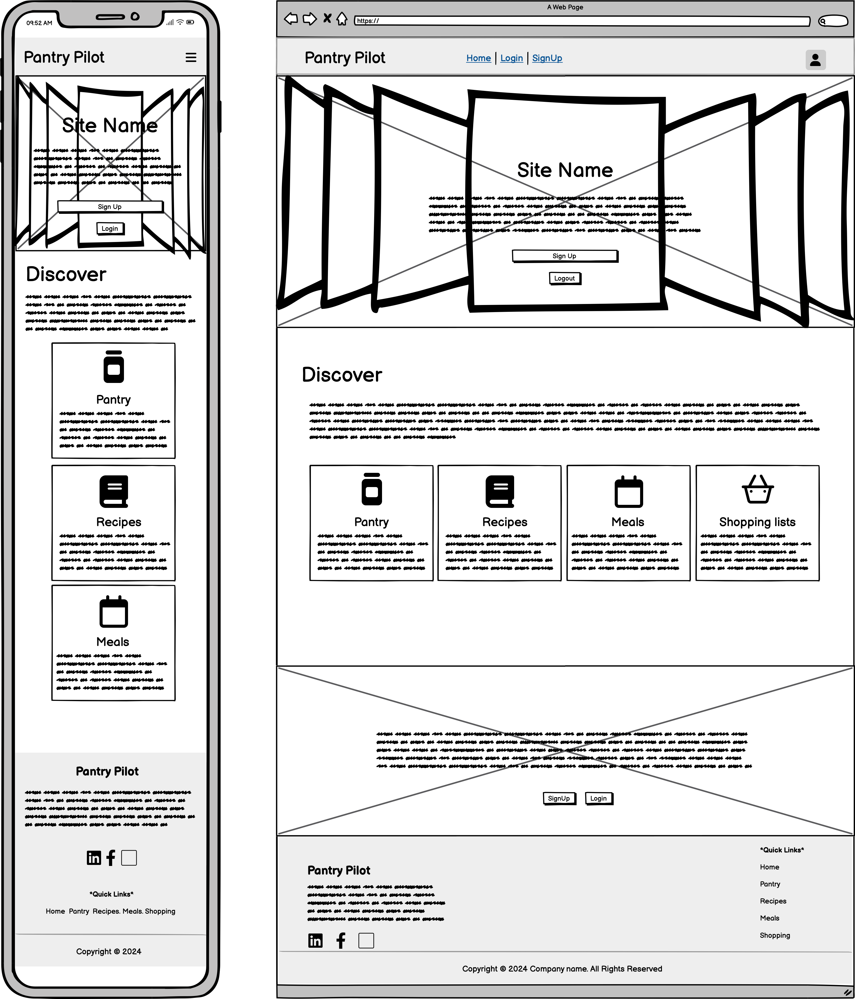
  <figcaption><strong>Figure 1:</strong> Home page view for unauthenticated users introducing site features
  <em>Only for unauthenticated users.</em>
  </figcaption>
</figure>

<figure>
  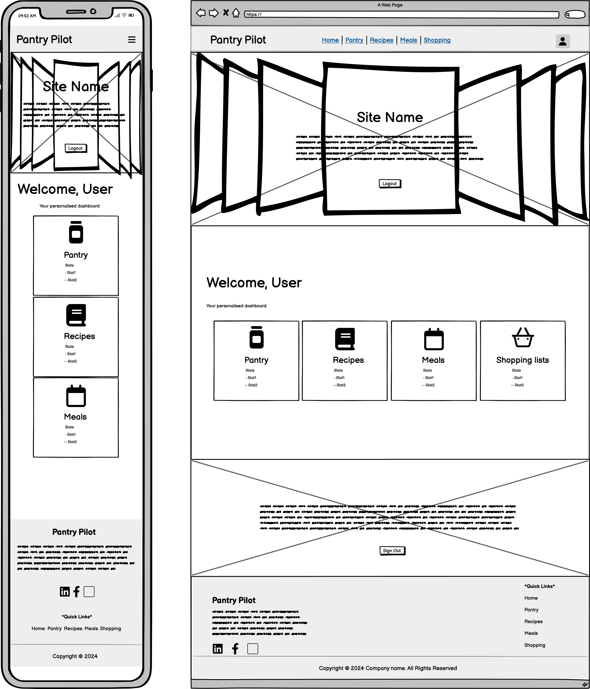
  <figcaption><strong>Figure 1:</strong> Home page view for authenticated users showing dashboard widgets
  <em>Only for authenticated users.</em>
  </figcaption>
</figure>

**2. Sign Up Page - Sprint 1**

<figure>
  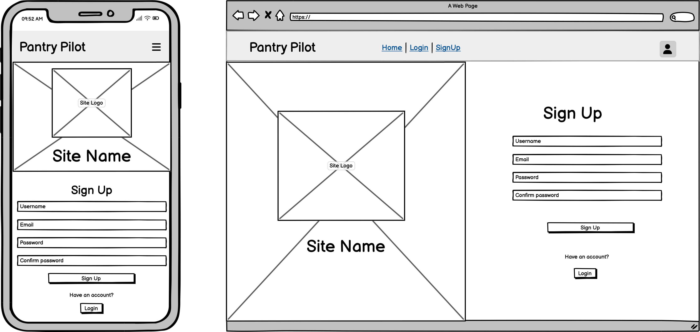
  <figcaption><strong>Figure 1:</strong> Signup page for user registration
  <em>Only for unauthenticated users.</em>
  </figcaption>
</figure>

**2. Login Page - Sprint 1**

<figure>
  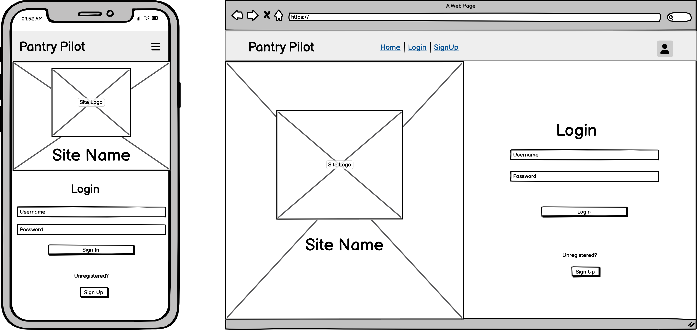
  <figcaption><strong>Figure 1:</strong> Login page for user sign in
  <em>Only for unauthenticated users.</em>
  </figcaption>
</figure>

**2. Logout Page - Sprint 1**

<figure>
  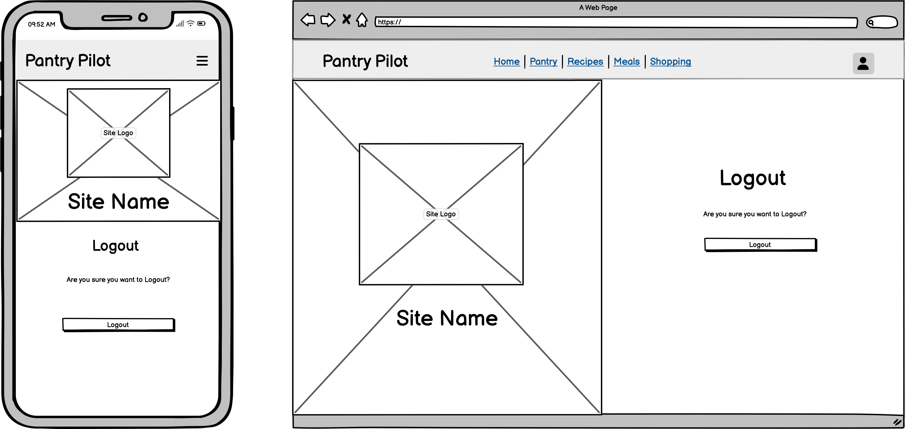
  <figcaption><strong>Figure 1:</strong> Logout page for user sign out
  <em>Only for authenticated users.</em>
  </figcaption>
</figure>

**2. Pantry List View - Sprint 1**

<figure>
  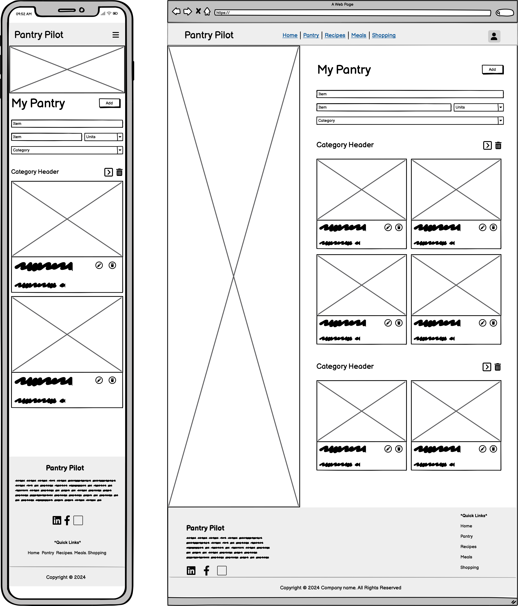
  <figcaption><strong>Figure 1:</strong> Pantry page wireframe showing the inventory management interface with category organization and item cards and Add/Update Form.
  <em>Only available to authenticated users.</em>
  </figcaption>
</figure>

**4. Recipe Search View - Sprint 2**

<figure>
  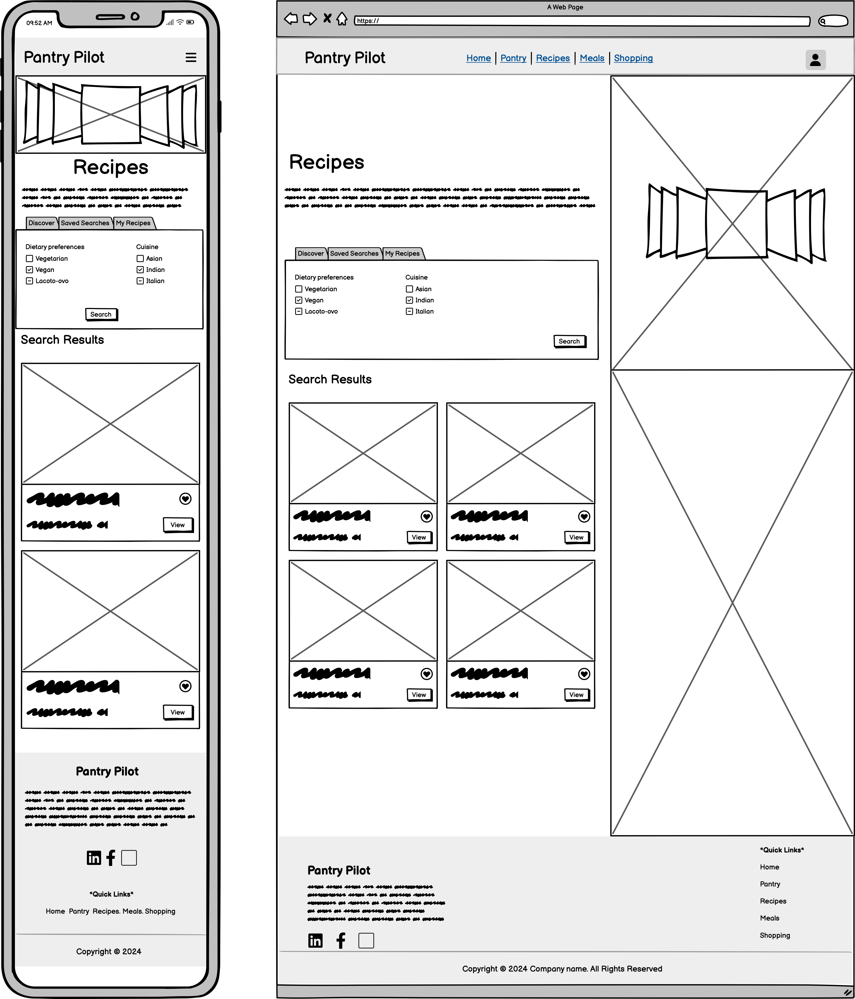
  <figcaption><strong>Figure 1:</strong> Recipe page wireframe showing the recipe search tab and saved recipes tab.
  <em>Only available to authenticated users.</em>
  </figcaption>
</figure>

**5. Recipe Detail View - Sprint 2**

<figure>
  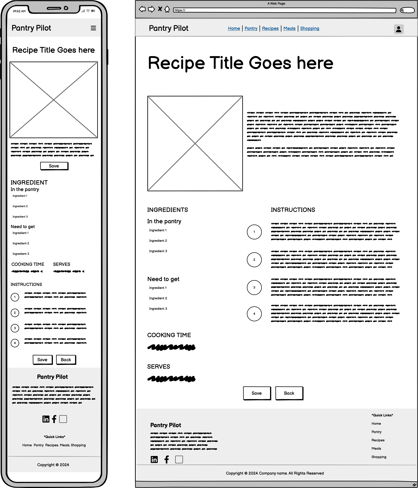
  <figcaption><strong>Figure 1:</strong> Recipe details page wireframe showing the ingredients, cooking instructions and save option for a recipe.
  <em>Only available to authenticated users.</em>
  </figcaption>
</figure>


**6. Weekly Meal Calendar - Sprint 3**

<figure>
  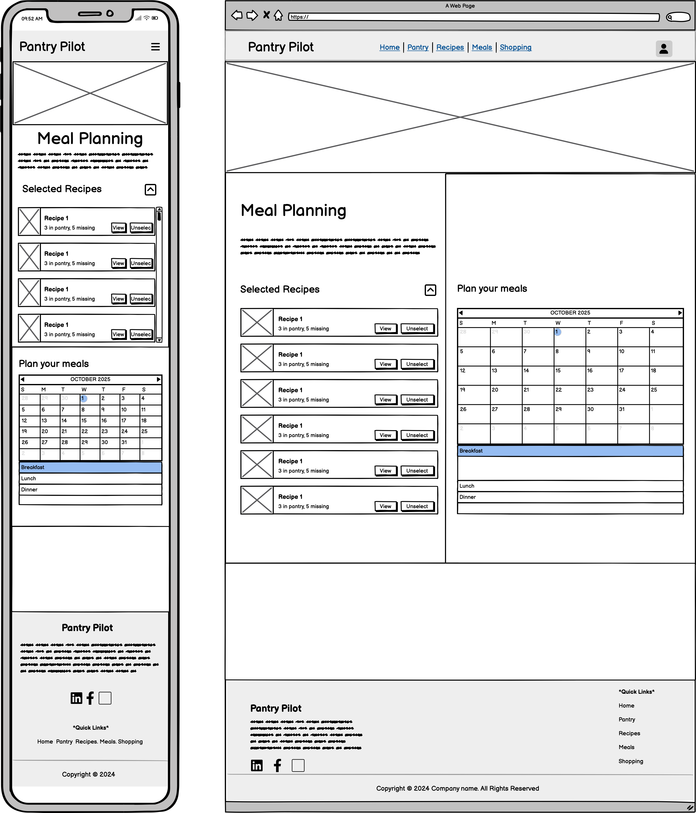
  <figcaption><strong>Figure 1:</strong> Meal planning page wireframe showing the selected recipes and meal planning calendar.
  <em>Only available to authenticated users.</em>
  </figcaption>
</figure>

**7. Shopping List View - Sprint 4**

<figure>
  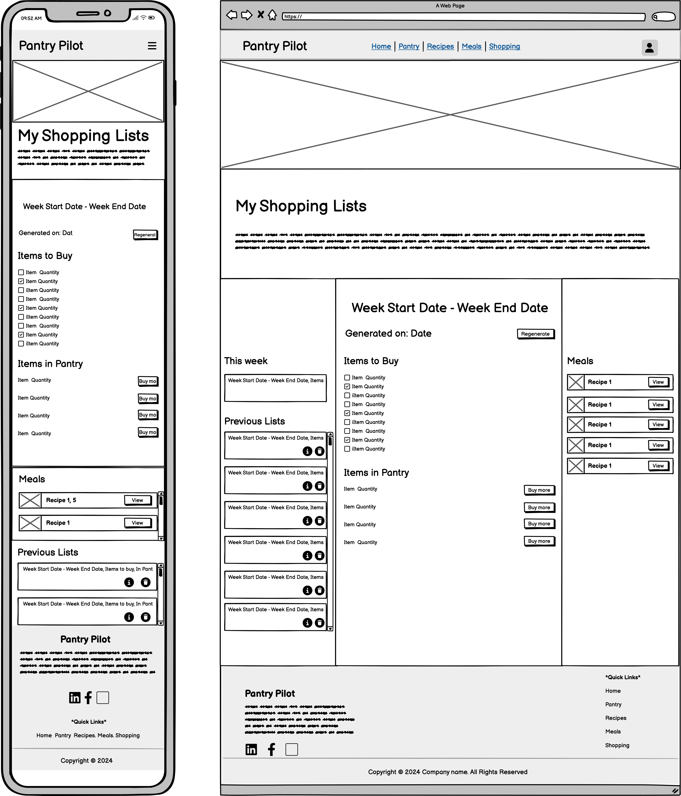
  <figcaption><strong>Figure 1:</strong> Shopping lists page wireframe showing the shopping list list view and detail view.
  <em>Only available to authenticated users.</em>
  </figcaption>
</figure>

</details>

### Surface Plane

<details>
    <summary>Surface plane considerations (Expand for details)</summary>

#### Color Palette

**Color Selection Process:**
Color combinations were evaluated using [Colormind.io](http://colormind.io/) to ensure optimal contrast ratios, brand consistency, and accessibility compliance. 

The warm red accent paired with vibrant blue creates a natural, food-focused aesthetic.

<figure>
  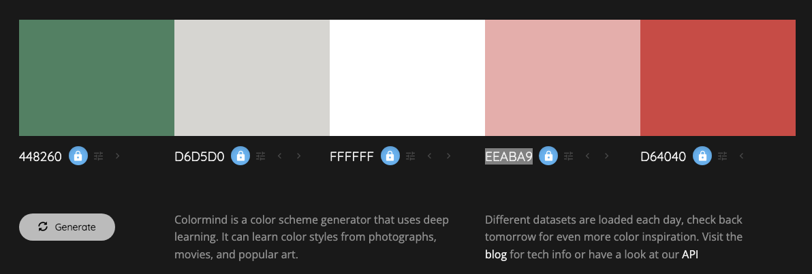
  <figcaption><strong>Figure 3:</strong> Complete color palette for PantryPilot showing primary brand colors, supporting colors.</figcaption>
</figure>

**Color Usage:**
**Primary Colors:**
- **Light Color**: `#FFFFFF` (White) - Primary background and text
- **Accent Color**: `#D64040` - Primary brand color for buttons and highlights
- **Secondary Accent**: `#0DCAF0` - Supporting accent for success states and secondary actions

**Supporting Colors:**
- **Secondary Light**: `#D6D5D0` - Subtle backgrounds and borders
- **Accent Light**: `#EEABA9` - Hover states and light accents

**Color Usage:**
- Primary navigation and key interactive elements use the main accent color
- Secondary buttons use the secondary accent
- Backgrounds maintain high contrast with white and light gray variations
- Color-blind friendly palette ensuring accessibility compliance

#### Typography

**Font Pairing Research:**

Typography combinations were evaluated using [Fontjoy.com](https://fontjoy.com/) to ensure optimal readability, visual hierarchy, and brand personality alignment. 

The serif-dominant approach reinforces the warm, traditional cooking aesthetic while maintaining modern digital usability.

<figure>
  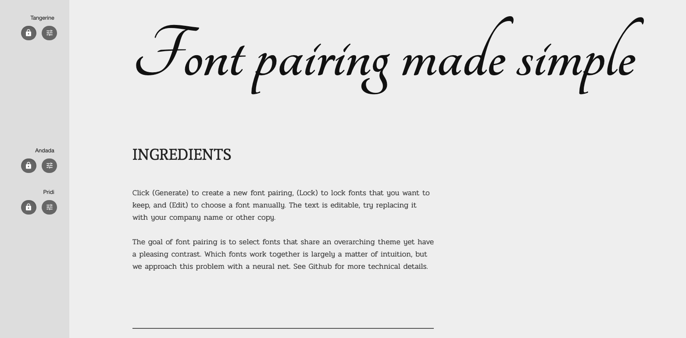
  <figcaption><strong>Figure 2:</strong> Typography hierarchy demonstrating the three-font system used throughout PantryPilot.</figcaption>
</figure>

**Font Stack:**
- **Primary Font**: "Pridi", serif - Body text and general content
- **Accent Font**: "Tangerine", cursive - Brand name and decorative headings  
- **Secondary Accent**: "Andada Pro", serif - Subheadings and emphasis text

**Typography Hierarchy:**
- **Brand/Logo**: Tangerine font for distinctive brand identity
- **Headings**: Andada Pro for clear content hierarchy
- **Body Text**: Pridi for optimal readability
- **Navigation**: Andada Pro with custom sizing using CSS variables

#### Imagery

**Visual Strategy and Selection:**

The imagery for PantryPilot was carefully curated from [Pexels.com](https://pexels.com/) and [Freepik](https://www.freepik.com/free-photos-vectors/png) to reinforce the website's core functionality and create an inviting, food-focused atmosphere. The visual strategy emphasizes fresh ingredients, organized kitchen spaces, and the joy of home cooking to align with the application's pantry management and meal planning features.

</details>


## Agile Methodology
Agile development flow was used for the project. 
The MVP for the project was organized into five focused sprints, each targeting a specific set of user stories and features. 
Regular sprint reviews, backlog refinement, and user testing were conducted to validate progress and prioritize enhancements, resulting in a user-centered application.

**Sprint Breakdown:**

**Sprint 1 (Foundation)**: Authentication + Basic Pantry
- Focus: Core user account management and basic pantry CRUD operations
- Deliverable: Users can register, login, and manage basic pantry inventory

**Sprint 2 (Recipe Discovery)**: Recipe Search + Recipe Management  
- Focus: Recipe discovery using pantry ingredients and basic recipe saving
- Deliverable: Users can find recipes based on available ingredients

**Sprint 3 (Planning Foundation)**: Meal Planning
- Focus: Meal calendar foundation and meal scheduling
- Deliverable: Users can plan weekly meals using saved recipes

**Sprint 4 (Shopping Integration)**: Shopping List Generation
- Focus: Generate shopping lists from meal plans with pantry comparison
- Deliverable: Complete meal planning to shopping workflow

**Sprint 5 (Polish & Enhancement)**: Advanced Pantry + Full Responsive + UX Improvements
- Focus: Advanced pantry features, mobile optimization and user experience enhancements
- Deliverable: MVP application with user-centered critical feature set

Github Project was used to manage and track project progress.
### GitHub issues for User stories
Github issues were created to capture each User Story. Task breakdown and Acceptance Criteria for each user story were also captured in the issues.

### MoSCoW prioritization
User stories were labelled as must-have, should-have, could-have and wont-have. Github labels were created for these prioritization and assigned to each user story.

### Github milestones for Sprints
The sprints were defined using Github Milestones. The user stories for core MVP features were assigned to five Sprints and the future enhancement user stories were assigned to a single Post-MVP sprint.

[Link to Project Sprints view](https://github.com/users/sthDINESH/projects/9/views/5)

<details>
     <summary>Expand to See Sprint View</summary>
<figure>
  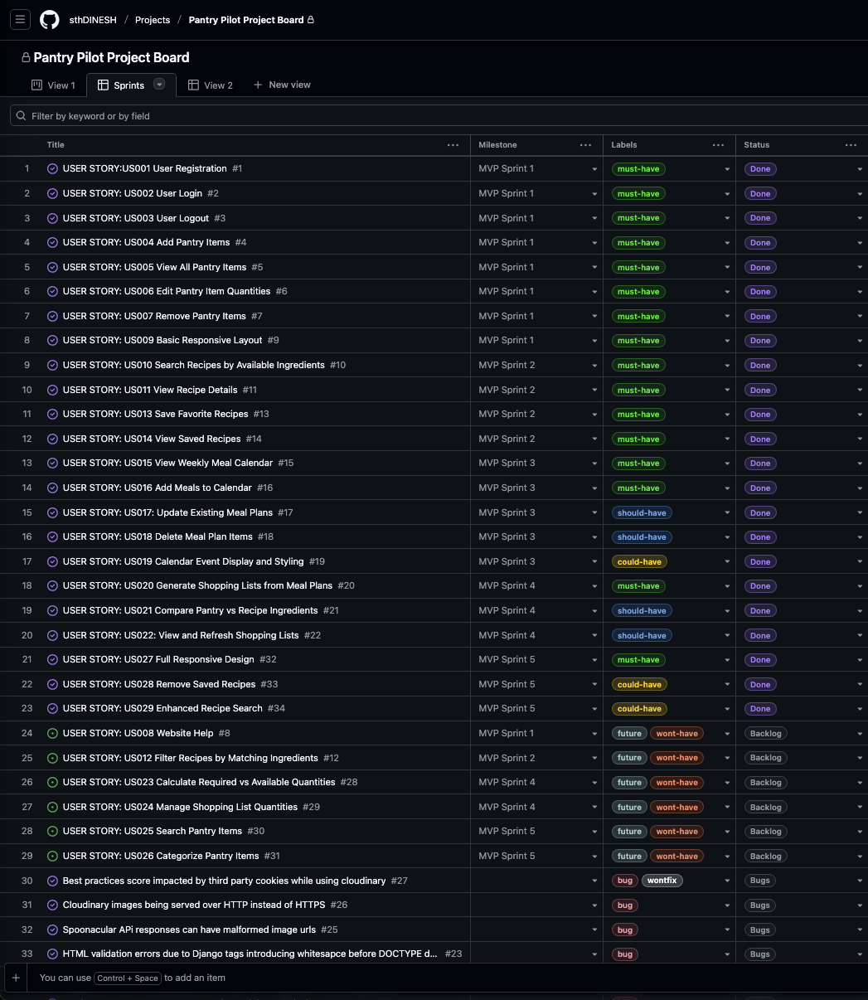
</figure>
</details>


### Kanban board
Kanban board was then created to provide a visual representation of project progress.

[Link to Kanban board](https://github.com/users/sthDINESH/projects/9/views/1)
<details>
     <summary>Expand to See Kanban board</summary>
<figure>
  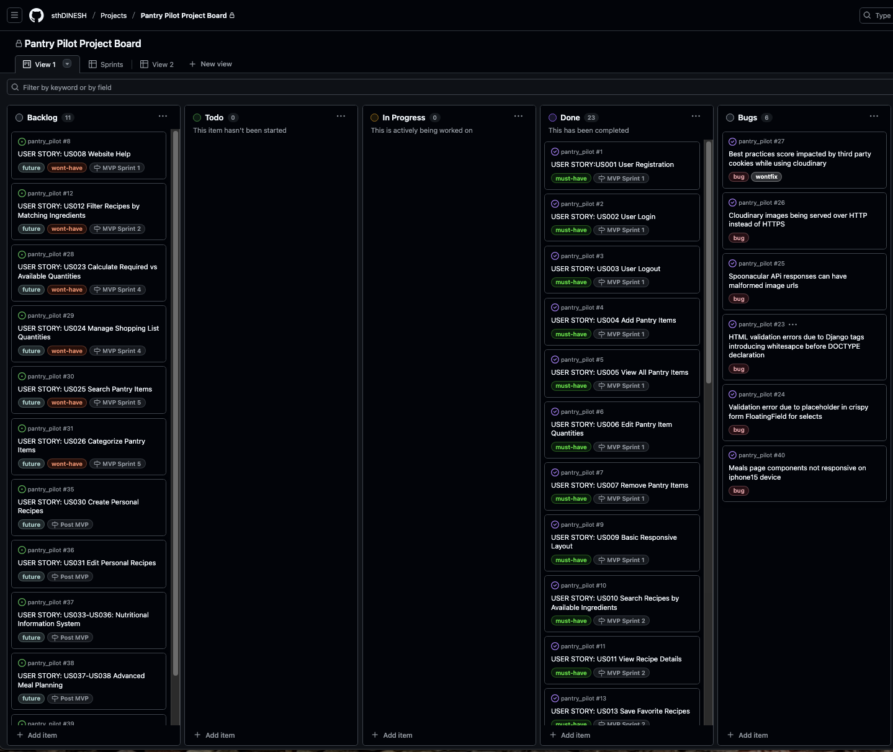
</figure>
</details>

## Entity Relationship Diagram for Database

The websites includes the following ORM Models

- **Category**: Represents a user-defined category for organizing pantry items (e.g., Dairy, Grains).
- **PantryItem**: Stores an individual pantry inventory item with quantity, units, and category for a user.
- **SavedRecipe**: Stores a recipe saved by a user, including details from external APIs or custom entries.
- **RecipeIngredient**: Represents a single ingredient (with quantity and units) belonging to a saved recipe.
- **MealPlanItem**: Represents a planned meal event, linking a user, a recipe, and a scheduled date/time.
- **ShoppingList**: Represents a shopping list generated for a user, typically for a specific week or meal plan.
- **ShoppingListItem**: Stores an individual item on a shopping list, including quantity, units, and status.

<details>
     <summary>Expand to View the Entity Relationship diagram for the website</summary>
<figure>
  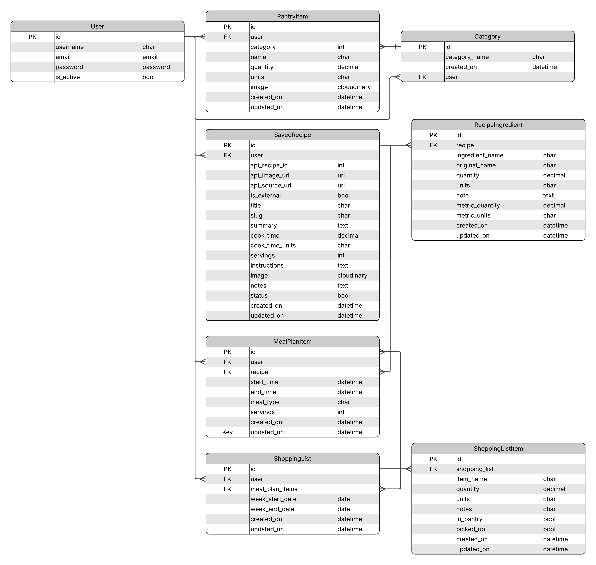
</figure>
</details>

## Features

### General features of the site

Each page of the site shares the following features:

#### Favicon

[Favicon.io](https://favicon.io/) was used to create a comprehensive favicon package for the site. 
The PantryPilot logo serves as the base design for all favicon variations, ensuring consistent brand recognition across different devices and platforms.

<details>
    <summary>(Expand for details)</summary>

The favicon package includes:

| Favicon File | Size | Purpose | Image |
|--------------|------|---------|-------|
| `favicon.ico` | 16x16, 32x32 | Standard favicon for browsers |  |
| `favicon-16x16.png` | 16x16 | 16x16 pixel PNG favicon |  |
| `favicon-32x32.png` | 32x32 | 32x32 pixel PNG favicon |  |
| `apple-touch-icon.png` | 180x180 | iOS devices touch icon |  |
| `android-chrome-192x192.png` | 192x192 | Android devices icon |  |
| `android-chrome-512x512.png` | 512x512 | Android devices high-res icon |  |
| `site.webmanifest` | N/A | Web app manifest file for PWA | N/A |

</details>

#### Navbar

The navigation bar provides access to all main application features across every page. 
It features a responsive Bootstrap design that adapts seamlessly to different screen sizes.

<details>
    <summary>(Expand for details)</summary>

**Key Features:**
- **Brand Logo**: PantryPilot logo and name linking to the dashboard
- **Fixed Position**: Stays at the top during scrolling for easy access
- **Responsive Design**: Collapses to hamburger menu on mobile devices
- **Active State Indicators**: Highlights the current page for clear navigation context
- **Nav link transitions**: CSS transitions on navigation links for user feedback
- **Authentication-Aware**: Shows different navigation options based on user login status

**Navigation Links (Authenticated Users):**
- Home - Landing page with user's personalized dashboard
- Pantry - Page for User's pantry inventory management
- Recipes - Recipe discovery and saved recipes
- Meals - Weekly meal planning calendar
- Shopping - Shopping list generation and management
- User Login status - Username display with dropdown menu to logout

<figure>
  
</figure>

<br clear="all">

<figure>
  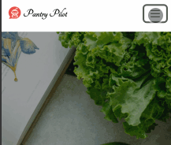
</figure>

**Navigation Links (Unauthenticated Users):**
- Home - Landing page with site introduction
- Sign In - User authentication page
- Sign Up - New user registration page

<figure>
  
</figure>

<br clear="all">

<figure>
  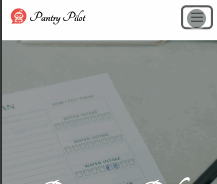
</figure>

</details>

#### Footer

The footer provides site information and maintains consistent branding across all pages. 
It features a responsive design that adapts to different screen sizes.

<details>
    <summary>(Expand for details)</summary>

**Key Features:**
- **Brand Identity**: PantryPilot logo text and tagline reinforcing the site's purpose
- **Site Description**: Concise explanation of the platform's value proposition
- **Social Media Links**: Access to site socials - Facebook, YouTube, Twitter, and Instagram home pages
- **Quick Navigation Links**: Easy access to main site features and pages, redirects to authentication pages for unauthorised users
- **Responsive Layout**: Adapts from single-column mobile to multi-column desktop layout
- **Consistent Styling**: Brand accent color background with light text for visual hierarchy
- **Copyright Information**: Legal footer with current year and rights statement

<figure>
  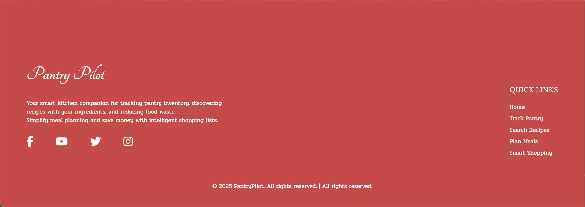
</figure>

**Responsive Behavior:**
- **Mobile**: Single-column vertical layout with centered content
- **Desktop**: Two-column horizontal layout with left-aligned content
- **Social Icons**: Maintains consistent spacing and accessibility across all screen sizes

<figure>
  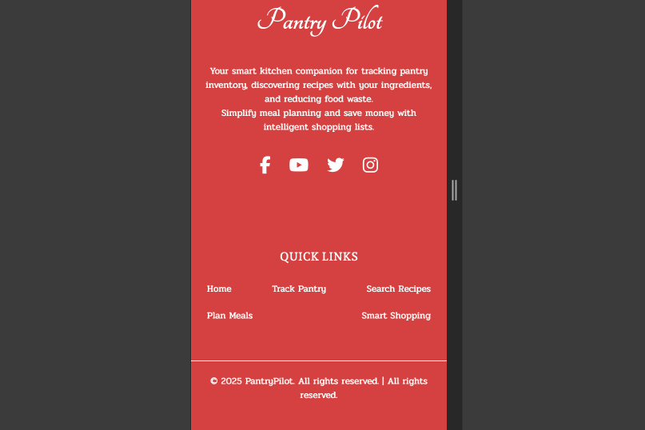
</figure>

</details>

#### Authorized Access Control

Defensive programming measures have been implemented to ensure only authorized users can access their personal data. 
All authenticated views use Django's `@login_required` decorator or `LoginRequiredMixin` class-based view mixin to prevent unauthorized access. 
User-specific data isolation is enforced through ownership validation before any CRUD operations. 
These measures ensure users can only access and modify their own pantry items, recipes, meal plans, and shopping lists, 
providing data privacy and security across all application features.


### Home Page
The home page serves as both a landing page for new users and a personalized dashboard for authenticated users, providing a welcoming introduction to the site's features and quick access to core functionality.

<details>
    <summary>(Expand for details)</summary>

**Key Features:**

**For Unauthenticated Users:**
- **Hero Carousel**: Dynamic image carousel showcasing key features (pantry management, recipes, meal planning, shopping)
- **Site Introduction**: Clear value proposition with tagline
- **Feature Overview Cards**: Visual introduction to four main features with descriptive text
- **Call-to-Action Buttons**: Prominent Sign Up and Login buttons for easy registration

<figure>
  
</figure>

**For Authenticated Users:**
- **Personalized Welcome**: Greeting with username and personalized dashboard message
- **Feature Access Cards**: Direct links to main application areas with current status:
  - **Your Pantry**: Shows available items count with "View All" link
  - **Discover Recipes**: Recipe search functionality access
  - **Upcoming Meal**: Displays next planned meal status
  - **Your Shopping Lists**: Shopping list management access

<figure>
  
</figure>

</details>

### Pantry Page

The pantry page allows users to view, add, update, and organize their pantry inventory. Items are grouped by category for easy navigation, and users can track quantities, units, and images for each ingredient. The interface supports quick edits, duplicate detection, and responsive design for seamless use on any device.

<details>
    <summary>(Expand for details)</summary>

**Key Features:**
- **Category Organization**: Items are grouped and displayed by user-defined categories.
- **Add/Update/Delete Items**: Easily manage pantry inventory with intuitive forms.
- **Quantity & Units Tracking**: Monitor exact amounts and measurement units for each item.
- **Image Upload**: Attach images to pantry items for visual reference.
- **Duplicate Detection**: Prevents duplicate entries and allows merging or updating quantities.
- **Responsive Layout**: Optimized for both desktop and mobile devices.
- **Validation & Feedback**: Real-time form validation and toast notifications for user actions.

<figure>
  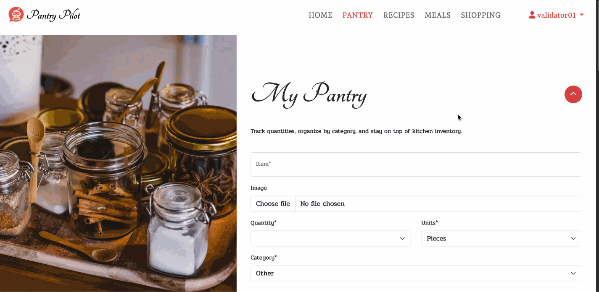
</figure>

</details>

### Recipes Page

The recipes page enables users to discover new recipes based on their pantry ingredients, search by cuisine or dietary preferences, and manage their personal collection of saved recipes. Users can view detailed recipe instructions, ingredient lists with pantry match indicators, and save or remove recipes for future use.

<details>
    <summary>(Expand for details)</summary>

**Key Features:**
- **Recipe Search**: Find recipes using available pantry ingredients, cuisine, or dietary filters.
- **Ingredient Matching**: Instantly see which ingredients are already in your pantry and which are missing.
- **Recipe Details**: View comprehensive recipe information including images, instructions, cook time, and servings.
- **Save & Remove Recipes**: Easily save favorite recipes to your personal collection or remove them as needed.
- **Tabbed Interface**: Switch between search results and your saved recipes for streamlined navigation.
- **Responsive Layout**: Optimized for both desktop and mobile devices.
- **API Integration**: Recipes are sourced from the Spoonacular API for variety and freshness.
- **Visual Feedback**: Toast notifications for save/remove actions and error handling for API issues.

<figure>
  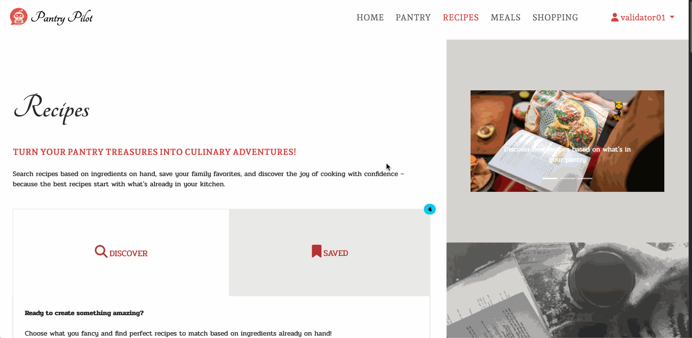
</figure>

</details>

### Recipe Detail page

The recipe detail page provides users with comprehensive information about a selected recipe, including an ingredient list with pantry match indicators, step-by-step cooking instructions, and recipe metadata such as cook time and servings. Users can save or remove recipes, and view which ingredients are already available in their pantry.

<details>
    <summary>(Expand for details)</summary>

**Key Features:**
- **Recipe Overview**: Displays recipe title, summary, and image.
- **Ingredient List**: Shows all required ingredients, with visual indicators for those already in the user's pantry.
- **Cooking Instructions**: Step-by-step instructions for preparing the recipe.
- **Cook Time & Servings**: Clearly displays preparation time and number of servings.
- **Save/Remove Recipe**: Allows users to save recipes to their collection or remove them if already saved.
- **Source Attribution**: Provides a link to the original recipe source when available.
- **Responsive Layout**: Optimized for both desktop and mobile viewing.
- **Visual Feedback**: Toast notifications for save/remove actions and error handling.

<figure>
  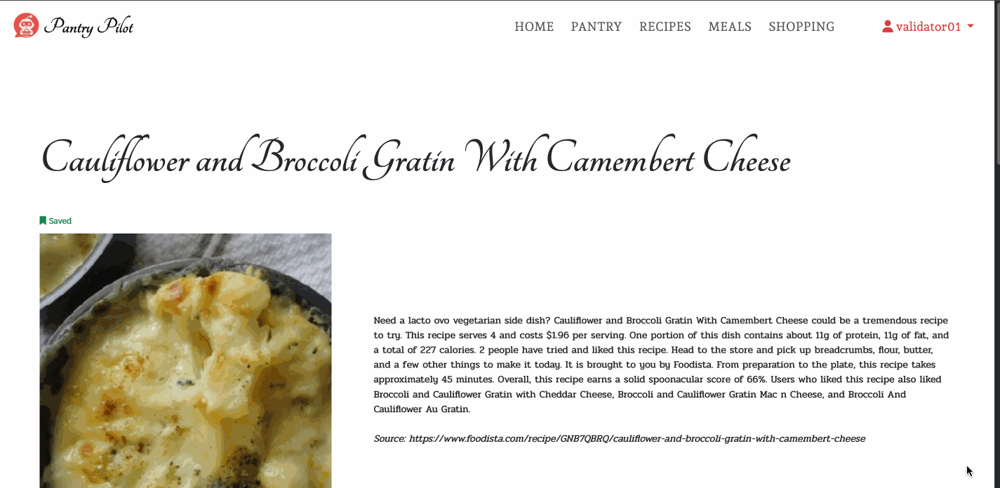
</figure>

</details>


### Meal Planning Page

The meal planning page provides an interactive weekly calendar for users to plan their meals using saved recipes. Users can assign recipes to specific days and meal times, update or remove planned meals, and visualize their weekly meal schedule. The calendar interface is fully responsive and integrates seamlessly with the shopping list generation workflow.

<details>
    <summary>(Expand for details)</summary>

**Key Features:**
- **Weekly Calendar View**: Visual calendar interface for planning meals by day and meal type.
- **Add Meals**: Assign saved recipes to specific dates and meal slots (breakfast, lunch, dinner, etc.).
- **Update & Delete Meals**: Edit or remove planned meals directly from the calendar modal.
- **Selected Meals Section**: Quickly select recipes for planning from your saved collection.
- **Meal Type & Servings**: Specify meal type and number of servings for each plan entry.
- **Clear Selection**: Remove all selected meals or clear the entire week's plan with one click.
- **Responsive Layout**: Optimized for both desktop and mobile devices.
- **Integration with Shopping Lists**: Generate shopping lists based on the current meal plan.

<figure>
  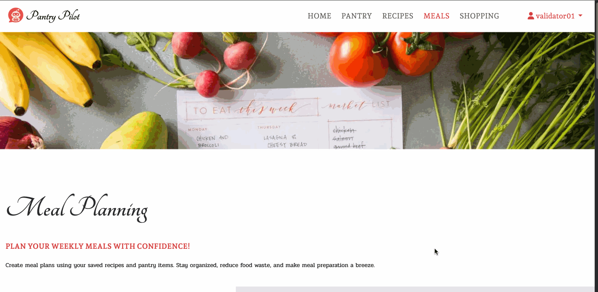
</figure>

</details>

### Shopping Lists Page

The shopping lists page allows users to automatically generate, view, and manage shopping lists based on their weekly meal plans and current pantry inventory. 
The page clearly separates items that need to be purchased from those already in the pantry, supports interactive check-off functionality, and provides options to refresh or delete lists as meal plans or pantry contents change.

<details>
    <summary>(Expand for details)</summary>

**Key Features:**
- **Auto-Generated Lists**: Instantly create shopping lists from planned meals, factoring in pantry stock.
- **Need to Buy vs. In Pantry**: Clearly separates missing ingredients from those already available.
- **Interactive Check-Off**: Check off items as you shop; checked state persists across sessions.
- **Refresh List**: Regenerate the list to reflect updates in meal plans or pantry inventory.
- **Delete List**: Remove outdated shopping lists with confirmation modal.
- **Planned Meals Overview**: Displays the meals associated with each shopping list for context.
- **Responsive Layout**: Optimized for both desktop and mobile devices.
- **Visual Feedback**: Toast notifications for actions like list creation, refresh, and item check-off.

<figure>
  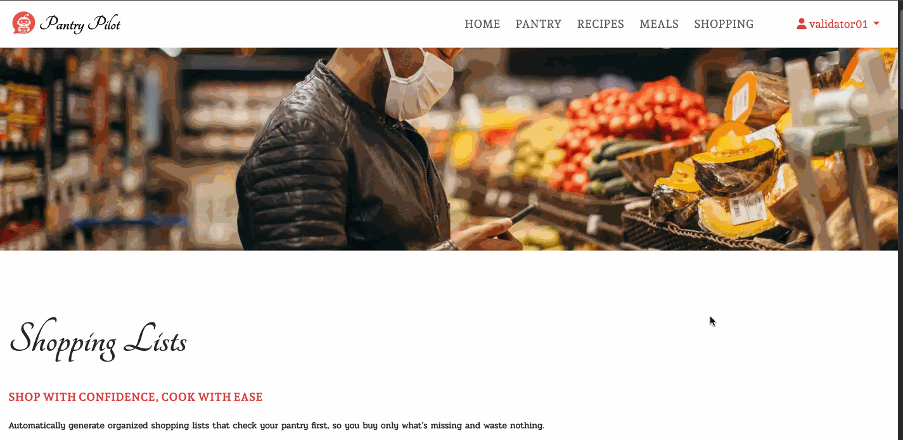
</figure>

</details>

### Sign Up Page

The sign up page allows new users to create their account.

<details>
    <summary>(Expand for details)</summary>

**Key Features**
- **Required Information**: Username, email address, and secure password confirmation
- **Form Validation**: Real-time client-side and server-side validation with clear error messaging
- **Responsive Layout**: Optimized for both desktop and mobile registration
- **Authentication Integration**: Seamless integration with Django Allauth for secure account creation
- **Login Redirect**: Displays direct link to login page for existing users
- **Password Requirements**: Enforced password complexity through Django with user-friendly guidance
- **CSRF Protection**: Django CSRF tokens for secure form submission
- **Duplicate Prevention**: Username and email uniqueness validation
- **Automatic Login**: Users are automatically logged in after successful registration
- **Dashboard Redirect**: Direct redirect to personalized dashboard upon successful registration

<figure>
  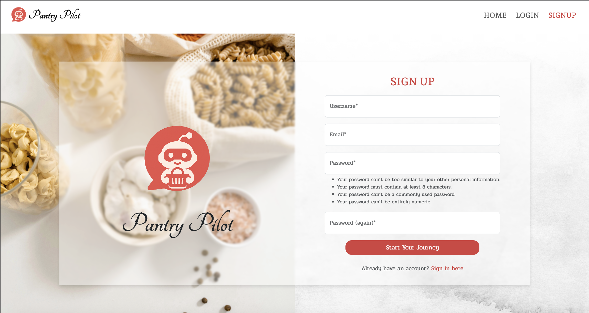
  </figcaption>
</figure>

</details>


### Sign In Page

The sign in page authenticates returning users and allows access to their personalized account and website features.

<details>
    <summary>(Expand for details)</summary>

**Key Features:**

- **Required Credentials**: Username and password authentication
- **Form Validation**: Real-time client-side and server-side validation with clear error messaging
- **Responsive Layout**: Optimized for both desktop and mobile authentication
- **Registration Link**: Direct link to signup page for new users
- **Authentication Integration**: Seamless integration with Django Allauth for secure login
- **CSRF Protection**: Django CSRF tokens for secure form submission
- **Password Security**: Secure password handling and validation
- **Failed Login Handling**: Clear error messages for authentication failures
- **Dashboard Redirect**: Direct redirect to personalized dashboard after successful login
- **Welcome Experience**: Seamless transition to authenticated user interface

<figure>
  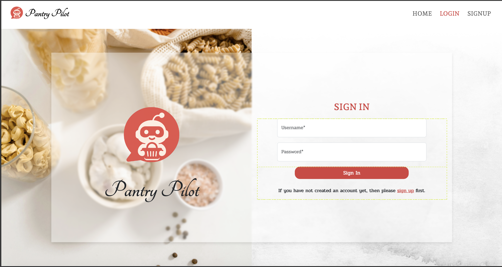
</figure>

</details>


### Sign Out Page

The sign out page provides a secure confirmation step for users to safely terminate their authenticated session and log out of their account.

<details>
    <summary>(Expand for details)</summary>

**Key Features:**

- **Confirmation Required**: Prevents accidental logout with explicit confirmation step
- **CSRF Protection**: Django CSRF tokens ensure secure logout process
- **Landing Redirect**: Returns users to the home page after successful logout
- **State Reset**: Clears all user-specific data from the interface
- **Success Feedback**: Toast notification confirming successful logout
- **Django Allauth**: Seamless integration with authentication system
- **Form Validation**: Proper form handling and CSRF validation

<figure>
  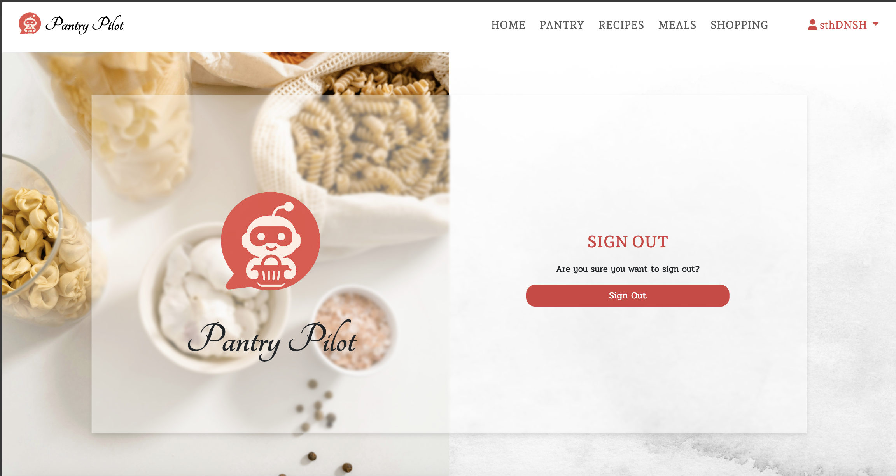
</figure>

</details>


## Technologies used

### Languages
- **HTML5** 
- **CSS3** 
- **JavaScript** 
- **Python**

### Database
- **PostgreSQL**

### Frameworks
- **[Django](https://docs.djangoproject.com/en/4.2/)** - Version 4.2.24 - Used as the website's framework providing user authentication, database ORM, template rendering, and MVT architecture for all application features.

- **[Bootstrap](https://getbootstrap.com/docs/5.3/getting-started/introduction/)** - Version 5.3.8 - Used to implement responsive design system, navigation components, form styling, and mobile-first layout across all pages.

### Libraries and packages

**Django Extensions & Authentication:**
- **[Django Allauth](https://django-allauth.readthedocs.io/en/latest/)** - Version 0.57.2 - Used to implement complete user authentication system including registration, login, logout, and account management features.
- **[Django Crispy Forms](https://django-crispy-forms.readthedocs.io/en/latest/)** - Version 2.4 - Used to render website forms with Bootstrap styling.
- **[Crispy Bootstrap 5](https://github.com/django-crispy-forms/crispy-bootstrap5)** - Version 0.7 - Used to integrate Bootstrap 5 components with crispy forms for modern, responsive form layouts.

**Database & Cloud Storage:**
- **[psycopg2](https://www.psycopg.org/docs/)** - Version 2.9.10 - Used to connect website's Django application to PostgreSQL database for all data operations and queries.
- **[dj-database-url](https://github.com/jazzband/dj-database-url)** - Version 0.5.0 - Used to configure website's database connection using environment variables for development and production deployments.
- **[Cloudinary](https://cloudinary.com/documentation/django_integration)** - Version 1.36.0 - Used to store and serve user uploaded static files and media assets with cloud-based optimization and CDN delivery.
- **[dj3-cloudinary-storage](https://github.com/klis87/dj3-cloudinary-storage)** - Version 0.0.6 - Used to integrate Cloudinary storage backend with Django for user media management.

**Deployment & Production:**
- **[Gunicorn](https://docs.gunicorn.org/en/latest/)** - Version 20.1.0 - Used as WSGI HTTP server for production deployment on Heroku.
- **[WhiteNoise](https://whitenoise.readthedocs.io/en/latest/)** - Version 5.3.0 - Used to serve static files directly from Django in production without requiring separate web server configuration.

**Text Processing & Algorithms:**
- **[RapidFuzz](https://rapidfuzz.github.io/RapidFuzz/)** - Version 3.14.1 - Used in ingredient matching system to find similar pantry items and suggest recipe ingredient substitutions with fuzzy string matching.

**Javascript libraries**
- **[FullCalendar](https://fullcalendar.io/)** - Version 6.1.19 - Used to implement PantryPilot's interactive meal planning calendar for scheduling recipes to specific dates and meal times.

### Programs Used

- **[Am I Responsive](https://ui.dev/amiresponsive)** - Used to create the responsive mockup images showing PantryPilot displayed across multiple device sizes for the README documentation.

- **[Balsamiq](https://balsamiq.com/)** - Used to create wireframes for all pages  during the UX design phase.

- **[Lucidchart](https://www.lucidchart.com/)** - Used to design and document the database schema, entity-relationship diagrams, and system architecture for data models and relationships.

- **[Favicon.io](https://favicon.io/)** - Used to generate the complete favicon package creating multiple sizes and formats from the site logo for cross-platform browser compatibility.

- **[Git](https://git-scm.com/)** - Used for version control throughout development.

- **[GitHub](https://github.com/)** - Used as the primary repository hosting service for source code, managing version control, issue tracking, and project documentation storage.

- **[Google Chrome DevTools](https://developer.chrome.com/docs/devtools/)** - Used extensively for debugging JavaScript functionality, testing responsive design across device sizes, troubleshooting CSS styling issues, and optimizing performance.

- **[Pip](https://pip.pypa.io/en/stable/)** - Used to install and manage all Python packages and dependencies for PantryPilot's Django project.

- **[GIMP](https://www.gimp.org/)** - Used for image resizing, cropping, and conversion to webP format for optimized web performance.

- **[Ezgif](https://ezgif.com/)** - Used for image compression and optimization to reduce file size for faster page loads.

- **[Figma](https://www.figma.com/)** - Used to design test page mockups, ensuring a consistent and user-friendly interface before implementation.


## Deployment

This website is deployed to Heroku from a GitHub repository, the following steps were taken:

### Creating Repository on GitHub
- First, make sure you are signed into [GitHub](https://github.com/).
- Click **New repository** from your GitHub dashboard.
- Enter the name for your new repository and an optional description.
- **Check the box to "Add a README file"** to initialize your repository with a README.
- Click **Create repository** to finish.
- Once the repository is created, you can clone it to your local machine using the **Code** button and selecting HTTPS, SSH, or GitHub CLI. Then, open the project in your preferred code editor to begin development.

### Creating an app on Heroku
- After creating the repository on GitHub, head over to [heroku](https://www.heroku.com/) and sign in.
- On the home page, click **New** and **Create new app** from the drop down.
- Give the app a name(this must be unique) and select a **region** I chose **Europe** as I am in Europe, Then click **Create app**.

### Create a database 
- Log into [CIdatabase maker](https://www.heroku.com/](https://dbs.ci-dbs.net/))
- add your email address in input field and submit the form
- open database link in your email
- paste database URL in your DATABASE_URL variable in env.py file and in Heroku config vars

### Deploying to Heroku.
- Head back over to [heroku](https://www.heroku.com/) and click on your **app** and then go to the **Settings tab**
- On the **settings page** scroll down to the **config vars** section and enter the **DATABASE_URL** which you will set equal to the DATABASE URL from previous step, create **Secret key** this can be anything,
**CLOUDINARY_URL** this will be set to your cloudinary url.
- Then scroll to the top and go to the **deploy tab** and go down to the **Deployment method** section and select **Github** and then sign into your account.
- Below that in the **search for a repository to connect to** search box enter the name of your repository that you created on **GitHub** and click **connect**
- Once it has been connected scroll down to the **Manual Deploy** and click **Deploy branch** when it has deployed you will see a **view app** button below and this will bring you to your newly deployed app.
- Please note that when deploying manually you will have to deploy after each change you make to your repository.

## Testing

Please refer to [TESTING.md](testing.md) for comprehensive testing performed.

## Credits

### Code
Code for navigation bar and different cards were copied and further refined using [Bootstrap 5](https://getbootstrap.com/docs/5.3/getting-started/introduction/) example code.

[Spoonacular API Docs](https://spoonacular.com/food-api/docs) was used to get the details for API integration with the project.

[Full Calendar Documentation](https://fullcalendar.io/docs) was used to get the details required to integrated Full Calendar JS library and calendar components.

[RapidFuzz documentation](https://rapidfuzz.github.io/RapidFuzz/index.html) was used to get the details required to implement a fuzzy search algorithm for fuzzy ingredient matching.

### Content

The text contents for the website was generated initially with the help of AI prompts and refined to suit the needs.

### Imagery

The imagery for the website was carefully curated from stock images from [Pexels.com](https://pexels.com/) and [Freepik](https://www.freepik.com/free-photos-vectors/png) to reinforce the website's core functionality and create an inviting, food-focused atmosphere.

### Iconography

All iconography in the website is picked from [FontAwesome](https://fontawesome.com/).

### Typography

The fonts in the website are imported from [Google Fonts](https://fonts.google.com/)


