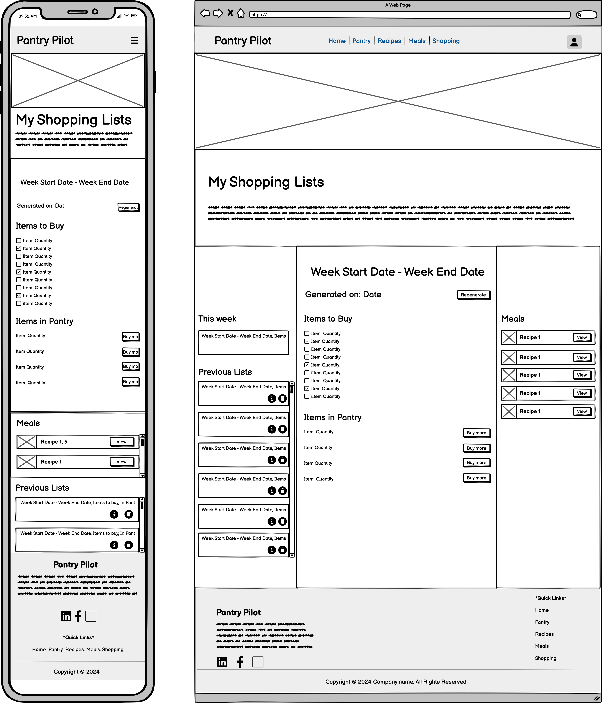
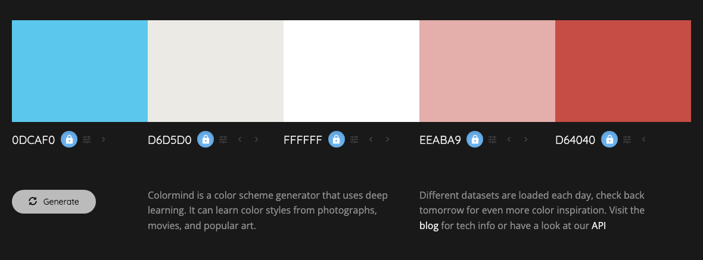

# PantryPilot - Smart Pantry Management System

## Table of Contents
1. [Project Summary](#project-summary)
   - [Technology Stack](#technology-stack)
   - [Website Preview](#website-preview)
   - [Core Features](#core-features)
   - [Future Enhancements](#future-enhancements)
2. [UX Design](#ux-design)
   - [Strategy Plane](#strategy-plane)
   - [Scope Plane](#scope-plane)
   - [Structure Plane](#structure-plane)
   - [Skeleton Plane](#skeleton-plane)

## Project Summary

PantryPilot is a comprehensive full-stack web application designed to help users efficiently manage their pantry inventory, discover recipes based on available ingredients, plan weekly meals, and generate smart shopping lists. The application combines intelligent ingredient tracking with meal planning capabilities to reduce food waste, save money, and streamline cooking experiences.

### Technology Stack
- **Frontend**: HTML5, CSS3, JavaScript (ES6+)
- **Backend**: Django Framework (Python)
- **Database**: PostgreSQL
- **Architecture**: Full-stack web application

### Website Preview

### Core Features

#### 1. Pantry Inventory Management
- **Add/Remove Items**: Simple interface for managing pantry contents
- **Quantity Tracking**: Monitor exact quantities of ingredients
- **Categories**: Organize items by type (spices, grains, proteins, etc.)
- **Search and Filter**: Quickly find specific ingredients

#### 2. Recipe Management System
- **Recipe Search**: Find recipes based on available pantry ingredients
- **Custom Recipe Storage**: Save, edit, and organize personal recipes
- **Cooking Instructions**: Step-by-step cooking guidance
- **Photo Integration**: Add images to recipes for visual reference

#### 3. Meal Planning Tools
- **Weekly Meal Planner**: Plan breakfast, lunch, and dinner for the week
- **Calendar Integration**: Visual calendar interface for meal planning

#### 4. Smart Shopping Lists
- **Auto-Generated Lists**: Create shopping lists based on planned meals
- **Missing Ingredients**: Identify ingredients needed for specific recipes

#### 5. User Interface and Experience
- **Responsive Design**: Works seamlessly on desktop, tablet, and mobile devices
- **Intuitive Navigation**: Easy-to-use interface with logical flow
- **Quick Actions**: Fast access to common tasks (add item, plan meal, create list)
- **Search Functionality**: Global search across ingredients, recipes, and meals
- **Dashboard**: Overview of pantry status, upcoming meal plans, and shopping needs

### Future Enhancements

#### 1. Advanced Pantry Management
- **Expiration Dates**: Track and receive alerts for expiring items
- **Barcode Scanning**: Quick item addition via barcode
- **Receipt Scanning** *(Could-Have Feature)*: Scan uploaded receipts to automatically update pantry items
- **Camera Receipt Scan** *(Could-Have Feature)*: Use mobile camera to scan receipts for instant updates

#### 2. Enhanced Recipe Features
- **Recipe Categories**: Organize recipes by meal type, cuisine, dietary restrictions
- **Ingredient Substitutions**: Suggest alternatives for missing ingredients

#### 3. Advanced Meal Planning
- **Family Preferences**: Account for different family member preferences
- **Portion Planning**: Calculate serving sizes and quantities needed
- **Batch Planning**: Plan multiple weeks in advance

#### 4. Enhanced Shopping Features
- **Store Organization**: Organize lists by store sections (produce, dairy, etc.)
- **Quantity Calculations**: Calculate exact quantities needed
- **Multiple Stores**: Manage different lists for different stores
- **Sharing Capability**: Share shopping lists with family members
- **Cost Tracking**: Monitor estimated and actual costs

#### 5. Nutritional Information System
- **Recipe Nutrition**: Display nutritional facts for each recipe
- **Weekly Nutrition Summary**: Overview of planned weekly nutrition
- **Dietary Tracking**: Track calories, macronutrients, vitamins, and minerals
- **Dietary Restrictions**: Filter recipes by dietary needs (vegetarian, gluten-free, etc.)
- **Health Goals**: Set and monitor nutritional goals

#### 6. Data Management and Insights
- **Usage Analytics**: Track ingredient usage patterns and trends
- **Export Options**: Export data for external use or backup
- **Data Backup**: Secure cloud storage of user data
- **Waste Reporting**: Monitor and report food waste reduction
- **Cost Tracking**: Track grocery spending and budget adherence

## UX Design

### Strategy plane

<details>
    <summary>
    Strategy plane considerations(Expand for details)
    </summary>

### Target Audience

#### Primary Personas

##### Busy Family Manager (35-45 years)
**Profile**: Working parent managing household groceries for family of 3-5
- **Pain Points**: Forgetting what's in pantry, duplicate purchases, meal planning stress
- **Goals**: Save time and money, reduce food waste, feed family well
- **Tech Comfort**: Moderate (uses smartphone apps regularly)
- **Frequency**: Daily pantry checks, weekly meal planning

##### Budget-Conscious Home Cook (30-50 years)
**Profile**: Price-sensitive shopper, enjoys cooking, wants to maximize value
- **Pain Points**: Overspending on groceries, food expiration waste
- **Goals**: Stretch grocery budget, use all purchased ingredients
- **Tech Comfort**: Moderate (uses apps for deals and coupons)
- **Frequency**: Weekly planning, daily pantry monitoring

##### College Student/Young Adult (18-25 years)
**Profile**: Learning to cook independently, limited budget
- **Pain Points**: Food management inexperience, tight budget
- **Goals**: Learn cooking skills, avoid food waste, eat well cheaply
- **Tech Comfort**: Very High (digital native)
- **Frequency**: Learning-based usage, irregular planning

### Secondary Personas

##### Health-Conscious Professional (25-35 years)
**Profile**: Single or couple, career-focused, health and nutrition aware
- **Pain Points**: Limited cooking time, ingredient waste, nutritional tracking
- **Goals**: Eat healthily, maximize ingredient usage, efficient meal prep
- **Tech Comfort**: High (early adopter of productivity apps)
- **Frequency**: Multiple daily interactions, batch meal planning

##### Empty Nester Couple (50-65 years)
**Profile**: Cooking for two, downsizing food purchases
- **Pain Points**: Adjusting portion sizes, avoiding overbuying
- **Goals**: Maintain cooking enjoyment, manage smaller quantities
- **Tech Comfort**: Moderate (selective app adoption)
- **Frequency**: Regular but relaxed usage

### Business Goals

#### Primary Business Objectives
1. **Reduce Food Waste**: Help users track ingredients to minimize food spoilage and environmental impact
2. **Cost Optimization**: Enable smart shopping decisions by avoiding duplicate purchases and maximizing ingredient usage
3. **Time Efficiency**: Streamline meal planning and grocery shopping processes to save users valuable time
4. **User Engagement**: Create an engaging, habit-forming application that users return to regularly

#### Secondary Business Objectives
5. **Health Awareness**: Provide nutritional insights for informed dietary decisions and healthier eating habits
6. **Market Positioning**: Position as a solution for modern household food management
7. **Portfolio Value**: Demonstrate full-stack development capabilities and UX design skills
8. **Scalability**: Build foundation for potential future enhancements or enterprise features

### User Goals

#### Primary User Goals

##### Inventory Management Goals
- **Real-time Tracking**: Maintain accurate, up-to-date inventory of pantry items
- **Quantity Management**: Monitor ingredient quantities and usage patterns
- **Easy Updates**: Simple interface for adding, removing, and updating items
- **Search & Filter**: Quickly find specific ingredients in their pantry
- **Visual Organization**: See pantry contents at a glance with clear categorization

##### Recipe Discovery Goals
- **Ingredient-Based Search**: Find recipes using available pantry ingredients
- **Recipe Variety**: Discover new recipes and cooking ideas
- **Custom Recipe Storage**: Save and organize personal favorite recipes

##### Meal Planning Goals
- **Weekly Planning**: Plan balanced meals for the entire week
- **Visual Calendar**: See meal plans in an organized calendar format
- **Preparation Coordination**: Plan meals considering prep time and complexity

##### Shopping Efficiency Goals
- **Smart Shopping Lists**: Generate lists for missing ingredients
- **Store Organization**: Shopping lists organized by store sections
- **Duplicate Prevention**: Avoid buying items already in pantry

#### Secondary User Goals
- **Nutritional Information**: Access nutritional data for recipes and ingredients
- **Nutritional Balance**: Ensure variety and nutrition across planned meals
- **Learning**: Improve cooking skills and food management knowledge
- **Sharing**: Share favorite recipes and meal plans with family/friends
- **Automation**: Reduce the stress of meal planning decisions
- **Customization**: Adapt the system to personal preferences and dietary needs

</details>

### Scope Plane

<details>
    <summary>Scope plane considerations(Expand for details)</summary>

#### Core User Stories

##### User Authentication Stories (Sprint 1)

- **US001: User Registration**: **AS A** new user **I WANT TO** create an account with email and password **SO THAT I CAN** save my pantry data and access personalized features
- **US002: User Login**: **AS A** returning user **I WANT TO** log into my account **SO THAT I CAN** access my personal pantry
- **US003: User Logout**: **AS A** logged in user **I WANT TO** log out of my account **SO THAT I CAN** secure my data when finished

##### Basic Pantry Management Stories (Sprint 1)

- **US004: Add Pantry Items**: **AS A** logged in user **I WANT TO** add ingredients to my pantry with name and quantity **SO THAT I CAN** track what I have available for cooking
- **US005: View All Pantry Items**: **AS A** logged in user **I WANT TO** see all my pantry items in a list **SO THAT I CAN** quickly review what ingredients I have
- **US006: Edit Pantry Item Quantities**: **AS A** logged in user **I WANT TO** update ingredient quantities **SO THAT I CAN** keep my pantry inventory accurate as I use items
- **US007: Remove Pantry Items**: **AS A** logged in user **I WANT TO** delete items from my pantry **SO THAT I CAN** remove ingredients I no longer have

##### Help and Navigation Stories (Sprint 1)

- **US008: Website Help**: **AS A** new user **I WANT TO** see website help and navigation guidance **SO THAT I CAN** understand how to use PantryPilot effectively
- **US009: Basic Responsive Layout**: **AS A** mobile user **I WANT TO** access basic pantry features on my phone **SO THAT I CAN** manage my pantry while shopping

##### Recipe Discovery Stories (Sprint 2)

- **US010: Search Recipes by Available Ingredients**: **AS A** home cook **I WANT TO** find recipes using ingredients I have in my pantry **SO THAT I CAN** cook meals without additional shopping
- **US011: View Recipe Details**: **AS A** cook **I WANT TO** see detailed recipe information including ingredients, instructions, and prep time **SO THAT I CAN** understand what's needed to make the recipe
- **US012: Filter Recipes by Matching Ingredients**: **AS A** home cook **I WANT TO** filter recipes by how many pantry ingredients they use **SO THAT I CAN** prioritize recipes requiring minimal shopping

##### Recipe Management Stories (Sprint 2)

- **US013: Save Favorite Recipes**: **AS A** cook **I WANT TO** save recipes I like to a favorites list **SO THAT I CAN** easily find them again for future cooking
- **US014: View Saved Recipes**: **AS A** cook **I WANT TO** see all my saved recipes in one place **SO THAT I CAN** browse my personal recipe collection

##### Meal Planning Foundation (Sprint 3)

- **US015: View Weekly Meal Calendar**: **AS A** organized cook **I WANT TO** see a weekly meal calendar interface **SO THAT I CAN** plan my meals for the week ahead
- **US016: Add Meals to Calendar**: **AS A** meal planner **I WANT TO** add specific recipes to calendar days and meal times **SO THAT I CAN** organize my weekly cooking schedule

##### Shopping List Generation (Sprint 4)

- **US017: Generate Shopping Lists from Meal Plans**: **AS A** meal planner **I WANT TO** automatically generate shopping lists based on my planned meals **SO THAT I CAN** buy ingredients needed for my weekly menu
- **US018: Compare Pantry vs Recipe Ingredients**: **AS A** meal planner **I WANT TO** see which recipe ingredients I already have **SO THAT I CAN** only buy what I need
- **US019: View and Edit Shopping Lists**: **AS A** shopper **I WANT TO** view and modify my generated shopping list **SO THAT I CAN** customize it before shopping

##### Advanced Pantry Features (Sprint 5)

- **US020: Search Pantry Items**: **AS A** user with many ingredients **I WANT TO** search my pantry by name **SO THAT I CAN** quickly find specific items
- **US021: Categorize Pantry Items**: **AS A** organized user **I WANT TO** view my pantry items organized by categories (spices, grains, proteins, etc.) **SO THAT I CAN** easily find ingredients by type

##### Enhanced User Experience (Sprint 5)

- **US022: Full Responsive Design**: **AS A** mobile user **I WANT TO** access all PantryPilot features on my phone **SO THAT I CAN** manage pantry, recipes, and meal planning while mobile
- **US023: Remove Saved Recipes**: **AS A** cook **I WANT TO** remove recipes from my favorites list **SO THAT I CAN** keep my saved recipes relevant
- **US024: Enhanced Recipe Search**: **AS A** cook **I WANT TO** search recipes by name, cuisine, or dietary restrictions **SO THAT I CAN** find specific types of meals

#### Future Enhancement Stories (Post-MVP)

##### Personal Recipe Management
- **US025: Create Personal Recipes**: **AS A** cook **I WANT TO** create and save my own recipes **SO THAT I CAN** store my family recipes digitally
- **US026: Edit Personal Recipes**: **AS A** cook **I WANT TO** edit my personal recipes **SO THAT I CAN** improve and update them over time

##### Nutritional Information System
- **US027: View Recipe Nutrition**: **AS A** health-conscious cook **I WANT TO** see nutritional information for recipes **SO THAT I CAN** make informed dietary choices
- **US028: View Ingredient Nutrition**: **AS A** health-conscious user **I WANT TO** access nutritional data for individual ingredients **SO THAT I CAN** understand the nutritional value of my pantry items
- **US029: Weekly Nutrition Summary**: **AS A** health-conscious meal planner **I WANT TO** see a nutritional summary of my planned weekly meals **SO THAT I CAN** ensure balanced nutrition across the week
- **US030: Nutritional Balance Tracking**: **AS A** health-conscious user **I WANT TO** track calories, macronutrients, vitamins, and minerals **SO THAT I CAN** monitor my nutritional intake
- **US031: Dietary Restriction Filtering**: **AS A** user with dietary needs **I WANT TO** filter recipes by dietary restrictions (vegetarian, gluten-free, etc.) **SO THAT I CAN** find recipes that match my dietary requirements

##### Advanced Meal Planning
- **US032: Family Preferences**: **AS A** family cook **I WANT TO** set dietary preferences for family members **SO THAT I CAN** plan meals that work for everyone
- **US033: Batch Meal Planning**: **AS A** organized planner **I WANT TO** plan multiple weeks at once **SO THAT I CAN** prepare for busy periods

##### Advanced Pantry Management
- **US034: Track Expiration Dates**: **AS A** user **I WANT TO** track expiration dates for pantry items **SO THAT I CAN** use ingredients before they spoil
- **US035: Expiration Alerts**: **AS A** user **I WANT TO** receive alerts for expiring items **SO THAT I CAN** prioritize using them

#### Updated Feature Prioritization Matrix

| Feature | Sprint | Priority | User Impact | Development Effort | MVP Status |
|---------|--------|----------|-------------|-------------------|------------|
| User Authentication (US001-US003) | 1 | High | High | Medium | ✅ Must Have |
| Basic Pantry Management (US004-US007) | 1 | High | High | Medium | ✅ Must Have |
| Help & Basic Mobile (US008-US009) | 1 | High | Medium | Low | ✅ Must Have |
| Recipe Discovery (US010-US012) | 2 | High | High | High | ✅ Must Have |
| Recipe Management (US013-US014) | 2 | Medium | Medium | Medium | ✅ Should Have |
| Meal Planning (US015-US016) | 3 | High | High | High | ✅ Must Have |
| Shopping Lists (US017-US019) | 4 | High | High | High | ✅ Must Have |
| Advanced Pantry (US020-US021) | 5 | Medium | High | Medium | ✅ Should Have |
| Enhanced UX (US022-US024) | 5 | Medium | High | Medium | ✅ Should Have |
| Personal Recipes (US025-US026) | Future | Low | Medium | High | ⚠️ Could Have |
| Nutritional Information (US027-US031) | Future | Low | Medium | High | ⚠️ Could Have |
| Advanced Planning (US032-US033) | Future | Low | Low | High | ❌ Won't Have |
| Expiration Tracking (US034-US035) | Future | Low | Low | Medium | ❌ Won't Have |

**Sprint Breakdown:**

**Sprint 1 (Foundation)**: Authentication + Basic Pantry + Help
- Focus: Core user account management and basic pantry CRUD operations
- Deliverable: Users can register, login, and manage basic pantry inventory

**Sprint 2 (Recipe Discovery)**: Recipe Search + Recipe Management  
- Focus: Recipe discovery using pantry ingredients and basic recipe saving
- Deliverable: Users can find recipes based on available ingredients

**Sprint 3 (Planning Foundation)**: Meal Planning
- Focus: Meal calendar foundation and meal scheduling
- Deliverable: Users can plan weekly meals using saved recipes

**Sprint 4 (Shopping Integration)**: Shopping List Generation
- Focus: Generate shopping lists from meal plans with pantry comparison
- Deliverable: Complete meal planning to shopping workflow

**Sprint 5 (Polish & Enhancement)**: Advanced Pantry + Full Responsive + UX Improvements
- Focus: Advanced pantry features, mobile optimization and user experience enhancements
- Deliverable: Production-ready application with full feature set

</details>

### Structure Plane

<details>
    <summary>Structure plane considerations (Expand for details)</summary>

#### Information Architecture

##### Site Map and Navigation Structure

```
PantryPilot (Root)
├── Authentication
│   ├── Registration (/accounts/register/)
│   ├── Login (/accounts/login/)
│   └── Logout (/accounts/logout/)
├── Dashboard (/)
│   ├── Pantry Overview Widget
│   ├── Recent Recipes Widget
│   └── Upcoming Meals Widget
├── Pantry Management (/pantry/)
│   ├── View All Items (/pantry/)
│   ├── Add Item (/pantry/)
│   ├── Edit Item (/pantry/item/<id>/update/)
│   ├── Delete Item (/pantry/item/<id>/delete/)
│   ├── Handle duplicates while adding (/pantry/item/<id>/resolve/)
│   └── Search & Filter (/pantry/?search=<term>&category=<cat>)
├── Recipe Discovery (/recipes/)
│   ├── Recipe Search (/recipes/)
│   ├── Recipe Details (/recipes/<id>/)
│   ├── Saved Recipes (/recipes/saved/)
│   └── Recipe by Ingredients (/recipes/search-by-ingredients/)
├── Meal Planning (/meals/)
│   ├── Weekly Calendar (/meals/)
│   ├── Add Meal (/meals/add/)
│   └── Edit Meal Plan (/meals/<week>/edit/)
├── Shopping Lists (/shopping/)
│   ├── View Lists (/shopping/)
│   ├── Generate from Meals (/shopping/generate/)
│   └── Edit List (/shopping/<id>/edit/)
└── Help & Support (/help/)
    └── Getting Started Guide
```

##### Content Hierarchy and Relationships

**Primary Content Objects:**
- **User**: Authenticates and owns all personal data
- **PantryItem**: Core inventory item with quantity and category
- **Recipe**: External/saved recipes with ingredients and instructions
- **MealPlan**: Weekly calendar entries linking recipes to specific dates/times
- **ShoppingList**: Generated lists based on meal plans vs. pantry comparison

**Content Relationships:**
```
User (1) ──→ (Many) PantryItem
User (1) ──→ (Many) SavedRecipe
User (1) ──→ (Many) MealPlan
User (1) ──→ (Many) ShoppingList

MealPlan (Many) ──→ (1) Recipe
Recipe (Many) ──→ (Many) Ingredient
PantryItem (Many) ──→ (1) Category
ShoppingList (1) ──→ (Many) MealPlan
```

##### Information Grouping Strategy

**Sprint 1 - Foundation Architecture:**
- User authentication and profile management
- Basic pantry CRUD operations with simple list/detail views
- Help documentation and onboarding flows

**Sprint 2 - Recipe Integration:**
- Recipe discovery with external API integration
- Recipe detail views with ingredient matching
- Saved recipes collection management

**Sprint 3 - Planning Architecture:**
- Calendar-based meal planning interface
- Weekly view with meal slots (breakfast/lunch/dinner)
- Recipe-to-meal assignment workflows

**Sprint 4 - Shopping Integration:**
- Shopping list generation algorithms
- Pantry vs. recipe ingredient comparison logic
- List management and editing interfaces

**Sprint 5 - Enhanced Organization:**
- Advanced search and filtering systems
- Category-based organization for pantry items
- Mobile-responsive navigation patterns

#### Interaction Design

##### Core User Workflows

**1. New User Onboarding Flow**
```
Landing Page → Registration → Welcome Tour → Add First Pantry Items → Dashboard
```

**2. Daily Pantry Management Flow**
```
Dashboard → Pantry View → [Add/Edit/Remove Items] → Updated Dashboard
```

**3. Recipe Discovery and Saving Flow**
```
Dashboard → Recipe Search → Filter by Available Ingredients → View Recipe Details → Save to Favorites
```

**4. Weekly Meal Planning Flow**
```
Dashboard → Meal Calendar → Select Day/Meal → Browse Saved Recipes → Assign Recipe → Complete Week
```

**5. Shopping List Generation Flow**
```
Meal Calendar → Generate Shopping List → Review Missing Ingredients → Edit List → Shopping Mode
```

##### Navigation Patterns

**Primary Navigation (Always Visible):**
- Dashboard (Home icon)
- Pantry (Pantry icon)
- Recipes (Recipe book icon)
- Meal Planning (Calendar icon)
- Shopping Lists (Shopping cart icon)

**Secondary Navigation (Contextual):**
- Search functionality (Global header)
- User account menu (Profile dropdown)
- Help/Support (Question mark icon)
- Mobile hamburger menu (Responsive)

**Breadcrumb Navigation:**
- Enabled for deep content paths
- Format: Dashboard > Pantry > Add Item
- Skip for single-level pages

##### Interaction Patterns

**Quick Actions (Dashboard):**
- "Add Pantry Item" floating action button
- "Find Recipes" based on available ingredients
- "Plan Today's Meal" quick calendar access
- "Generate Shopping List" if meals planned

**Search and Filter Interactions:**
- Real-time search with debounced input
- Filter chips for categories, dietary restrictions
- Sort options for alphabetical, date added, quantity
- Clear all filters option

**Form Interactions:**
- Inline validation with immediate feedback
- Auto-save for lengthy forms (meal planning)
- Confirmation dialogs for destructive actions
- Progress indicators for multi-step processes

**Mobile-Specific Interactions:**
- Swipe gestures for delete/edit actions
- Pull-to-refresh for data updates
- Touch-friendly button sizing (44px minimum)
- Bottom navigation for primary actions

##### Progressive Disclosure Strategy

**Dashboard Information Hierarchy:**
```
Level 1: Critical alerts (low stock, expiring items)
Level 2: Quick stats (pantry count, planned meals)
Level 3: Recent activity and recommendations
Level 4: Detailed insights and analytics
```

**Pantry Management Hierarchy:**
```
Level 1: Item name, quantity, basic category
Level 2: Last updated date, usage frequency
Level 3: Detailed nutrition info, expiration dates
Level 4: Purchase history, cost tracking
```

**Recipe Information Hierarchy:**
```
Level 1: Recipe title, image, cook time, difficulty
Level 2: Ingredient list with pantry match indicators
Level 3: Detailed instructions and tips
Level 4: Nutritional information and user reviews
```

##### Error Handling and Feedback

**Error Prevention:**
- Form validation before submission
- Confirmation dialogs for destructive actions
- Auto-save drafts for complex forms
- Offline capability with sync notifications

**Error Recovery:**
- Clear error messages with suggested actions
- Undo functionality for accidental deletions
- Form state preservation after errors
- Alternative paths for failed operations

**Success Feedback:**
- Toast notifications for completed actions
- Visual state changes (checkmarks, color updates)
- Progress indicators for ongoing processes
- Achievement badges for milestones

##### Accessibility Considerations

**Keyboard Navigation:**
- Tab order follows logical content flow
- Skip links for main content areas
- Keyboard shortcuts for frequent actions
- Focus indicators clearly visible

**Screen Reader Support:**
- Semantic HTML structure with proper headings
- Alt text for all images and icons
- ARIA labels for complex interactions
- Live regions for dynamic content updates

**Visual Accessibility:**
- High contrast color schemes
- Scalable text up to 200% zoom
- Clear visual hierarchy with sufficient spacing
- Color-blind friendly design choices

#### Technical Architecture Considerations

##### Django App Structure
```
pantry_pilot/
├── accounts/          # User authentication and profiles
├── pantry/           # Pantry inventory management
├── recipes/          # Recipe discovery and management
├── meals/            # Meal planning functionality
├── shopping/         # Shopping list generation
├── core/             # Shared utilities and base templates
└── static/           # CSS, JavaScript, images
```

##### Database Relationship Design
- User-centric data isolation for privacy
- Optimized queries for dashboard widgets
- Efficient filtering for recipe searches
- Scalable architecture for future features

##### API Integration Points
- External recipe API for discovery
- Potential barcode scanning integration
- Future nutritional data services
- Shopping list sharing capabilities

</details>

### Skeleton Plane

<details>
    <summary>Skeleton plane considerations (Expand for details)</summary>

#### Interface Design and Wireframes

##### Layout Principles

**Grid System:**
- 12-column responsive grid for desktop layouts
- Mobile-first approach with breakpoints at 768px, 992px, and 1200px
- Consistent spacing using 8px baseline grid
- Maximum content width of 1200px with centered alignment

**Navigation Architecture:**
- Fixed top navigation bar with brand logo and primary navigation
- Breadcrumb navigation for deep content paths
- Mobile hamburger menu for responsive navigation
- Persistent user account and logout options in header

##### Core Page Wireframes

**1. Dashboard (Home Page) - Sprint 1**
```
┌─────────────────────────────────────────────────────────┐
│ Header: [Logo] [Nav: Pantry|Recipes|Meals|Shopping] [User]│
├─────────────────────────────────────────────────────────┤
│ Hero Section                                            │
│ ┌─────────────────────────────────────────────────────┐ │
│ │ Welcome to PantryPilot                              │ │
│ │ [Quick Add Item] [Find Recipes] [Plan Meal Today]   │ │
│ └─────────────────────────────────────────────────────┘ │
│                                                         │
│ Dashboard Widgets (3-column layout)                    │
│ ┌─────────────┐ ┌─────────────┐ ┌─────────────────────┐ │
│ │Pantry Stats │ │Recent       │ │Upcoming Meals       │ │
│ │• 24 Items   │ │Recipes      │ │Today: Pasta         │ │
│ │• 3 Low Stock│ │• Saved: 12  │ │Tomorrow: Salad      │ │
│ │[View All]   │ │• Recent: 5  │ │[View Calendar]      │ │
│ └─────────────┘ └─────────────┘ └─────────────────────┘ │
│                                                         │
│ Help Section                                           │
│ ┌─────────────────────────────────────────────────────┐ │
│ │ Getting Started Guide                               │ │
│ │ [Add Your First Item] [Explore Recipes]             │ │
│ └─────────────────────────────────────────────────────┘ │
└─────────────────────────────────────────────────────────┘
```

**2. Pantry List View with Add/Update Item Form - Sprint 1**

<figure>
  
  <figcaption><strong>Figure 1:</strong> Pantry page wireframe showing the inventory management interface with category organization and item cards and Add/Update Form.
  <em>Only available to authenticated users.</em>
  </figcaption>
</figure>

**4. Recipe Search View - Sprint 2**
```
┌─────────────────────────────────────────────────────────┐
│ Header: [Logo] [Nav: Pantry|RECIPES|Meals|Shopping] [User]│
├─────────────────────────────────────────────────────────┤
│ Breadcrumb: Dashboard > Recipes                        │
│                                                         │
│ Search Section                                         │
│ ┌─────────────────────────────────────────────────────┐ │
│ │ Find Recipes Using Your Pantry                      │ │
│ │ [Search by recipe name.............] [Search]       │ │
│ │ [☑] Show recipes I can make now                     │ │
│ │ [☐] Include recipes with missing ingredients        │ │
│ └─────────────────────────────────────────────────────┘ │
│                                                         │
│ Recipe Results (Grid Layout)                           │
│ ┌─────────────┐ ┌─────────────┐ ┌─────────────┐         │
│ │┌───────────┐│ │┌───────────┐│ │┌───────────┐│         │
│ ││Recipe IMG ││ ││Recipe IMG ││ ││Recipe IMG ││         │
│ │└───────────┘│ │└───────────┘│ │└───────────┘│         │
│ │Pasta Salad  │ │Stir Fry     │ │Tomato Soup  │         │
│ │⭐⭐⭐⭐⭐      │ │⭐⭐⭐⭐       │ │⭐⭐⭐⭐⭐       │         │
│ │✓ 5/6 items  │ │✓ 4/7 items  │ │✓ 3/5 items  │         │
│ │30 min       │ │20 min       │ │45 min       │         │
│ │[View][💖]   │ │[View][💖]   │ │[View][💖]   │         │
│ └─────────────┘ └─────────────┘ └─────────────┘         │
└─────────────────────────────────────────────────────────┘
```

**5. Recipe Detail View - Sprint 2**

<figure>
  
  <figcaption><strong>Figure 1:</strong> Recipe details page wireframe showing the ingredients, cooking instructions and save option for a recipe.
  <em>Only available to authenticated users.</em>
  </figcaption>
</figure>


**6. Weekly Meal Calendar - Sprint 3**
```
┌─────────────────────────────────────────────────────────┐
│ Header: [Logo] [Nav: Pantry|Recipes|MEALS|Shopping] [User]│
├─────────────────────────────────────────────────────────┤
│ Breadcrumb: Dashboard > Meal Planning                  │
│                                                         │
│ Calendar Header                                        │
│ ┌─────────────────────────────────────────────────────┐ │
│ │ Week of March 11-17, 2024   [< Previous] [Next >]  │ │
│ │ [Generate Shopping List] [Clear Week] [+ Add Meal]  │ │
│ └─────────────────────────────────────────────────────┘ │
│                                                         │
│ Weekly Calendar Grid                                   │
│ ┌────┬────────┬────────┬────────┬────────┬────────┬────┐ │
│ │    │ Mon 11 │ Tue 12 │ Wed 13 │ Thu 14 │ Fri 15 │... │ │
│ ├────┼────────┼────────┼────────┼────────┼────────┼────┤ │
│ │🌅  │Oatmeal │Smoothie│Pancakes│Cereal  │Toast   │... │ │
│ │    │[Edit]  │[Edit]  │[Edit]  │[Edit]  │[+]     │    │ │
│ ├────┼────────┼────────┼────────┼────────┼────────┼────┤ │
│ │🌞  │Salad   │Leftover│Sandwich│Soup    │[+]     │... │ │
│ │    │[Edit]  │[Edit]  │[Edit]  │[Edit]  │        │    │ │
│ ├────┼────────┼────────┼────────┼────────┼────────┼────┤ │
│ │🌙  │Pasta   │Stir Fry│Tacos   │Pizza   │[+]     │... │ │
│ │    │[Edit]  │[Edit]  │[Edit]  │[Edit]  │        │    │ │
│ └────┴────────┴────────┴────────┴────────┴────────┴────┘ │
└─────────────────────────────────────────────────────────┘
```

**7. Shopping List View - Sprint 4**

<figure>
  
  <figcaption><strong>Figure 1:</strong> Shopping lists page wireframe showing the shopping list list view and detail view.
  <em>Only available to authenticated users.</em>
  </figcaption>
</figure>
```
┌─────────────────────────────────────────────────────────┐
│ Header: [Logo] [Nav: Pantry|Recipes|Meals|SHOPPING] [User]│
├─────────────────────────────────────────────────────────┤
│ Breadcrumb: Dashboard > Shopping Lists                 │
│                                                         │
│ List Header                                            │
│ ┌─────────────────────────────────────────────────────┐ │
│ │ Shopping List for Week of March 11-17              │ │
│ │ Generated from meal plan • 12 items                 │ │
│ │ [🖨️ Print] [📤 Share] [✏️ Edit] [🔄 Regenerate]     │ │
│ └─────────────────────────────────────────────────────┘ │
│                                                         │
│ Shopping Categories                                    │
│ ┌─────────────────────────────────────────────────────┐ │
│ │ 🥬 Produce                                          │ │
│ │ ☐ Lettuce (1 head) - for Monday salad              │ │
│ │ ☐ Avocado (2) - for Wednesday tacos                │ │
│ │ ☐ Bell peppers (3) - for Tuesday stir fry          │ │
│ ├─────────────────────────────────────────────────────┤ │
│ │ 🧀 Dairy                                            │ │
│ │ ☐ Feta cheese (1 container) - for pasta salad      │ │
│ │ ☐ Milk (1 gallon) - for cereal                     │ │
│ ├─────────────────────────────────────────────────────┤ │
│ │ 🥩 Meat & Seafood                                   │ │
│ │ ☐ Ground beef (1 lb) - for tacos                   │ │
│ │ ☐ Chicken breast (2 lbs) - for stir fry            │ │
│ └─────────────────────────────────────────────────────┘ │
│                                                         │
│ [Mark All Complete] [Clear Completed]                  │
└─────────────────────────────────────────────────────────┘
```

**8. Mobile Navigation (Responsive)**
```
Mobile Breakpoint (<768px):

┌─────────────────────────┐
│ [☰] PantryPilot    [👤] │
├─────────────────────────┤
│                         │
│ Dashboard Content       │
│ (Stacked single column) │
│                         │
│ ┌─────────────────────┐ │
│ │ Pantry Stats        │ │
│ │ • 24 Items          │ │
│ │ • 3 Low Stock       │ │
│ └─────────────────────┘ │
│                         │
│ ┌─────────────────────┐ │
│ │ Recent Recipes      │ │
│ │ • Saved: 12         │ │
│ └─────────────────────┘ │
│                         │
│ ┌─────────────────────┐ │
│ │ Upcoming Meals      │ │
│ │ Today: Pasta        │ │
│ └─────────────────────┘ │
│                         │
├─────────────────────────┤
│ [🏠][🥫][📚][📅][🛒]    │
└─────────────────────────┘

Hamburger Menu Expanded:
┌─────────────────────────┐
│ [×] Navigation     [👤] │
├─────────────────────────┤
│ 🏠 Dashboard            │
│ 🥫 My Pantry            │
│ 📚 Recipes              │
│ 📅 Meal Planning        │
│ 🛒 Shopping Lists       │
│ ❓ Help & Support       │
│ ⚙️ Settings             │
│ 🚪 Logout               │
└─────────────────────────┘
```

##### Unauthenticated User Wireframes

**1. Landing Page (Home) - Unauthenticated**
```
┌─────────────────────────────────────────────────────────┐
│ Header: [Logo] PantryPilot              [Login][Sign Up]│
├─────────────────────────────────────────────────────────┤
│ Hero Section                                            │
│ ┌─────────────────────────────────────────────────────┐ │
│ │             Welcome to PantryPilot                  │ │
│ │        Smart Pantry Management Made Simple          │ │
│ │                                                     │ │
│ │ • Track your pantry inventory                       │ │
│ │ • Find recipes with available ingredients           │ │
│ │ • Plan weekly meals effortlessly                    │ │
│ │ • Generate smart shopping lists                     │ │
│ │                                                     │ │
│ │           [Get Started - Sign Up Free]              │ │
│ │                [Learn More]                         │ │
│ └─────────────────────────────────────────────────────┘ │
│                                                         │
│ Feature Showcase (3-column layout)                     │
│ ┌─────────────┐ ┌─────────────┐ ┌─────────────────────┐ │
│ │🥫 Pantry    │ │📚 Recipes   │ │📅 Meal Planning     │ │
│ │Management   │ │Discovery    │ │& Shopping           │ │
│ │             │ │             │ │                     │ │
│ │Keep track of│ │Find recipes │ │Plan meals and       │ │
│ │ingredients  │ │using what   │ │generate shopping    │ │
│ │and          │ │you already  │ │lists automatically │ │
│ │quantities   │ │have at home │ │                     │ │
│ └─────────────┘ └─────────────┘ └─────────────────────┘ │
│                                                         │
│ Testimonials/Benefits Section                          │
│ ┌─────────────────────────────────────────────────────┐ │
│ │ "Reduced my food waste by 40% and saved $200/month"│ │
│ │ "No more buying ingredients I already have!"       │ │
│ │ "Makes meal planning so much easier for my family" │ │
│ └─────────────────────────────────────────────────────┘ │
│                                                         │
│ Call to Action                                         │
│ ┌─────────────────────────────────────────────────────┐ │
│ │        Ready to Transform Your Kitchen?             │ │
│ │           [Sign Up - It's Free!]                    │ │
│ └─────────────────────────────────────────────────────┘ │
└─────────────────────────────────────────────────────────┘
```

**2. User Registration Page**
```
┌─────────────────────────────────────────────────────────┐
│ Header: [Logo] PantryPilot              [Login][Sign Up]│
├─────────────────────────────────────────────────────────┤
│ Breadcrumb: Home > Sign Up                              │
│                                                         │
│ Registration Container (Centered)                      │
│ ┌─────────────────────────────────────────────────────┐ │
│ │                Create Your Account                  │ │
│ │           Join thousands of smart home cooks       │ │
│ │                                                     │ │
│ │ Email Address *                                     │ │
│ │ [_________________________________]                │ │
│ │                                                     │ │
│ │ Username *                                          │ │
│ │ [_________________________________]                │ │
│ │                                                     │ │
│ │ Password *                                          │ │
│ │ [_________________________________]                │ │
│ │ ℹ️ Must be at least 8 characters                    │ │
│ │                                                     │ │
│ │ Confirm Password *                                  │ │
│ │ [_________________________________]                │ │
│ │                                                     │ │
│ │ ☐ I agree to the Terms of Service and Privacy      │ │
│ │   Policy                                            │ │
│ │                                                     │ │
│ │ [Create Account]                                    │ │
│ │                                                     │ │
│ │ Already have an account? [Login here]               │ │
│ └─────────────────────────────────────────────────────┘ │
│                                                         │
│ Security & Privacy Info                                │
│ ┌─────────────────────────────────────────────────────┐ │
│ │ 🔒 Your data is secure and private                  │ │
│ │ 📧 No spam - we only send helpful cooking tips     │ │
│ │ 🚫 Free forever - no hidden fees                   │ │
│ └─────────────────────────────────────────────────────┘ │
└─────────────────────────────────────────────────────────┘
```

**3. User Login Page**
```
┌─────────────────────────────────────────────────────────┐
│ Header: [Logo] PantryPilot              [Login][Sign Up]│
├─────────────────────────────────────────────────────────┤
│ Breadcrumb: Home > Login                                │
│                                                         │
│ Login Container (Centered)                             │
│ ┌─────────────────────────────────────────────────────┐ │
│ │                Welcome Back!                        │ │
│ │           Login to access your pantry               │ │
│ │                                                     │ │
│ │ Username or Email *                                 │ │
│ │ [_________________________________]                │ │
│ │                                                     │ │
│ │ Password *                                          │ │
│ │ [_________________________________]                │ │
│ │                                                     │ │
│ │ ☐ Remember me                                       │ │
│ │                                                     │ │
│ │ [Login to PantryPilot]                              │ │
│ │                                                     │ │
│ │ [Forgot your password?]                             │ │
│ │                                                     │ │
│ │ Don't have an account? [Sign up here]               │ │
│ └─────────────────────────────────────────────────────┘ │
│                                                         │
│ Quick Preview                                          │
│ ┌─────────────────────────────────────────────────────┐ │
│ │ After logging in, you'll be able to:               │ │
│ │ ✅ Add items to your personal pantry                 │ │
│ │ ✅ Search recipes using your ingredients             │ │
│ │ ✅ Plan your weekly meals                            │ │
│ │ ✅ Generate smart shopping lists                     │ │
│ └─────────────────────────────────────────────────────┘ │
└─────────────────────────────────────────────────────────┘
```

**4. Password Reset Request Page**
```
┌─────────────────────────────────────────────────────────┐
│ Header: [Logo] PantryPilot              [Login][Sign Up]│
├─────────────────────────────────────────────────────────┤
│ Breadcrumb: Home > Login > Reset Password               │
│                                                         │
│ Reset Container (Centered)                             │
│ ┌─────────────────────────────────────────────────────┐ │
│ │                Reset Your Password                  │ │
│ │       Enter your email to receive reset link       │ │
│ │                                                     │ │
│ │ Email Address *                                     │ │
│ │ [_________________________________]                │ │
│ │                                                     │ │
│ │ [Send Reset Link]                                   │ │
│ │                                                     │ │
│ │ Remember your password? [Back to Login]             │ │
│ └─────────────────────────────────────────────────────┘ │
│                                                         │
│ Help Section                                           │
│ ┌─────────────────────────────────────────────────────┐ │
│ │ Having trouble?                                     │ │
│ │ • Check your spam folder for the reset email       │ │
│ │ • Make sure you're using the correct email         │ │
│ │ • Contact support if you need additional help      │ │
│ └─────────────────────────────────────────────────────┘ │
└─────────────────────────────────────────────────────────┘
```

**5. About/Help Page (Public)**
```
┌─────────────────────────────────────────────────────────┐
│ Header: [Logo] [About][Features][Help]  [Login][Sign Up]│
├─────────────────────────────────────────────────────────┤
│ Breadcrumb: Home > Help                                 │
│                                                         │
│ Help Header                                            │
│ ┌─────────────────────────────────────────────────────┐ │
│ │                  How to Use PantryPilot             │ │
│ │              Your Smart Kitchen Assistant           │ │
│ └─────────────────────────────────────────────────────┘ │
│                                                         │
│ Help Sections                                          │
│ ┌─────────────────────────────────────────────────────┐ │
│ │ 🥫 Getting Started with Your Pantry                │ │
│ │ ├─ Adding your first items                          │ │
│ │ ├─ Organizing by categories                         │ │
│ │ └─ Tracking quantities                              │ │
│ │                                                     │ │
│ │ 📚 Finding and Saving Recipes                      │ │
│ │ ├─ Search recipes by ingredients                    │ │
│ │ ├─ Save your favorites                              │ │
│ │ └─ View detailed instructions                       │ │
│ │                                                     │ │
│ │ 📅 Meal Planning Made Easy                          │ │
│ │ ├─ Create weekly meal plans                         │ │
│ │ ├─ Assign recipes to days                           │ │
│ │ └─ Generate shopping lists                          │ │
│ │                                                     │ │
│ │ 🛒 Smart Shopping Lists                             │ │
│ │ ├─ Automatic list generation                        │ │
│ │ ├─ Check what you already have                      │ │
│ │ └─ Organize by store sections                       │ │
│ └─────────────────────────────────────────────────────┘ │
│                                                         │
│ FAQ Section                                            │
│ ┌─────────────────────────────────────────────────────┐ │
│ │ Frequently Asked Questions                          │ │
│ │ ▼ Is PantryPilot really free?                       │ │
│ │ ▼ How do I add items to my pantry?                  │ │
│ │ ▼ Can I use this on my mobile phone?                │ │
│ │ ▼ How does recipe search work?                      │ │
│ │ ▼ Can I share my meal plans?                        │ │
│ └─────────────────────────────────────────────────────┘ │
│                                                         │
│ Call to Action                                         │
│ ┌─────────────────────────────────────────────────────┐ │
│ │           Ready to Get Started?                     │ │
│ │           [Create Free Account]                     │ │
│ └─────────────────────────────────────────────────────┘ │
└─────────────────────────────────────────────────────────┘
```

**6. Features Page (Public)**
```
┌─────────────────────────────────────────────────────────┐
│ Header: [Logo] [About][Features][Help]  [Login][Sign Up]│
├─────────────────────────────────────────────────────────┤
│ Breadcrumb: Home > Features                             │
│                                                         │
│ Features Header                                        │
│ ┌─────────────────────────────────────────────────────┐ │
│ │               PantryPilot Features                  │ │
│ │         Everything you need for smart cooking       │ │
│ └─────────────────────────────────────────────────────┘ │
│                                                         │
│ Core Features (2-column layout)                       │
│ ┌─────────────────────┐ ┌─────────────────────────────┐ │
│ │ 🥫 Pantry Management│ │ 📚 Recipe Discovery         │ │
│ │ • Add/edit items    │ │ • Search by ingredients     │ │
│ │ • Track quantities  │ │ • View detailed recipes     │ │
│ │ • Organize by type  │ │ • Save favorites            │ │
│ │ • Search & filter   │ │ • Rate and review           │ │
│ └─────────────────────┘ └─────────────────────────────┘ │
│                                                         │
│ ┌─────────────────────┐ ┌─────────────────────────────┐ │
│ │ 📅 Meal Planning    │ │ 🛒 Smart Shopping           │ │
│ │ • Weekly calendar   │ │ • Auto-generated lists      │ │
│ │ • Drag & drop meals │ │ • Check pantry inventory    │ │
│ │ • Plan for family   │ │ • Organize by store         │ │
│ │ • Multiple meals    │ │ • Print or share lists      │ │
│ └─────────────────────┘ └─────────────────────────────┘ │
│                                                         │
│ Future Features                                        │
│ ┌─────────────────────────────────────────────────────┐ │
│ │ Coming Soon:                                        │ │
│ │ • 📊 Nutritional tracking                           │ │
│ │ • 📱 Barcode scanning                               │ │
│ │ • 📈 Food waste analytics                           │ │
│ │ • 👨‍👩‍👧‍👦 Family sharing                                 │ │
│ │ • 🧾 Receipt scanning                               │ │
│ └─────────────────────────────────────────────────────┘ │
│                                                         │
│ Pricing Information                                    │
│ ┌─────────────────────────────────────────────────────┐ │
│ │                   100% Free Forever                │ │
│ │ • No hidden fees or premium tiers                  │ │
│ │ • All features included                             │ │
│ │ • No ads or data selling                            │ │
│ │ • Built for the community                           │ │
│ │                                                     │ │
│ │              [Start Using PantryPilot]              │ │
│ └─────────────────────────────────────────────────────┘ │
└─────────────────────────────────────────────────────────┘
```

**7. Mobile Landing Page (Responsive)**
```
Mobile Breakpoint (<768px):

┌─────────────────────────┐
│[☰] PantryPilot  [Login]│
├─────────────────────────┤
│                         │
│ Hero Section            │
│ ┌─────────────────────┐ │
│ │   Smart Pantry      │ │
│ │   Management        │ │
│ │                     │ │
│ │ Track • Plan • Save │ │
│ │                     │ │
│ │ [Get Started Free]  │ │
│ │ [Learn More]        │ │
│ └─────────────────────┘ │
│                         │
│ Features (Stacked)      │
│ ┌─────────────────────┐ │
│ │ 🥫 Track Pantry     │ │
│ │ Never run out of    │ │
│ │ ingredients again   │ │
│ └─────────────────────┘ │
│                         │
│ ┌─────────────────────┐ │
│ │ 📚 Find Recipes     │ │
│ │ Use what you have   │ │
│ │ at home             │ │
│ └─────────────────────┘ │
│                         │
│ ┌─────────────────────┐ │
│ │ 📅 Plan Meals       │ │
│ │ Weekly planning     │ │
│ │ made simple         │ │
│ └─────────────────────┘ │
│                         │
│ ┌─────────────────────┐ │
│ │ 🛒 Smart Shopping   │ │
│ │ Auto-generated      │ │
│ │ shopping lists      │ │
│ └─────────────────────┘ │
│                         │
│ CTA Section             │
│ ┌─────────────────────┐ │
│ │ Ready to start?     │ │
│ │ [Sign Up Free]      │ │
│ └─────────────────────┘ │
└─────────────────────────┘

Hamburger Menu Expanded:
┌─────────────────────────┐
│ [×] Menu        [Login] │
├─────────────────────────┤
│ 🏠 Home                 │
│ ⭐ Features             │
│ ❓ How It Works         │
│ 📞 Contact              │
│ 📝 Sign Up              │
└─────────────────────────┘
```

##### Unauthenticated User Experience Flow

**User Journey for New Visitors:**
```
Landing Page → Features/About → Registration → Welcome Tour → Add First Pantry Items → Dashboard
     ↓
Help/FAQ → Registration → Email Verification → First Pantry Items
     ↓
Login Page → Dashboard → Onboarding Flow
```

**Key Design Considerations for Unauthenticated Users:**

1. **Clear Value Proposition**: Immediately communicate what PantryPilot does and why it's valuable
2. **Social Proof**: Include testimonials and benefits to build trust
3. **Low Friction Registration**: Simple signup process with minimal required fields
4. **Educational Content**: Help users understand the features before signing up
5. **Mobile Optimization**: Ensure landing pages work well on all devices
6. **Call-to-Action Placement**: Strategic placement of signup buttons throughout the journey

These wireframes ensure that users who aren't logged in have a clear path to understanding PantryPilot's value and can easily create an account to start using the application.

</details>

### Surface Plane

<details>
    <summary>Surface plane considerations (Expand for details)</summary>

#### Color Palette

**Color Selection Process:**
Color combinations were evaluated using [Colormind.io](http://colormind.io/) to ensure optimal contrast ratios, brand consistency, and accessibility compliance. 

The warm red accent paired with earthy green creates a natural, food-focused aesthetic.

<figure>
  
  <figcaption><strong>Figure 3:</strong> Complete color palette for PantryPilot showing primary brand colors, supporting colors.</figcaption>
</figure>

**Color Usage:**
**Primary Colors:**
- **Light Color**: `#FFFFFF` (White) - Primary background and text
- **Accent Color**: `#D64040` - Primary brand color for buttons and highlights
- **Secondary Accent**: `#448260` - Supporting accent for success states and secondary actions

**Supporting Colors:**
- **Secondary Light**: `#D6D5D0` - Subtle backgrounds and borders
- **Accent Light**: `#EEABA9` - Hover states and light accents

**Color Usage:**
- Primary navigation and key interactive elements use the main accent color
- Success messages and confirmations use the secondary accent green
- Backgrounds maintain high contrast with white and light gray variations
- Color-blind friendly palette ensuring accessibility compliance

#### Typography

**Font Pairing Research:**

Typography combinations were evaluated using [Fontjoy.com](https://fontjoy.com/) to ensure optimal readability, visual hierarchy, and brand personality alignment. 

The serif-dominant approach reinforces the warm, traditional cooking aesthetic while maintaining modern digital usability.

<figure>
  
  <figcaption><strong>Figure 2:</strong> Typography hierarchy demonstrating the three-font system used throughout PantryPilot.</figcaption>
</figure>

**Font Stack:**
- **Primary Font**: "Pridi", serif - Body text and general content
- **Accent Font**: "Tangerine", cursive - Brand name and decorative headings  
- **Secondary Accent**: "Andada Pro", serif - Subheadings and emphasis text

**Typography Hierarchy:**
- **Brand/Logo**: Tangerine font for distinctive brand identity
- **Headings**: Andada Pro for clear content hierarchy
- **Body Text**: Pridi for optimal readability
- **Navigation**: Andada Pro with custom sizing using CSS variables

</details>