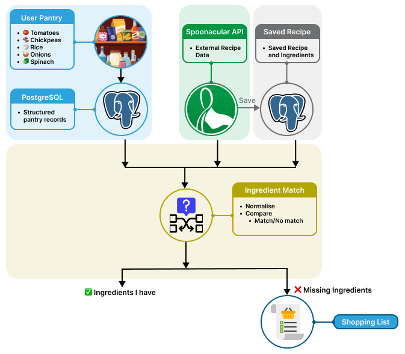
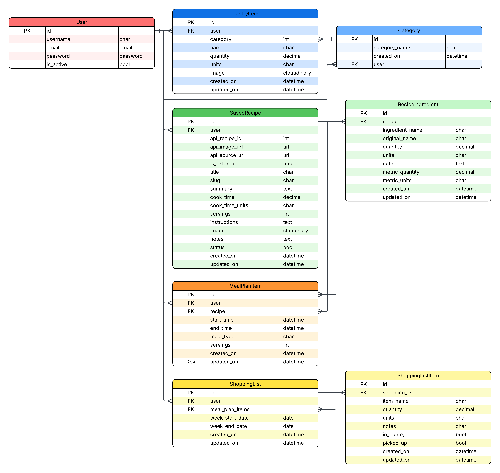

# Data Engineering Show & Tell
<br>

> ## 🍽️ Can I make dinner with what I've already got?
>
> *A simple question that becomes an interesting data problem.*

<br>

**PantryPilot** is a smart pantry management application, but underneath the user-facing features is a small data engineering problem:

**How do I take data from different sources, structure it, clean it, match it, and turn it into something useful?**

For example,
<table>
  <tr>
    <td><strong>My Pantry</strong></td>
    <td><strong>Online Recipe Ingredients</strong></td>
  </tr>

  <tr>
    <td>🍅 Tomatoes</td>
    <td>🍅 Fresh tomatoes</td>
  </tr>

  <tr>
    <td>🫘 Chickpeas</td>
    <td>🫘 Chickpeas</td>
  </tr>

  <tr>
    <td>🍚 Rice</td>
    <td>🍚 White rice</td>
  </tr>

  <tr>
    <td>🧅 Onions</td>
    <td>🌱 Spring onions</td>
  </tr>

  <tr>
    <td>🥬 Spinach</td>
    <td>🧄 Garlic</td>
  </tr>

  <tr>
    <td colspan="2">
      <strong>💡 The interesting question:</strong><br><br>
      Can I make this recipe with what I already have, and what am I missing?
    </td>
  </tr>
  <tr>
    <td colspan="2">
      <strong>That question drives the data flow behind PantryPilot.</strong>
    </td>
  </tr>
</table>


### 🔄 The Data Flow

PantryPilot brings together two different sources of ingredient data. 
- Pantry data stored as structured records in PostgreSQL.
- Recipe information retrieved from the Spoonacular API and transformed into a format the application can work with.

These two data sources are then compared through the ingredient-matching process.
- The system normalises ingredient names, applies fuzzy matching, and identifies which ingredients are already available and which are missing.

The result is derived data — a **shopping list** containing the ingredients needed to make the selected recipe.

<figure>
  
</figure>

The interesting part isn't any individual technology in the flow.

It's the **movement and transformation of data**.

<br>

---

## 1. 🥕 The Problem

A pantry sounds simple, but from a data perspective there are several questions:

- How should ingredients be stored?
- How do I connect ingredients to a particular user?
- How do I represent quantities and units?
- How do I bring in recipe data from an external source?
- How do I compare ingredients when different systems use different names?
- How do I turn those comparisons into a useful shopping list?

This gave me an opportunity to work with several concepts that overlap with data engineering:

```text
Ingest → Store → Clean → Transform → Match → Generate useful data
```

<br>
<br>

---

# 2. 🗃️ Giving the Ingredients a Home

The first step was designing a relational data model.

Instead of storing something like:

```text
"Tomatoes, rice, chickpeas, onions, spinach"
```

as one large piece of text, each pantry item becomes a structured record.

### Entity Relationship Diagram(ERD)

<figure>
  
</figure>

This structure means the data has relationships rather than being one large collection of text.

For example:

```text
User
 │
 ├── PantryItem
 │      ├── Tomatoes
 │      ├── Chickpeas
 │      └── Rice
 │
 └── SavedRecipe
        │
        └── RecipeIngredient
               ├── Tomatoes
               ├── Chickpeas
               └── Garlic
```

### Why this matters

This makes the data:

- structured
- queryable
- connected through relationships
- easier to validate
- easier to extend later

<br>

---

# 3. 🐍 From ERD to Python

The ERD became Django models backed by PostgreSQL.

For example, a pantry item contains structured fields rather than just a name:

```python
class PantryItem(models.Model):
    user = models.ForeignKey(
        User,
        on_delete=models.CASCADE
    )

    name = models.CharField(max_length=100)

    quantity = models.DecimalField(
        max_digits=8,
        decimal_places=2
    )

    units = models.CharField(
        max_length=20,
        choices=UNIT_CHOICES
    )

    category = models.ForeignKey(
        Category,
        on_delete=models.CASCADE
    )
```

The important idea here is:

```text
Ingredient
   │
   ├── name
   ├── quantity
   ├── units
   ├── category
   └── user
```

I'm not just storing information.

I'm giving the information **structure and meaning**.

---

# 4. 🌐 Bringing in Data From Outside

The next challenge was bringing recipe information into the application.

PantryPilot uses the **Spoonacular API** as an external recipe data source.

The application sends a request:

```text
PantryPilot
     │
     │ HTTP request
     ▼
Spoonacular API
     │
     │ recipe data
     ▼
PantryPilot
```

The API response isn't necessarily in exactly the structure the application needs.

So I added a service layer to:

1. make the API request
2. handle errors
3. receive the external response
4. transform it into the application's structure

A simplified version of the request looks like:

```python
response = requests.get(
    url,
    params=params,
    timeout=30
)

response.raise_for_status()
data = response.json()
```

Then the API response is formatted into fields the application can work with, including:

```text
Recipe
├── API recipe ID
├── Title
├── Matched ingredients
├── Missing ingredients
├── Matched ingredient count
└── Missing ingredient count
```

This is essentially a small **data ingestion and transformation pipeline**.

```text
external API -> application -> structured data
```

---

# 5. 🥊 The Interesting Problem: Are These the Same Ingredient?

This became the most interesting data problem in the project.

The pantry might contain:

```text
Onions
```

while the API might return:

```text
Spring onions
```

Or:

```text
Fresh tomatoes
```

versus:

```text
Tomatoes
```

Or:

```text
Chickpea
```

versus:

```text
Chickpeas
```

A simple exact comparison would fail:

```python
"fresh tomatoes" == "tomatoes"

False
```

But to a person, these may obviously be related.

So I needed a way to compare ingredient names.

---

# 6. 🧹 Step One: Normalisation

Before comparing the ingredients, I clean the names.

The project has a `_normalize()` function which:

- converts text to lowercase
- removes unnecessary whitespace
- removes configured ignore terms
- makes the strings more consistent

Conceptually:

```text
" Fresh   Tomatoes "
          │
          ▼
"fresh tomatoes"
```

This means I'm comparing cleaner data rather than whatever wording happened to come from the API.

---

# 7. 🥊 Step Two: Fuzzy Matching

Normalisation helps, but it doesn't solve everything.

So PantryPilot uses **RapidFuzz** to calculate how similar two ingredient names are.

Conceptually:

```text
Recipe ingredient
       │
       ▼
   Normalise
       │
       ▼
  RapidFuzz
       │
       ▼
Similarity score
       │
       ▼
 ┌─────┴─────┐
 │           │
Match     No Match
```

The implementation uses:

```python
process.extract(
    query=normalized_ingredient,
    choices=pantry_names,
    scorer=fuzz.token_set_ratio,
    limit=PantrySearchConfig.MATCH_LIMIT,
    score_cutoff=PantrySearchConfig.SIMILAR_THRESHOLD
)
```

Then a threshold is used to decide whether the result is considered a match.

For example:

```text
"tomato"      → "tomatoes"       → likely match
"chickpea"    → "chickpeas"      → likely match
"fresh rice"  → "rice"           → likely match
```

This is a useful example of **entity resolution**:

> Working out whether two differently written records refer to the same real-world thing.

---

# 8. ⚠️ The Catch: Similar Doesn't Always Mean the Same

This is also where I discovered an important limitation.

Consider:

```text
"onion"
"spring onion"
```

A fuzzy matching algorithm can tell me that the words are similar.

But similarity doesn't necessarily mean:

> "These ingredients are interchangeable."

That's an important **data quality problem**.

The current system therefore uses a relatively simple approach:

```text
Text
 ↓
Normalisation
 ↓
Fuzzy similarity
 ↓
Threshold
 ↓
Match / No Match
```

It's useful, but it isn't perfect.

And that's actually one of the things I would improve.

---

# 9. 🛒 Turning Data Into Something Useful

Once the system knows which recipe ingredients are already in the pantry, the remaining ingredients can be turned into a shopping list.

For example:

```text
🍲 Recipe
├── Tomatoes       ✓ In pantry
├── Chickpeas      ✓ In pantry
├── Rice            ✓ In pantry
├── Garlic          ✗ Missing
└── Basil           ✗ Missing
```

Becomes:

```text
🛒 Shopping List

☐ Garlic
☐ Basil
```

This is an example of **derived data**.

I'm not storing a completely new source of information.

I'm calculating something useful from existing data:

```text
Pantry data
     +
Recipe data
     ↓
Ingredient matching
     ↓
Missing ingredients
     ↓
Shopping list
```

---

# 10. 🚀 What I'd Do Next

The current matching approach works, but there is an obvious next step.

I've been learning about **semantic search**, and I think this would be a good fit for improving ingredient matching.

Instead of only asking:

> "How similar are these words?"

we could ask:

> "How similar are these ingredients in meaning?"

A future approach could look like:

```text
Ingredient
     │
     ▼
Embedding
     │
     ▼
Semantic Search
     │
     ▼
Candidate Ingredients
     │
     ▼
Domain Rules
     │
     ▼
Match / No Match
```

For example:

```text
"fresh tomatoes"
        │
        ▼
 semantic representation
        │
        ▼
 "tomatoes"
```

This could help with variations in wording that simple string matching struggles with.

However, semantic similarity alone wouldn't be enough.

I'd combine it with a **canonical ingredient database and domain rules**, because:

```text
"onion"
"spring onion"
```

can be semantically related without necessarily being interchangeable.

I'd also want to evaluate the new approach using labelled examples and measure things like:

- false positives
- false negatives
- precision
- recall

---

# 11. 🏗️ Scaling the Data Architecture

If PantryPilot grew beyond a small application, I would separate the external data ingestion from the application itself.

Instead of:

```text
Application → API → Database
```

I'd move towards something like:

```text
             Spoonacular API
                    │
                    ▼
              Ingestion Job
                    │
                    ▼
             Raw / Staging Data
                    │
                    ▼
          Validation & Cleaning
                    │
                    ▼
            Structured Data
                    │
             ┌──────┴──────┐
             ▼             ▼
        Application     Analytics
```

This would make the system easier to scale and would provide a cleaner separation between:

**getting data** and **using data**.

---

# 12. 🎯 Why This Is Relevant to Data Engineering

Although PantryPilot is a food application, the underlying problems are familiar data engineering problems.

| PantryPilot | Data Engineering Concept |
|---|---|
| Spoonacular API | Data ingestion |
| PostgreSQL | Data storage |
| Django models / ERD | Data modelling |
| Normalisation | Data cleaning |
| RapidFuzz | Entity resolution |
| Ingredient matching | Data quality |
| Shopping list generation | Derived data |
| Future semantic search | Advanced data retrieval |
| Raw/staging architecture | Scalable data pipeline |

The biggest lesson for me was:

> **Getting data into a database is only the beginning. The interesting part is making data from different sources reliable, comparable and useful.**
