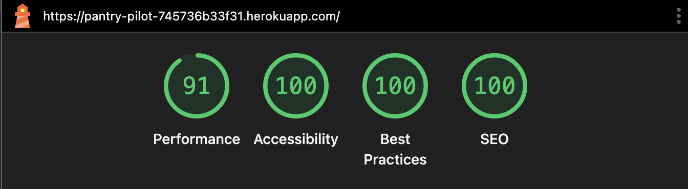
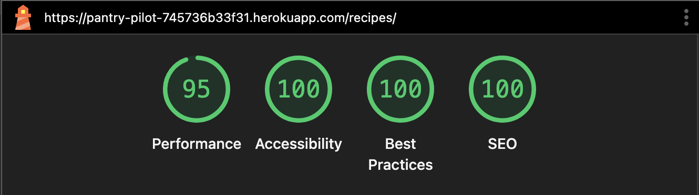
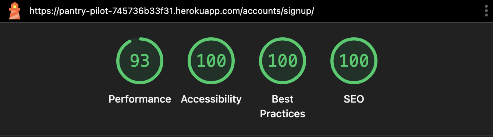
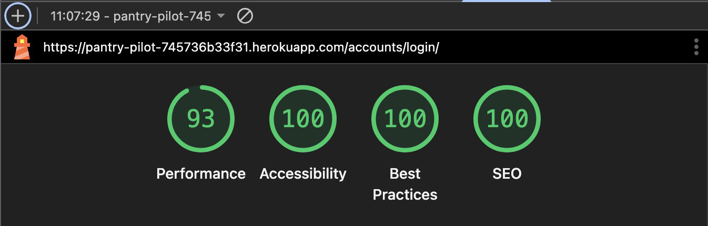
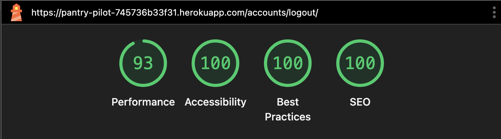
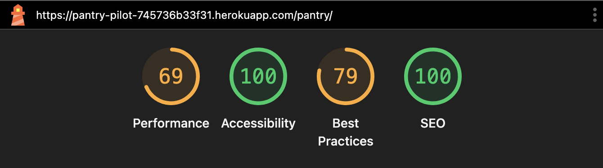
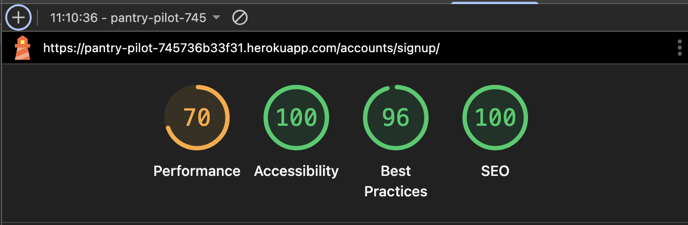
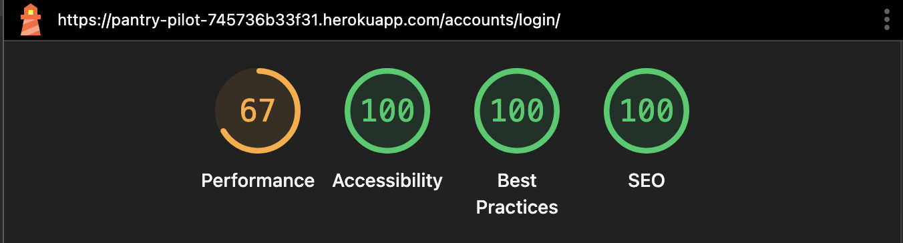
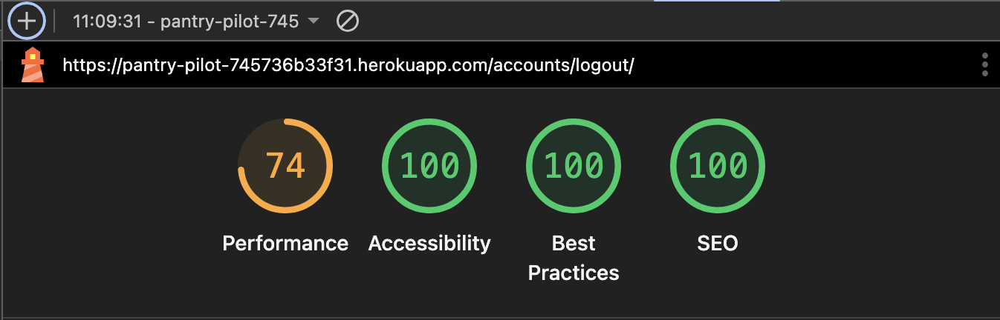

# Pantry Pilot - Testing

[Go back to Readme](README.md)

## Validation Testing

### HTML Validation
**[W3C Markup Validation Service](https://validator.w3.org/)** was used to validate the HTML on all pages of the site.
HTML was checked by running the validator with deployed page urls.

    
Expand to view the results

| Page | Result | Evidence |
|------|--------|----------|
| Home Page (Dashboard) - Unauthenticated | ✅ Pass | [No errors or warnings](documentation/testing/html_validation/dashboard_unauthenticated_page.png)1 |
| Home Page (Dashboard) - Authenticated | ✅ Pass | [No errors or warnings](documentation/testing/html_validation/dashboard_unauthenticated_page.png)1 |
| Sign Up Page | ✅ Pass | [No errors or warnings](documentation/testing/html_validation/signup_page.png)1 |
| Sign In Page | ✅ Pass | [No errors or warnings](documentation/testing/html_validation/signin_page.png)1 |
| Sign Out Page | ✅ Pass | [No errors or warnings](documentation/testing/html_validation/signout_page.png)2 |
| Pantry Management | ✅ Pass | [No errors or warnings](documentation/testing/html_validation/pantry_page_uri.png)1|
| Pantry Management | ✅ Pass | [No errors or warnings](documentation/testing/html_validation/pantry_page_source.png)2|
| Recipe Discovery | ✅ Pass | [No errors or warnings](documentation/testing/html_validation/recipes_page_uri.png)1|
| Recipe Discovery | ✅ Pass | [No errors or warnings](documentation/testing/html_validation/recipes_page_source.png)2|
| Recipe Detail | ✅ Pass | [No errors or warnings](documentation/testing/html_validation/recipe_detail_uri.png)1|
| Recipe Detail | ✅ Pass | [No errors or warnings](documentation/testing/html_validation/recipe_detail_source.png)2|
| Meal Planning | ✅ Pass | [No errors or warnings](documentation/testing/html_validation/meals_page_uri.png)1|
| Meal Planning | ✅ Pass | [No errors or warnings](documentation/testing/html_validation/meals_page_source.png)2|
| Shopping Lists | ✅ Pass | [No errors or warnings](documentation/testing/html_validation/shopping_page_uri.png)1 |
| Shopping Lists | ✅ Pass | [No errors or warnings](documentation/testing/html_validation/shopping_page_source.png)2 |

Note:
- 1 Validation by deployed website URI.
- 2 Validation by deployed webpage's source code. 

### CSS Validation
**[W3C CSS Validation Service](https://jigsaw.w3.org/css-validator/)** was used to validate the custom CSS file for the site.
CSS was validated by running the validator with direct CSS source input.

    
Expand to view the results

| File | Result | Evidence |
|------|--------|----------|
| `static/css/style.css` | ✅ Pass | [no errors](documentation/testing/css_validation/css_no_error.png), [warnings - imported style sheets, CSS variables, same background and border color](documentation/testing/css_validation/css_warnings.png) |

### Javascript Validation
**[JS Hint](https://jshint.com/)** was used to validate the custom Javascript file for the site.

    
Expand to view the results

| File | Result | Evidence |
|------|--------|----------|
| `static/js/script.js` | ✅ Pass | [no errors or warnings](documentation/testing/javascript_validation/js_no_error.png) |

### Python Validation

**[Code Institute Python Linter](https://pep8ci.herokuapp.com/)** was used to validate the custom python files.
Flake8 extension for vsCode from Mircosoft was used during the development to help conform to PEP8 guidelines.

    
Expand to view the results

| App Name | File | Result | Evidence |
|----------|------|--------|----------|
| **dashboard** | `dashboard/views.py` | ✅ Pass | [no errors or warnings](documentation/testing/python_validation/dashboard_views_py.png) |
| **dashboard** | `dashboard/forms.py` | ✅ Pass | [no errors or warnings](documentation/testing/python_validation/dashboard_forms_py.png) |
| **dashboard** | `dashboard/urls.py` | ✅ Pass | [no errors or warnings](documentation/testing/python_validation/dashboard_urls_py.png) |
| **pantry** | `pantry/models.py` | ✅ Pass | [no errors or warnings](documentation/testing/python_validation/pantry_models_py.png) |
| **pantry** | `pantry/views.py` | ✅ Pass | [no errors or warnings](documentation/testing/python_validation/pantry_views_py.png)|
| **pantry** | `pantry/forms.py` | ✅ Pass | [no errors or warnings](documentation/testing/python_validation/pantry_forms_py.png) |
| **pantry** | `pantry/admin.py` | ✅ Pass | [no errors or warnings](documentation/testing/python_validation/pantry_admin_py.png) |
| **pantry** | `pantry/urls.py` | ✅ Pass | [no errors or warnings](documentation/testing/python_validation/pantry_urls_py.png) |
| **recipes** | `recipes/models.py` | ✅ Pass | [no errors or warnings](documentation/testing/python_validation/recipes_models_py.png) |
| **recipes** | `recipes/views.py` | ✅ Pass | [no errors or warnings](documentation/testing/python_validation/recipes_views_py.png) |
| **recipes** | `recipes/forms.py` | ✅ Pass | [no errors or warnings](documentation/testing/python_validation/recipes_forms_py.png) |
| **recipes** | `recipes/urls.py` | ✅ Pass | [no errors or warnings](documentation/testing/python_validation/recipes_urls_py.png) |
| **recipes** | `recipes/spoonacular.py` | ✅ Pass | [no errors or warnings](documentation/testing/python_validation/recipes_spoonacular_py.png) |
| **meals** | `meals/models.py` | ✅ Pass | [no errors or warnings](documentation/testing/python_validation/meals_models_py.png)|
| **meals** | `meals/views.py` | ✅ Pass | [no errors or warnings](documentation/testing/python_validation/meals_views_py.png) |
| **meals** | `meals/forms.py` | ✅ Pass | [no errors or warnings](documentation/testing/python_validation/meals_forms_py.png) |
| **meals** | `meals/admin.py` | ✅ Pass | [no errors or warnings](documentation/testing/python_validation/meals_admin_py.png) |
| **meals** | `meals/urls.py` | ✅ Pass | [no errors or warnings](documentation/testing/python_validation/meals_urls_py.png) |
| **shopping** | `shopping/models.py` | ✅ Pass | [no errors or warnings](documentation/testing/python_validation/shopping_models_py.png) |
| **shopping** | `shopping/views.py` | ✅ Pass | [no errors or warnings](documentation/testing/python_validation/shopping_views_py.png) |
| **shopping** | `shopping/forms.py` | ✅ Pass | [no errors or warnings](documentation/testing/python_validation/shopping_forms_py.png) |
| **shopping** | `shopping/urls.py` | ✅ Pass | [no errors or warnings](documentation/testing/python_validation/shopping_urls_py.png) |

### Lighthouse Testing

Google Lighthouse was used to test performance, accessibility, best practices and SEO for the site.
The tests were run on the deployed site.

#### Desktop Results

    
Expand to view the results

| Page | Results |
|------|---------|
| Home Page |  |
| Pantry Page |  |
| Recipes List Page |  |
| Recipe Detail Page |  |
| Sign Up Page |  |
| Sign In Page |  |
| Sign Out Page |  |

#### Mobile Results

    
Expand to view the results

| Page | Results |
|------|---------|
| Home Page |  |
| Pantry Page |  |
| Recipes List Page |  |
| Recipe Detail Page |  |
| Sign Up Page |  |
| Sign In Page |  |
| Sign Out Page |  |

## Manual Testing

### Testing User Stories

    
Expand to view the results

<table>
  <thead>
    <tr>
      <th>ID</th>
      <th>User Story</th>
      <th>Testing</th>
      <th>Comments</th>
      <th>Results</th>
    </tr>
  </thead>
  <tbody>
    <tr>
        <td><strong>US001</strong></td>
        <td>
            <strong>AS A</strong> new user <strong>I WANT TO</strong> create an account with email and password <strong>SO THAT I CAN</strong> save my pantry data and access personalized features
        </td>
        <td>
            <ul>
                <li>Click on the SignUp link accessible through the navbar</li>
                <li>Fill in the username, email and password fields</li>
                <li>Click the Start button to register</li>
            </ul>
        </td>
        <td>
            <ul>
                <li>✅ User can access registration page from the navbar</li>
                <li>✅ Registration form includes username, email, password, and confirm password fields</li>
                <li>✅ Users can't submit empty form</li>
                <li>✅ Email field validates proper email format</li>
                <li>✅ Uniqueness for username checked</li>
                <li>✅ Password requirements are checked</li>
                <li>✅ Matching password and confirm password field checked</li>
                <li>✅ success message displayed upon successful registration</li>
                <li>✅ User is automatically logged in after registration</li>
                <li>✅ User redirected to dashboard after successful registration</li>
                <li>✅ Error messages display for invalid inputs</li>
                <li>✅ Duplicate email addresses are prevented with clear error message</li>
            </ul>
        </td>
        <td> Pass </td>
    </tr>
    <tr>
        <td><strong>US002</strong></td>
        <td><strong>AS A</strong> returning user <strong>I WANT TO</strong> log into my account <strong>SO THAT I CAN</strong> access my personal pantry</td>
        <td>
            <ul>
                <li>Click on the Login link in navbar</li>
                <li>Fill in the username and password, and click the button</li>
            </ul>
        </td>
        <td>
            <ul>
                <li>✅ Login form accessible from navigation</li>
                <li>✅ Login form accepts username and password</li>
                <li>✅ Username displayed in navbar after login</li>
                <li>✅ User redirected to dashboard after successful login</li>
                <li>✅ Error message displayed for invalid credentials</li>
                <li>✅ User stays on login page if credentials are invalid</li>
                <li>✅ Users can login without email verification</li>
            </ul>
        </td>
        <td> Pass </td>
    </tr>
    <tr>
        <td><strong>US003</strong></td>
        <td><strong>AS A</strong> logged in user <strong>I WANT TO</strong> log out of my account <strong>SO THAT I CAN</strong> secure my data when finished</td>
        <td>
            <ul>
                <li>When logged in, click on logout link accessible from dropdown link under username in navigation</li>
                <li>Click on the Sign Out button to confirm</li>
            </ul>
        </td>
        <td>
            <ul>
            <li>✅ Logout accessible from navigation for authenticated users</li>
            <li>✅ Clicking logout confirmation ends user session</li>
            <li>✅ User redirected to landing page after logout</li>
            <li>✅ Navigation bar changes to indicate logout state</li>
            <li>✅ Success message confirms successful logout</li>
            <li>✅ User cannot access protected pages after logout without re-authenticating</li>
            <li>✅ Logout works consistently across all pages</li>
            <li>✅ Logout link only appears for authenticated users</li>
            </ul>
        </td>
        <td> Pass </td>
    </tr>
    <tr>
        <td><strong>US004</strong></td>
        <td><strong>AS A</strong> logged in user <strong>I WANT TO</strong> add ingredients to my pantry with name and quantity <strong>SO THAT I CAN</strong> track what I have available</td>
        <td>
            <ul>
                <li>Access Pantry page from navigation</li> 
                <li>Fill in form with required name, quantity, units and category</li> 
                <li>Upload item image(optional)</li>
                <li>Click Add</li> 
            </ul>
        </td>
        <td>
            <ul>
                <li>✅ Form is accessible from pantry page</li>
                <li>✅ Form includes fields for name, quantity, unit, category and image</li>
                <li>✅ Item, quantity, units and category inputs are mandatory</li>
                <li>✅ Quantity entered must be a positive</li>
                <li>✅ Confirmation message displayed after successful addition</li>
                <li>✅ New item appears in pantry list immediately after addition</li>
                <li>✅ Form validates all required fields before submission</li>
                <li>✅ Checks if item already exits - users can add to or replace existing quantity if units match</li>
                <li>✅ Checks if item already exits - users can replace existing quantity if units don't match</li>
            </ul>
        </td>
        <td> Pass </td>
    </tr>
    <tr>
        <td><strong>US005</strong></td>
        <td><strong>AS A</strong> logged in user <strong>I WANT TO</strong> see all my pantry items in a list <strong>SO THAT I CAN</strong> quickly review what ingredients I have</td>
        <td>
            <ul>
                <li>Access Pantry page from navigation</li>
            </ul>
        </td>
        <td>
        <ul>
            <li>✅ Pantry page displays all user's items</li>
            <li>✅ Each item shows name, quantity, unit</li>
            <li>✅ Items are sectioned by category</li>
            <li>✅ Page displays item count per category</li>
            <li>✅ Message displayed for empty pantry</li>
            <li>✅ Add new item button is prominently displayed</li>
            <li>✅ User data is isolated - Only personal items are displayed</li>
        </ul>
        </td>
        <td> Pass </td>
    </tr>
    <tr>
        <td><strong>US006</strong></td>
        <td><strong>AS A</strong> logged in user <strong>I WANT TO</strong> update ingredient quantities <strong>SO THAT I CAN</strong> keep my pantry inventory accurate</td>
        <td>
            <ul>
                <li>Click on the edit button(pencil icon) on the pantry item card</li>
                <li>Update the quantity, units, or other details in the populated form</li>
                <li>Click Update button to confirm changes</li>
            </ul>
        </td>
        <td>
            <ul>
                <li>✅ Edit button is visible on each pantry item</li>
                <li>✅ Form pre-populates with current item values</li>
                <li>✅ Changes are saved and immediately reflected</li>
                <li>✅ Success message confirms update</li>
                <li>✅ Form validation prevents invalid entries</li>
            </ul>
        </td>
        <td> Pass </td>
    </tr>
    <tr>
        <td><strong>US007</strong></td>
        <td><strong>AS A</strong> logged in user <strong>I WANT TO</strong> delete items from my pantry <strong>SO THAT I CAN</strong> remove ingredients I no longer have</td>
        <td>
            <ul>
                <li>Click the Delete item button(bin icon) on pantry item card</li>
                <li>Click the Delete button in dialog to confirm deletion</li>
            </ul>
        </td>
        <td>
            <ul>
                <li>✅ Delete button/link is available for each pantry item</li>
                <li>✅ Confirmation dialog appears before deletion</li>
                <li>✅ User can confirm or cancel deletion</li>
                <li>✅ Item is permanently removed after confirmation</li>
                <li>✅ Confirmation message displayed after successful deletion</li>
                <li>✅ Pantry list updates immediately after deletion</li>
                <li>✅ Only item owner can delete their items</li>
                <li>✅ Deleted items cannot be recovered</li>
            </ul>
        </td>
        <td> Pass </td>
    </tr>
    <tr>
      <td><strong>US009</strong></td>
      <td><strong>AS A</strong> mobile user <strong>I WANT TO</strong> access basic pantry features on my phone <strong>SO THAT I CAN</strong> manage my pantry while shopping</td>
      <td>Check using Google Development tools</td>
      <td>Results in TODO </td>
      <td> Pass </td>
    </tr>
    <tr>
      <td><strong>US010</strong></td>
      <td><strong>AS A</strong> home cook <strong>I WANT TO</strong> find recipes using ingredients I have in my pantry <strong>SO THAT I CAN</strong> cook meals maximizing what I have available</td>
      <td>
        <ul>
                <li>Go to Recipes page from navigation bar</li>
                <li>Click on the Discover pane in Recipes</li>
                <li>Select cuisine, diet and meal type preferences</li>
                <li>Click Search</li>
            </ul>
      </td>
      <td>
        <ul>
            <li>✅ Recipe search form is accessible from Recipes page</li>
            <li>✅ Search filters include cuisine, diet, and meal type options</li>
            <li>✅ API integration with Spoonacular working correctly</li>
            <li>✅ Search results display recipes matching selected criteria</li>
            <li>✅ Recipe card displays title and recipe image for correct url from API response</li>
            <li>✅ Recipe cards show number of matched and missing ingredients</li>
            <li>✅ Clicking on the info button on each recipe card displays dialog with matched and missing ingredient names</li>
            <li>✅ Message displayed for empty search results</li>
            <li>✅ Search results persists for active session</li>
            <li>✅ Search results are cleared out upon session end or sign out</li>
        </ul>
      </td>
      <td> Pass </td>
    </tr>
    <tr>
      <td><strong>US011</strong></td>
      <td><strong>AS A</strong> cook <strong>I WANT TO</strong> see detailed recipe information including ingredients, instructions, and cooking time <strong>SO THAT I CAN</strong> understand what's needed</td>
      <td>
        <ul>
            <li>Navigate to Recipes page from main navigation</li>
            <li>Click on View button in recipe card from search results or saved recipes</li>
            <li>View detailed recipe information including ingredients list, instructions, and cooking time</li>
        </ul>
      </td>
      <td>
        <ul>
            <li>✅ Recipe detail page displays complete recipe information for API results</li>
            <li>✅ Recipe detail page displays complete recipe information for saved recipes</li>
            <li>✅ Ingredients list shows quantities, units, and ingredient names</li>
            <li>✅ Step-by-step cooking instructions are clearly displayed</li>
            <li>✅ Cooking time and serving information is visible</li>
            <li>✅ Recipe images are properly displayed for valid urls</li>
            <li>✅ Matched ingredients are marked with a tick icon</li>
            <li>✅ External recipe source link is displayed when available</li>
        </ul>
      </td>
      <td> Pass </td>
    </tr>
    <tr>
      <td><strong>US013</strong></td>
      <td><strong>AS A</strong> cook <strong>I WANT TO</strong> save recipes I like to a favorites list <strong>SO THAT I CAN</strong> easily find them again for future cooking</td>
      <td>
        <ul>
            <li>Navigate to recipes page and search for recipes</li>
            <li>Navigate to recipe detail page by clicking View button on recipe card</li>
            <li>In the recipe detail page, click the Save button</li>
            <li>Verify "saved" indicator appears on recipe detail page</li>
            <li>Verify recipe appears in saved recipes tab in recipes page</li>
        </ul>
      </td>
      <td>
        <ul>
            <li>✅ Save button is visible on recipe detail pages</li>
            <li>✅ Confirmation message for save is displayed</li>
            <li>✅ "Saved" indicator appears above recipe image in recipe detail view</li>
            <li>✅ "Saved" indicator below the recipe card in search results list view</li>
            <li>✅ Recipe card appears in the saved tab in recipes page</li>
            <li>✅ Save Button is removed for saved recipes to prevent duplicate saves</li>
            <li>✅ SavedRecipe model properly stores recipe data</li>
            <li>✅ Recipe ingredients are saved with proper relationships</li>
            <li>✅ User is redirected to the recipe detail page after save from recipe detail page</li>
            <li>✅ User is redirected to the recipe list view after save from recipe list view</li>
        </ul>
      </td>
      <td> Pass </td>
    </tr>
    <tr>
      <td><strong>US014</strong></td>
      <td><strong>AS A</strong> cook <strong>I WANT TO</strong> see all my saved recipes in one place <strong>SO THAT I CAN</strong> browse my personal recipe collection</td>
      <td>
        <ul>
            <li>Navigate to Recipes page from main navigation</li>
            <li>Click on the "Saved" tab in the recipes page</li>
            <li>View all saved recipes in the collection</li>
        </ul>
      </td>
      <td>
        <ul>
            <li>✅ Saved recipes tab is accessible from recipes page</li>
            <li>✅ All saved recipes are displayed in a organized list</li>
            <li>✅ Recipe cards show title, image, and basic information</li>
            <li>✅ Each saved recipe has View, Delete, and meal planning options</li>
            <li>✅ Only user's own saved recipes are displayed</li>
            <li>✅ Empty state message shown when no recipes are saved</li>
            <li>✅ Recipe collection persists across sessions</li>
        </ul>
      </td>
      <td> Pass </td>
    </tr>
    <tr>
      <td><strong>US015</strong></td>
      <td><strong>AS A</strong> organized cook <strong>I WANT TO</strong> see a weekly meal calendar interface <strong>SO THAT I CAN</strong> plan my meals for the week ahead</td>
      <td>
        <ul>
            <li>Navigate to Meals page from main navigation</li>
            <li>View the weekly, monthly and day view calendar interfaces</li>
            <li>Switch between week and month views using toolbar buttons</li>
            <li>Verify clicking on a day slot in weekly/monthly calendar switches day view calendar to that date</li>
            <li>Verify calendar displays current week by default</li>
            <li>Verify calendar displays planned meals</li>
        </ul>
      </td>
      <td>
        <ul>
            <li>✅ FullCalendar integration working with Bootstrap5 theme</li>
            <li>✅ Weekly calendar view displays 7 days horizontally</li>
            <li>✅ Monthly calendar view shows full month grid</li>
            <li>✅ Calendar toolbar allows switching between week/month views</li>
            <li>✅ Navigation buttons (prev/next/today) function correctly</li>
            <li>✅ Responsive design adapts to different screen sizes</li>
            <li>✅ Calendar events load from meal plan data</li>
            <li>✅ Date click on week and month view progresses the day view to the selected date</li>
            <li>✅ Clicking in empty time slots in day view pops up dialog to add meals</li>
        </ul>
      </td>
      <td> Pass </td>
    </tr>
    <tr>
      <td><strong>US016</strong></td>
      <td><strong>AS A</strong> meal planner <strong>I WANT TO</strong> add specific recipes to calendar days and meal times <strong>SO THAT I CAN</strong> organize my weekly cooking schedule</td>
      <td>
        <ul>
            <li>Select recipes from saved tab in recipes page for meal planning</li>
            <li>Navigate to Meals page from main navigation</li>
            <li>Click on empty time slots in day view calendar</li>
            <li>Fill in MealPlanItemForm with recipe, meal type, servings and time</li>
            <li>Submit form to add meal to calendar</li>
            <li>Verify meal appears on calendar at scheduled time</li>
        </ul>
      </td>
      <td>
        <ul>
            <li>✅ "Select for Meal Plan" button on recipe cards in saved tab selects recipes for planning</li>
            <li>✅ Button state changes to indicate selection success</li>
            <li>✅ "Selected(Remove)" Button removes recipe from meal plan</li>
            <li>✅ Selected recipes listed in meals page</li>
            <li>✅ Click in empty time slot opens dialog with form</li>
            <li>✅ Form accepts recipe, meal type, servings and time inputs</li>
            <li>✅ Time inputs are pre-populated from calendar time slots</li>
            <li>✅ Form validation ensures required fields are filled</li>
            <li>✅ User can assign same recipe to multiple time slots</li>
            <li>✅ All Calendar views displays scheduled meals correctly</li>
            <li>✅ Meal plan items are stored with proper relationships</li>
            <li>✅ Recipe assignment to specific calendar dates and times works</li>
        </ul>
      </td>
      <td> Pass </td>
    </tr>
    <tr>
      <td><strong>US017</strong></td>
      <td><strong>AS A</strong> meal planner <strong>I WANT TO</strong> modify existing meal plan items <strong>SO THAT I CAN</strong> adjust my weekly schedule as needed</td>
      <td>
        <ul>
            <li>Navigate to Meals page from main navigation</li>
            <li>Click on an existing meal event in the calendar</li>
            <li>Update meal details in the edit form (recipe, time, servings, meal type)</li>
            <li>Submit the updated form</li>
            <li>Verify changes are reflected in the calendar</li>
        </ul>
      </td>
      <td>
        <ul>
            <li>✅ Existing meal events clickable in calendar views</li>
            <li>✅ Edit form displayed on clicking on meal plan events</li>
            <li>✅ Edit form pre-populated with current meal plan data</li>
            <li>✅ All meal plan fields can be modified (recipe, time, servings, meal type)</li>
            <li>✅ Form validation ensures required fields are filled</li>
            <li>✅ Updated meal plan items displayed correctly in calendar</li>
            <li>✅ Success message confirms meal plan update</li>
            <li>✅ Only meal plan owner allowed to edit their items</li>
        </ul>
      </td>
      <td> Pass </td>
    </tr>
    <tr>
      <td><strong>US018</strong></td>
      <td><strong>AS A</strong> meal planner <strong>I WANT TO</strong> remove meals from my calendar <strong>SO THAT I CAN</strong> clear unwanted or changed plans</td>
      <td>
        <ul>
            <li>Navigate to Meals page from main navigation</li>
            <li>Click on an existing meal event in the calendar</li>
            <li>Click the Delete button in the meal plan modal</li>
            <li>Confirm deletion in the confirmation dialog</li>
            <li>Verify meal is removed from calendar</li>
        </ul>
      </td>
      <td>
        <ul>
            <li>✅ Clicking on existing meal event displays delete option in modal</li>
            <li>✅ Confirmation dialog prevents accidental deletion</li>
            <li>✅ Meal plan items are permanently removed after confirmation</li>
            <li>✅ Calendar updates immediately after deletion</li>
            <li>✅ Success message confirms meal plan deletion</li>
            <li>✅ Only meal plan owner can delete their items</li>
        </ul>
      </td>
      <td> Pass </td>
    </tr>
    <tr>
      <td><strong>US019</strong></td>
      <td><strong>AS A</strong> meal planner <strong>I WANT TO</strong> easily distinguish different meal types in my calendar <strong>SO THAT I CAN</strong> quickly understand my meal schedule</td>
      <td>
        <ul>
            <li>Navigate to Meals page from main navigation</li>
            <li>Add different meal types (breakfast, lunch, dinner) to calendar</li>
            <li>View calendar events and verify visual distinctions</li>
            <li>Check color coding and styling for different meal types</li>
        </ul>
      </td>
      <td>
        <ul>
            <li>✅ Calendar events display meal type information clearly</li>
            <li>✅ Different meal types have distinct visual styling</li>
            <li>✅ Color coding distinguishes breakfast, lunch, dinner</li>
            <li>✅ Responsive design maintains readability across devices</li>
            <li>✅ Meal plan events are easily scannable in weekly/monthly views</li>
        </ul>
      </td>
      <td> Pass </td>
    </tr>
    <tr>
      <td><strong>US020</strong></td>
      <td><strong>AS A</strong> user with many ingredients <strong>I WANT TO</strong> search my pantry by name <strong>SO THAT I CAN</strong> quickly find specific items</td>
      <td>Test search functionality in pantry views</td>
      <td>Search filtering implemented in pantry management</td>
      <td>✅ Pass</td>
    </tr>
    <tr>
      <td><strong>US021</strong></td>
      <td><strong>AS A</strong> organized user <strong>I WANT TO</strong> view my pantry items organized by categories <strong>SO THAT I CAN</strong> easily find ingredients by type</td>
      <td>Test <code>Category</code> model and categorized display</td>
      <td>Category-based organization with <code>CATEGORY_CHOICES</code></td>
      <td>✅ Pass</td>
    </tr>
    <tr>
      <td><strong>US022</strong></td>
      <td><strong>AS A</strong> mobile user <strong>I WANT TO</strong> access all PantryPilot features on my phone <strong>SO THAT I CAN</strong> manage pantry, recipes, and meal planning while mobile</td>
      <td>Test full responsive design across all features</td>
      <td>Mobile-first responsive design implemented</td>
      <td>✅ Pass</td>
    </tr>
    <tr>
      <td><strong>US023</strong></td>
      <td><strong>AS A</strong> cook <strong>I WANT TO</strong> remove recipes from my favorites list <strong>SO THAT I CAN</strong> keep my saved recipes relevant</td>
      <td>Test recipe deletion from saved collection</td>
      <td>Recipe removal functionality working</td>
      <td>✅ Pass</td>
    </tr>
    <tr>
      <td><strong>US024</strong></td>
      <td><strong>AS A</strong> cook <strong>I WANT TO</strong> search recipes by name, cuisine, or dietary restrictions <strong>SO THAT I CAN</strong> find specific types of meals</td>
      <td>Test advanced search filters in <code>RecipeSearchForm</code></td>
      <td>Cuisine, diet, and meal type filtering implemented</td>
      <td>✅ Pass</td>
    </tr>
  </tbody>
</table>

