# Pantry Pilot - Testing

# 
[Go back to Readme](README.md)

## Table of Contents

1. [Validation Testing](#validation-testing)
  - [HTML Validation](#html-validation)
  - [CSS Validation](#css-validation)
  - [Python Validation](#python-validation)
  - [Accessibility Testing](#accessibility-testing)
  - [Lighthouse Testing](#lighthouse-testing)
2. [Responsiveness](#responsiveness)
  - [Responsiveness Summary](#responsiveness-summary)
3. [Browser Compatibility](#browser-compatibility)
4. [Manual Testing](#manual-testing)
  - [Testing User Stories](#testing-user-stories)
5. [Features](#features)
6. [Bugs](#bugs)

## Validation Testing

### HTML Validation
**[W3C Markup Validation Service](https://validator.w3.org/)** was used to validate the HTML on all pages of the site.
HTML was checked by running the validator with deployed page urls.

    
Expand to view the results

| Page | Result | Evidence |
|------|--------|----------|
| Home Page (Dashboard) - Unauthenticated | ✅ Pass | [No errors or warnings](documentation/testing/html_validation/dashboard_unauthenticated_page.png)1 |
| Home Page (Dashboard) - Authenticated | ✅ Pass | [No errors or warnings](documentation/testing/html_validation/dashboard_unauthenticated_page.png)1 |
| Sign Up Page | ✅ Pass | [No errors or warnings](documentation/testing/html_validation/signup_page.png)1 |
| Sign In Page | ✅ Pass | [No errors or warnings](documentation/testing/html_validation/signin_page.png)1 |
| Sign Out Page | ✅ Pass | [No errors or warnings](documentation/testing/html_validation/signout_page.png)2 |
| Pantry Management | ✅ Pass | [No errors or warnings](documentation/testing/html_validation/pantry_page_uri.png)1|
| Pantry Management | ✅ Pass | [No errors or warnings](documentation/testing/html_validation/pantry_page_source.png)2|
| Recipe Discovery | ✅ Pass | [No errors or warnings](documentation/testing/html_validation/recipes_page_uri.png)1|
| Recipe Discovery | ✅ Pass | [No errors or warnings](documentation/testing/html_validation/recipes_page_source.png)2|
| Recipe Detail | ✅ Pass | [No errors or warnings](documentation/testing/html_validation/recipe_detail_uri.png)1|
| Recipe Detail | ✅ Pass | [No errors or warnings](documentation/testing/html_validation/recipe_detail_source.png)2|
| Meal Planning | ✅ Pass | [No errors or warnings](documentation/testing/html_validation/meals_page_uri.png)1|
| Meal Planning | ✅ Pass | [No errors or warnings](documentation/testing/html_validation/meals_page_source.png)2|
| Shopping Lists | ✅ Pass | [No errors or warnings](documentation/testing/html_validation/shopping_page_uri.png)1 |
| Shopping Lists | ✅ Pass | [No errors or warnings](documentation/testing/html_validation/shopping_page_source.png)2 |

Note:
- 1 Validation by deployed website URI.
- 2 Validation by deployed webpage's source code. 

### CSS Validation
**[W3C CSS Validation Service](https://jigsaw.w3.org/css-validator/)** was used to validate the custom CSS file for the site.
CSS was validated by running the validator with direct CSS source input.

    
Expand to view the results

| File | Result | Evidence |
|------|--------|----------|
| `static/css/style.css` | ✅ Pass | [no errors](documentation/testing/css_validation/css_no_error.png), [warnings - imported style sheets, CSS variables, same background and border color](documentation/testing/css_validation/css_warnings.png) |

### Javascript Validation
**[JS Hint](https://jshint.com/)** was used to validate the custom Javascript file for the site.

    
Expand to view the results

| File | Result | Evidence |
|------|--------|----------|
| `static/js/script.js` | ✅ Pass | [no errors or warnings](documentation/testing/javascript_validation/js_no_error.png) |

### Python Validation

**[Code Institute Python Linter](https://pep8ci.herokuapp.com/)** was used to validate the custom python files.
Flake8 extension for vsCode from Mircosoft was used during the development to help conform to PEP8 guidelines.

    
Expand to view the results

| App Name | File | Result | Evidence |
|----------|------|--------|----------|
| **dashboard** | `dashboard/views.py` | ✅ Pass | [no errors or warnings](documentation/testing/python_validation/dashboard_views_py.png) |
| **dashboard** | `dashboard/forms.py` | ✅ Pass | [no errors or warnings](documentation/testing/python_validation/dashboard_forms_py.png) |
| **dashboard** | `dashboard/urls.py` | ✅ Pass | [no errors or warnings](documentation/testing/python_validation/dashboard_urls_py.png) |
| **pantry** | `pantry/models.py` | ✅ Pass | [no errors or warnings](documentation/testing/python_validation/pantry_models_py.png) |
| **pantry** | `pantry/views.py` | ✅ Pass | [no errors or warnings](documentation/testing/python_validation/pantry_views_py.png)|
| **pantry** | `pantry/forms.py` | ✅ Pass | [no errors or warnings](documentation/testing/python_validation/pantry_forms_py.png) |
| **pantry** | `pantry/admin.py` | ✅ Pass | [no errors or warnings](documentation/testing/python_validation/pantry_admin_py.png) |
| **pantry** | `pantry/urls.py` | ✅ Pass | [no errors or warnings](documentation/testing/python_validation/pantry_urls_py.png) |
| **recipes** | `recipes/models.py` | ✅ Pass | [no errors or warnings](documentation/testing/python_validation/recipes_models_py.png) |
| **recipes** | `recipes/views.py` | ✅ Pass | [no errors or warnings](documentation/testing/python_validation/recipes_views_py.png) |
| **recipes** | `recipes/forms.py` | ✅ Pass | [no errors or warnings](documentation/testing/python_validation/recipes_forms_py.png) |
| **recipes** | `recipes/urls.py` | ✅ Pass | [no errors or warnings](documentation/testing/python_validation/recipes_urls_py.png) |
| **recipes** | `recipes/spoonacular.py` | ✅ Pass | [no errors or warnings](documentation/testing/python_validation/recipes_spoonacular_py.png) |
| **meals** | `meals/models.py` | ✅ Pass | [no errors or warnings](documentation/testing/python_validation/meals_models_py.png)|
| **meals** | `meals/views.py` | ✅ Pass | [no errors or warnings](documentation/testing/python_validation/meals_views_py.png) |
| **meals** | `meals/forms.py` | ✅ Pass | [no errors or warnings](documentation/testing/python_validation/meals_forms_py.png) |
| **meals** | `meals/admin.py` | ✅ Pass | [no errors or warnings](documentation/testing/python_validation/meals_admin_py.png) |
| **meals** | `meals/urls.py` | ✅ Pass | [no errors or warnings](documentation/testing/python_validation/meals_urls_py.png) |
| **shopping** | `shopping/models.py` | ✅ Pass | [no errors or warnings](documentation/testing/python_validation/shopping_models_py.png) |
| **shopping** | `shopping/views.py` | ✅ Pass | [no errors or warnings](documentation/testing/python_validation/shopping_views_py.png) |
| **shopping** | `shopping/forms.py` | ✅ Pass | [no errors or warnings](documentation/testing/python_validation/shopping_forms_py.png) |
| **shopping** | `shopping/urls.py` | ✅ Pass | [no errors or warnings](documentation/testing/python_validation/shopping_urls_py.png) |
| **config** | `config/settings.py` | ✅ Pass | [no errors or warnings](documentation/testing/python_validation/config_settings_py.png) |

### Lighthouse Testing

Google Lighthouse was used to test performance, accessibility, best practices and SEO for the site.
The tests were run on the deployed site.

#### Desktop Results

    
Expand to view the results

| Page | Results |
|------|---------|
| Home Page | 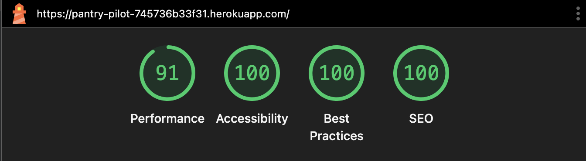 |
| Pantry Page 1 | 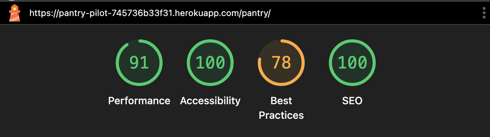 |
| Recipes List Page | 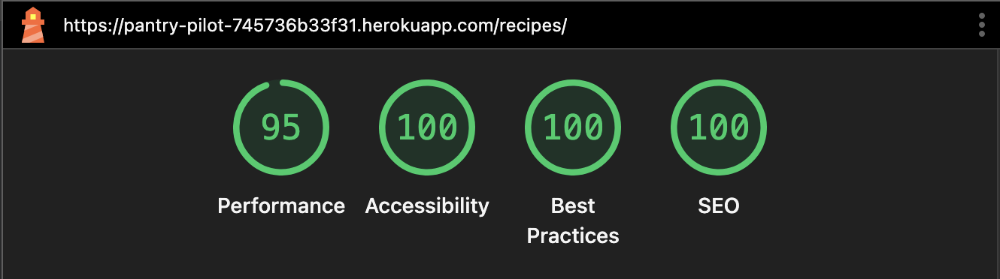 |
| Recipe Detail Page | 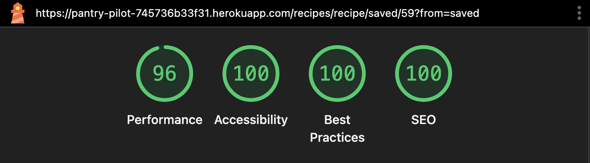 |
| Meal Planning Page |  |
| Shopping Lists Page |  |
| Sign Up Page | 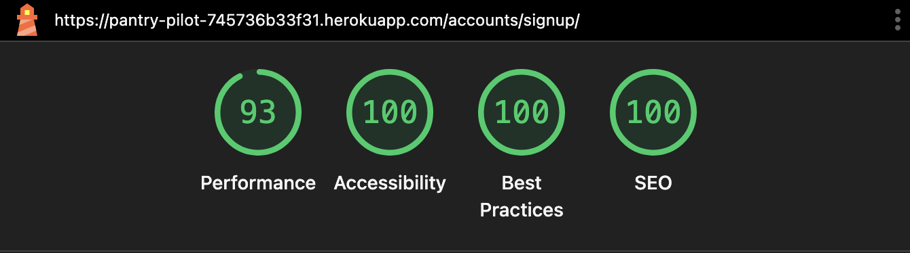 |
| Sign In Page | 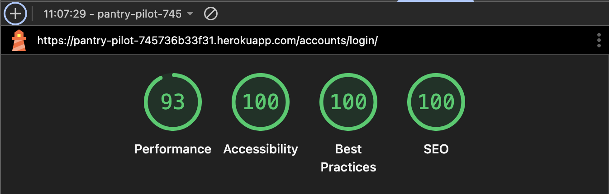 |
| Sign Out Page | 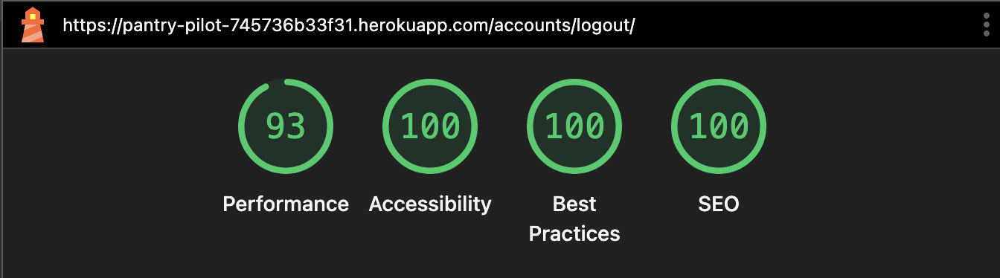 |

Note:
- 1 Analysis of best practices score documented in this [issue](https://github.com/sthDINESH/pantry_pilot/issues/27)

#### Mobile Results

    
Expand to view the results

| Page | Results |
|------|---------|
| Home Page | 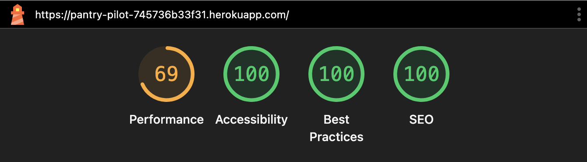 |
| Pantry Page | 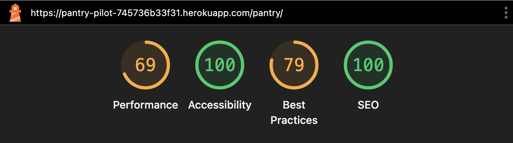 |
| Recipes List Page | 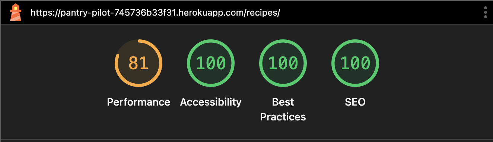 |
| Recipe Detail Page | 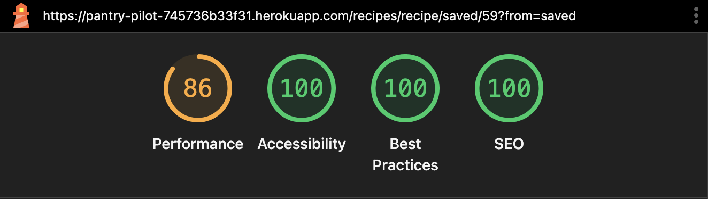 |
| Meal Planning Page |  |
| Shopping Lists Page | 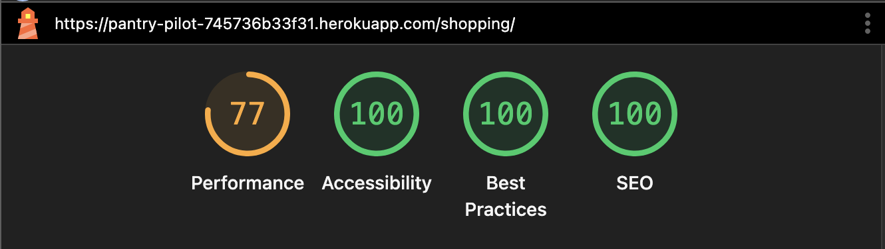 |
| Sign Up Page | 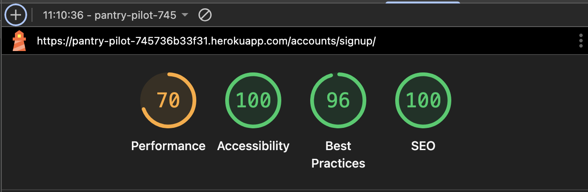 |
| Sign In Page | 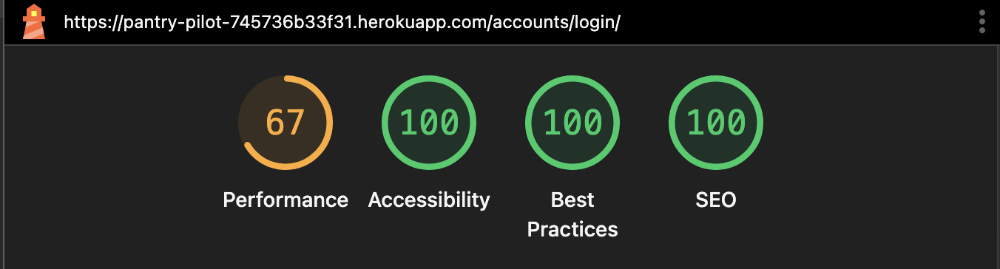 |
| Sign Out Page | 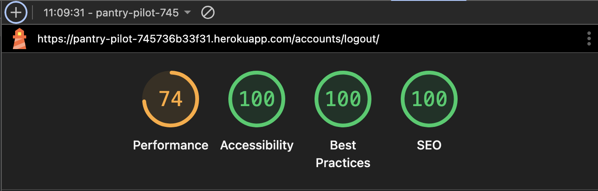 |

## Responsiveness

Chrome Developer tool was used to test the responsiveness of the website throughout development.

    
Expand to view the results

| Page | Responsiveness (320px - 1440px) |
|------|--------------------------------|
| Home |  |
| Pantry Page | 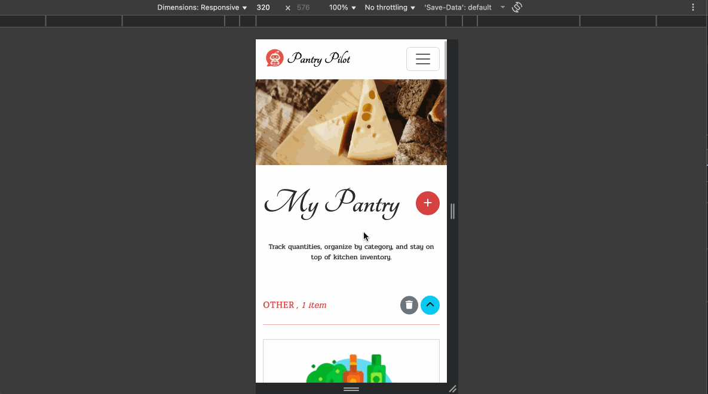 |
| Recipe List |  |
| Recipe detail | 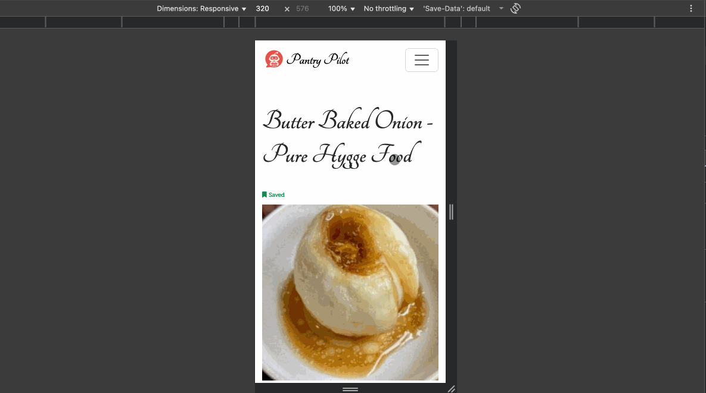 |
| Meal planning |  |
| Shopping Lists | 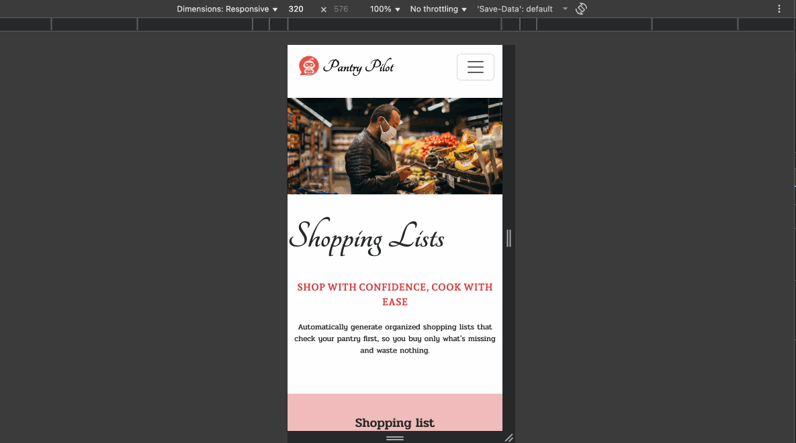 |
| Signup | 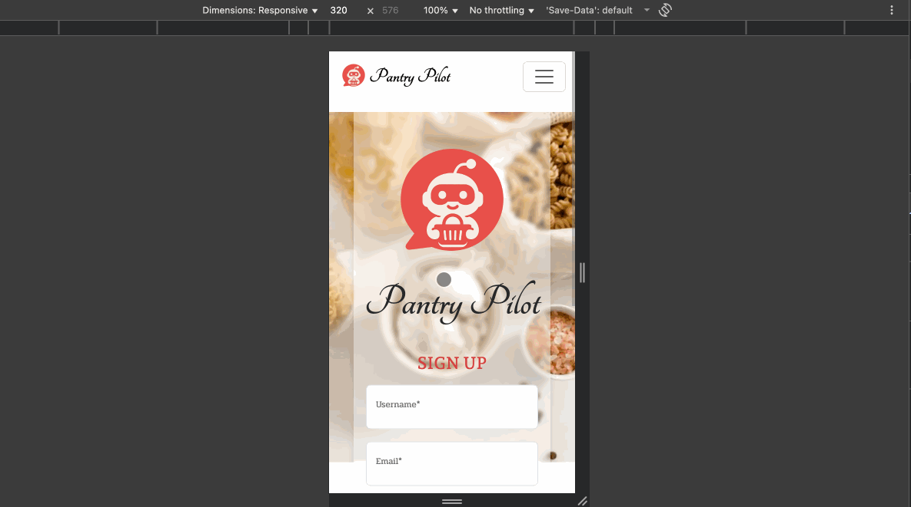 |
| Login | 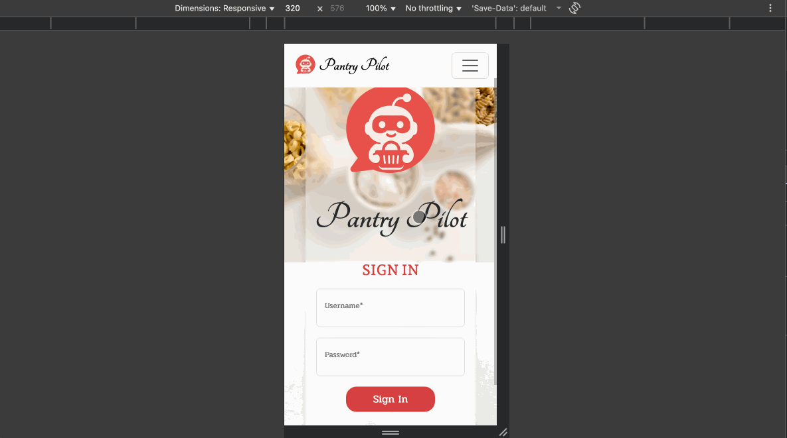 |
| Sign Out | 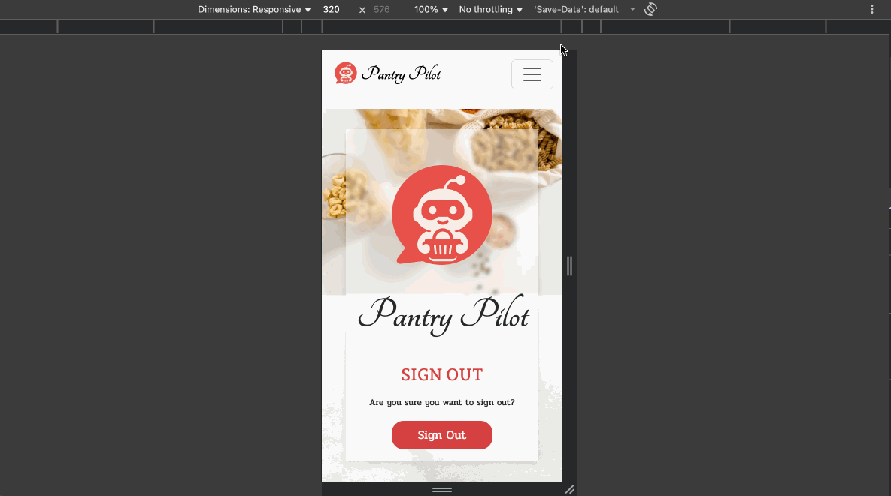 |

### Responsiveness Summary

<table>
  <thead>
    <tr>
      <th colspan="9">Responsiveness</th>
      <th rowspan="1">Notes</th>
    </tr>
    <tr>
      <th></th>
      <th>Galaxy S9+</th>
      <th>Galaxy S5</th>
      <th>iPhone 6/7/8</th>
      <th>iPhone X</th>
      <th>iPad Air</th>
      <th>iPad Pro</th>
      <th>Desktop 1024px</th>
      <th>Desktop > 1200px</th>
      <th>Personal phone: iphone 15. All others tested virtually</th>
    </tr>
  </thead>
  <tbody>
    <tr>
      <td>Site is responsive >=700px</td>
      <td>n/a</td>
      <td>n/a</td>
      <td>n/a</td>
      <td>n/a</td>
      <td>✅</td>
      <td>✅</td>
      <td>✅</td>
      <td>✅</td>
      <td></td>
    </tr>
    <tr>
      <td>Site is responsive < 699px </td>
      <td>✅</td>
      <td>✅</td>
      <td>✅</td>
      <td>✅</td>
      <td>n/a</td>
      <td>n/a</td>
      <td>n/a</td>
      <td>n/a</td>
      <td></td>
    </tr>
    <tr>
      <td>Images work</td>
      <td>✅</td>
      <td>✅</td>
      <td>✅</td>
      <td>✅</td>
      <td>✅</td>
      <td>✅</td>
      <td>✅</td>
      <td>✅</td>
      <td></td>
    </tr>
    <tr>
      <td>Links/ URLs work</td>
      <td>✅</td>
      <td>✅</td>
      <td>✅</td>
      <td>✅</td>
      <td>✅</td>
      <td>✅</td>
      <td>✅</td>
      <td>✅</td>
      <td></td>
    </tr>
    <tr>
      <td>Renders as expected</td>
      <td>✅</td>
      <td>✅</td>
      <td>✅</td>
      <td>✅</td>
      <td>✅</td>
      <td>✅</td>
      <td>✅</td>
      <td>✅</td>
      <td></td>
    </tr>
  </tbody>
</table>

## Browser Compatibility

The deployed site was tested with Google Chrome, Microsoft Firefox and Safari for browser compatibility.

    
Expand to view the results

| Browser | Evidence | Intended Appearance | Intended Responsiveness |
|---------|----------|-------------------|----------------------|
| Google Chrome |  | ✅ | ✅ |
| Microsoft Firefox |  | ✅ | ✅ |
| Safari |  | ✅ | ✅ |

## Manual Testing

### Testing User Stories

    
Expand to view the results

<table>
  <thead>
    <tr>
      <th>ID</th>
      <th>User Story</th>
      <th>Testing</th>
      <th>Comments</th>
      <th>Results</th>
    </tr>
  </thead>
  <tbody>
    <tr>
        <td><strong>US001</strong></td>
        <td>
            <strong>AS A</strong> new user <strong>I WANT TO</strong> create an account with email and password <strong>SO THAT I CAN</strong> save my pantry data and access personalized features
        </td>
        <td>
            <ul>
                <li>Click on the SignUp link accessible through the navbar</li>
                <li>Fill in the username, email and password fields</li>
                <li>Click the Start button to register</li>
            </ul>
        </td>
        <td>
            <ul>
                <li>✅ User can access registration page from the navbar</li>
                <li>✅ Registration form includes username, email, password, and confirm password fields</li>
                <li>✅ Users can't submit empty form</li>
                <li>✅ Email field validates proper email format</li>
                <li>✅ Uniqueness for username checked</li>
                <li>✅ Password requirements are checked</li>
                <li>✅ Matching password and confirm password field checked</li>
                <li>✅ success message displayed upon successful registration</li>
                <li>✅ User is automatically logged in after registration</li>
                <li>✅ User redirected to dashboard after successful registration</li>
                <li>✅ Error messages display for invalid inputs</li>
                <li>✅ Duplicate email addresses are prevented with clear error message</li>
            </ul>
        </td>
        <td> Pass </td>
    </tr>
    <tr>
        <td><strong>US002</strong></td>
        <td><strong>AS A</strong> returning user <strong>I WANT TO</strong> log into my account <strong>SO THAT I CAN</strong> access my personal pantry</td>
        <td>
            <ul>
                <li>Click on the Login link in navbar</li>
                <li>Fill in the username and password, and click the button</li>
            </ul>
        </td>
        <td>
            <ul>
                <li>✅ Login form accessible from navigation</li>
                <li>✅ Login form accepts username and password</li>
                <li>✅ Username displayed in navbar after login</li>
                <li>✅ User redirected to dashboard after successful login</li>
                <li>✅ Error message displayed for invalid credentials</li>
                <li>✅ User stays on login page if credentials are invalid</li>
                <li>✅ Users can login without email verification</li>
            </ul>
        </td>
        <td> Pass </td>
    </tr>
    <tr>
        <td><strong>US003</strong></td>
        <td><strong>AS A</strong> logged in user <strong>I WANT TO</strong> log out of my account <strong>SO THAT I CAN</strong> secure my data when finished</td>
        <td>
            <ul>
                <li>When logged in, click on logout link accessible from dropdown link under username in navigation</li>
                <li>Click on the Sign Out button to confirm</li>
            </ul>
        </td>
        <td>
            <ul>
            <li>✅ Logout accessible from navigation for authenticated users</li>
            <li>✅ Clicking logout confirmation ends user session</li>
            <li>✅ User redirected to landing page after logout</li>
            <li>✅ Navigation bar changes to indicate logout state</li>
            <li>✅ Success message confirms successful logout</li>
            <li>✅ User cannot access protected pages after logout without re-authenticating</li>
            <li>✅ Logout works consistently across all pages</li>
            <li>✅ Logout link only appears for authenticated users</li>
            </ul>
        </td>
        <td> Pass </td>
    </tr>
    <tr>
        <td><strong>US004</strong></td>
        <td><strong>AS A</strong> logged in user <strong>I WANT TO</strong> add ingredients to my pantry with name and quantity <strong>SO THAT I CAN</strong> track what I have available</td>
        <td>
            <ul>
                <li>Access Pantry page from navigation</li> 
                <li>Fill in form with required name, quantity, units and category</li> 
                <li>Upload item image(optional)</li>
                <li>Click Add</li> 
            </ul>
        </td>
        <td>
            <ul>
                <li>✅ Form is accessible from pantry page</li>
                <li>✅ Form includes fields for name, quantity, unit, category and image</li>
                <li>✅ Item, quantity, units and category inputs are mandatory</li>
                <li>✅ Quantity entered must be a positive</li>
                <li>✅ Confirmation message displayed after successful addition</li>
                <li>✅ New item appears in pantry list immediately after addition</li>
                <li>✅ Form validates all required fields before submission</li>
                <li>✅ Checks if item already exits - users can add to or replace existing quantity if units match</li>
                <li>✅ Checks if item already exits - users can replace existing quantity if units don't match</li>
            </ul>
        </td>
        <td> Pass </td>
    </tr>
    <tr>
        <td><strong>US005</strong></td>
        <td><strong>AS A</strong> logged in user <strong>I WANT TO</strong> see all my pantry items in a list <strong>SO THAT I CAN</strong> quickly review what ingredients I have</td>
        <td>
            <ul>
                <li>Access Pantry page from navigation</li>
            </ul>
        </td>
        <td>
        <ul>
            <li>✅ Pantry page displays all user's items</li>
            <li>✅ Each item shows name, quantity, unit</li>
            <li>✅ Items are sectioned by category</li>
            <li>✅ Page displays item count per category</li>
            <li>✅ Message displayed for empty pantry</li>
            <li>✅ Add new item button is prominently displayed</li>
            <li>✅ User data is isolated - Only personal items are displayed</li>
        </ul>
        </td>
        <td> Pass </td>
    </tr>
    <tr>
        <td><strong>US006</strong></td>
        <td><strong>AS A</strong> logged in user <strong>I WANT TO</strong> update ingredient quantities <strong>SO THAT I CAN</strong> keep my pantry inventory accurate</td>
        <td>
            <ul>
                <li>Click on the edit button(pencil icon) on the pantry item card</li>
                <li>Update the quantity, units, or other details in the populated form</li>
                <li>Click Update button to confirm changes</li>
            </ul>
        </td>
        <td>
            <ul>
                <li>✅ Edit button is visible on each pantry item</li>
                <li>✅ Form pre-populates with current item values</li>
                <li>✅ Changes are saved and immediately reflected</li>
                <li>✅ Success message confirms update</li>
                <li>✅ Form validation prevents invalid entries</li>
            </ul>
        </td>
        <td> Pass </td>
    </tr>
    <tr>
        <td><strong>US007</strong></td>
        <td><strong>AS A</strong> logged in user <strong>I WANT TO</strong> delete items from my pantry <strong>SO THAT I CAN</strong> remove ingredients I no longer have</td>
        <td>
            <ul>
                <li>Click the Delete item button(bin icon) on pantry item card</li>
                <li>Click the Delete button in dialog to confirm deletion</li>
            </ul>
        </td>
        <td>
            <ul>
                <li>✅ Delete button/link is available for each pantry item</li>
                <li>✅ Confirmation dialog appears before deletion</li>
                <li>✅ User can confirm or cancel deletion</li>
                <li>✅ Item is permanently removed after confirmation</li>
                <li>✅ Confirmation message displayed after successful deletion</li>
                <li>✅ Pantry list updates immediately after deletion</li>
                <li>✅ Only item owner can delete their items</li>
                <li>✅ Deleted items cannot be recovered</li>
            </ul>
        </td>
        <td> Pass </td>
    </tr>
    <tr>
      <td><strong>US009</strong></td>
      <td><strong>AS A</strong> mobile user <strong>I WANT TO</strong> access basic pantry features on my phone <strong>SO THAT I CAN</strong> manage my pantry while shopping</td>
      <td>Check using Google Development tools</td>
      <td>✅ <a href="#responsiveness">See Responsiveness</a> </td>
      <td> Pass </td>
    </tr>
    <tr>
      <td><strong>US010</strong></td>
      <td><strong>AS A</strong> home cook <strong>I WANT TO</strong> find recipes using ingredients I have in my pantry <strong>SO THAT I CAN</strong> cook meals maximizing what I have available</td>
      <td>
        <ul>
                <li>Go to Recipes page from navigation bar</li>
                <li>Click on the Discover pane in Recipes</li>
                <li>Select cuisine, diet and meal type preferences</li>
                <li>Click Search</li>
            </ul>
      </td>
      <td>
        <ul>
            <li>✅ Recipe search form is accessible from Recipes page</li>
            <li>✅ Search filters include cuisine, diet, and meal type options</li>
            <li>✅ API integration with Spoonacular working correctly</li>
            <li>✅ Search results display recipes matching selected criteria</li>
            <li>✅ Recipe card displays title and recipe image for correct url from API response</li>
            <li>⚠️ Some API responses can be malformed - non-existent/malformed image urls</li>
            <li>✅ Recipe cards show number of matched and missing ingredients</li>
            <li>✅ Clicking on the info button on each recipe card displays dialog with matched and missing ingredient names</li>
            <li>✅ Message displayed for empty search results</li>
            <li>✅ Search results persists for active session</li>
            <li>✅ Search results are cleared out upon session end or sign out</li>
        </ul>
      </td>
      <td> Pass </td>
    </tr>
    <tr>
      <td><strong>US011</strong></td>
      <td><strong>AS A</strong> cook <strong>I WANT TO</strong> see detailed recipe information including ingredients, instructions, and cooking time <strong>SO THAT I CAN</strong> understand what's needed</td>
      <td>
        <ul>
            <li>Navigate to Recipes page from main navigation</li>
            <li>Click on View button in recipe card from search results or saved recipes</li>
            <li>View detailed recipe information including ingredients list, instructions, and cooking time</li>
        </ul>
      </td>
      <td>
        <ul>
            <li>✅ Recipe detail page displays complete recipe information for API results</li>
            <li>✅ Recipe detail page displays complete recipe information for saved recipes</li>
            <li>⚠️ Some API responses can be malformed - non-existent/malformed recipe detail urls, malformed/non-existent image urls, duplicate ingredients, etc.</li>
            <li>✅ Ingredients list shows quantities, units, and ingredient names</li>
            <li>✅ Step-by-step cooking instructions are clearly displayed</li>
            <li>✅ Cooking time and serving information is visible</li>
            <li>✅ Recipe images are properly displayed for valid urls</li>
            <li>✅ Matched ingredients are marked with a tick icon</li>
            <li>✅ External recipe source link is displayed when available</li>
        </ul>
      </td>
      <td> Pass </td>
    </tr>
    <tr>
      <td><strong>US013</strong></td>
      <td><strong>AS A</strong> cook <strong>I WANT TO</strong> save recipes I like to a favorites list <strong>SO THAT I CAN</strong> easily find them again for future cooking</td>
      <td>
        <ul>
            <li>Navigate to recipes page and search for recipes</li>
            <li>Navigate to recipe detail page by clicking View button on recipe card</li>
            <li>In the recipe detail page, click the Save button</li>
            <li>Verify "saved" indicator appears on recipe detail page</li>
            <li>Verify recipe appears in saved recipes tab in recipes page</li>
        </ul>
      </td>
      <td>
        <ul>
            <li>✅ Save button is visible on recipe detail pages</li>
            <li>✅ Confirmation message for save is displayed</li>
            <li>✅ "Saved" indicator appears above recipe image in recipe detail view</li>
            <li>✅ "Saved" indicator below the recipe card in search results list view</li>
            <li>✅ Recipe card appears in the saved tab in recipes page</li>
            <li>✅ Save Button is removed for saved recipes to prevent duplicate saves</li>
            <li>✅ SavedRecipe model properly stores recipe data</li>
            <li>✅ Recipe ingredients are saved with proper relationships</li>
            <li>✅ User is redirected to the recipe detail page after save from recipe detail page</li>
            <li>✅ User is redirected to the recipe list view after save from recipe list view</li>
        </ul>
      </td>
      <td> Pass </td>
    </tr>
    <tr>
      <td><strong>US014</strong></td>
      <td><strong>AS A</strong> cook <strong>I WANT TO</strong> see all my saved recipes in one place <strong>SO THAT I CAN</strong> browse my personal recipe collection</td>
      <td>
        <ul>
            <li>Navigate to Recipes page from main navigation</li>
            <li>Click on the "Saved" tab in the recipes page</li>
            <li>View all saved recipes in the collection</li>
        </ul>
      </td>
      <td>
        <ul>
            <li>✅ Saved recipes tab is accessible from recipes page</li>
            <li>✅ All saved recipes are displayed in a organized list</li>
            <li>✅ Recipe cards show title, image, and basic information</li>
            <li>✅ Each saved recipe has View, Delete, and meal planning options</li>
            <li>✅ Only user's own saved recipes are displayed</li>
            <li>✅ Empty state message shown when no recipes are saved</li>
            <li>✅ Recipe collection persists across sessions</li>
        </ul>
      </td>
      <td> Pass </td>
    </tr>
    <tr>
      <td><strong>US015</strong></td>
      <td><strong>AS A</strong> organized cook <strong>I WANT TO</strong> see a weekly meal calendar interface <strong>SO THAT I CAN</strong> plan my meals for the week ahead</td>
      <td>
        <ul>
            <li>Navigate to Meals page from main navigation</li>
            <li>View the weekly, monthly and day view calendar interfaces</li>
            <li>Switch between week and month views using toolbar buttons</li>
            <li>Verify clicking on a day slot in weekly/monthly calendar switches day view calendar to that date</li>
            <li>Verify calendar displays current week by default</li>
            <li>Verify calendar displays planned meals</li>
        </ul>
      </td>
      <td>
        <ul>
            <li>✅ FullCalendar integration working with Bootstrap5 theme</li>
            <li>✅ Weekly calendar view displays 7 days horizontally</li>
            <li>✅ Monthly calendar view shows full month grid</li>
            <li>✅ Calendar toolbar allows switching between week/month views</li>
            <li>✅ Navigation buttons (prev/next/today) function correctly</li>
            <li>✅ Responsive design adapts to different screen sizes</li>
            <li>✅ Calendar events load from meal plan data</li>
            <li>✅ Date click on week and month view progresses the day view to the selected date</li>
            <li>✅ Clicking in empty time slots in day view pops up dialog to add meals</li>
        </ul>
      </td>
      <td> Pass </td>
    </tr>
    <tr>
      <td><strong>US016</strong></td>
      <td><strong>AS A</strong> meal planner <strong>I WANT TO</strong> add specific recipes to calendar days and meal times <strong>SO THAT I CAN</strong> organize my weekly cooking schedule</td>
      <td>
        <ul>
            <li>Select recipes from saved tab in recipes page for meal planning</li>
            <li>Navigate to Meals page from main navigation</li>
            <li>Click on empty time slots in day view calendar</li>
            <li>Fill in MealPlanItemForm with recipe, meal type, servings and time</li>
            <li>Submit form to add meal to calendar</li>
            <li>Verify meal appears on calendar at scheduled time</li>
        </ul>
      </td>
      <td>
        <ul>
            <li>✅ "Select for Meal Plan" button on recipe cards in saved tab selects recipes for planning</li>
            <li>✅ Button state changes to indicate selection success</li>
            <li>✅ "Selected(Remove)" Button removes recipe from meal plan</li>
            <li>✅ Selected recipes listed in meals page</li>
            <li>✅ Click in empty time slot opens dialog with form</li>
            <li>✅ Form accepts recipe, meal type, servings and time inputs</li>
            <li>✅ Time inputs are pre-populated from calendar time slots</li>
            <li>✅ Form validation ensures required fields are filled</li>
            <li>✅ User can assign same recipe to multiple time slots</li>
            <li>✅ All Calendar views displays scheduled meals correctly</li>
            <li>✅ Meal plan items are stored with proper relationships</li>
            <li>✅ Recipe assignment to specific calendar dates and times works</li>
        </ul>
      </td>
      <td> Pass </td>
    </tr>
    <tr>
      <td><strong>US017</strong></td>
      <td><strong>AS A</strong> meal planner <strong>I WANT TO</strong> modify existing meal plan items <strong>SO THAT I CAN</strong> adjust my weekly schedule as needed</td>
      <td>
        <ul>
            <li>Navigate to Meals page from main navigation</li>
            <li>Click on an existing meal event in the calendar</li>
            <li>Update meal details in the edit form (recipe, time, servings, meal type)</li>
            <li>Submit the updated form</li>
            <li>Verify changes are reflected in the calendar</li>
        </ul>
      </td>
      <td>
        <ul>
            <li>✅ Existing meal events clickable in calendar views</li>
            <li>✅ Edit form displayed on clicking on meal plan events</li>
            <li>✅ Edit form pre-populated with current meal plan data</li>
            <li>✅ All meal plan fields can be modified (recipe, time, servings, meal type)</li>
            <li>✅ Form validation ensures required fields are filled</li>
            <li>✅ Updated meal plan items displayed correctly in calendar</li>
            <li>✅ Success message confirms meal plan update</li>
            <li>✅ Only meal plan owner allowed to edit their items</li>
        </ul>
      </td>
      <td> Pass </td>
    </tr>
    <tr>
      <td><strong>US018</strong></td>
      <td><strong>AS A</strong> meal planner <strong>I WANT TO</strong> remove meals from my calendar <strong>SO THAT I CAN</strong> clear unwanted or changed plans</td>
      <td>
        <ul>
            <li>Navigate to Meals page from main navigation</li>
            <li>Click on an existing meal event in the calendar</li>
            <li>Click the Delete button in the meal plan modal</li>
            <li>Confirm deletion in the confirmation dialog</li>
            <li>Verify meal is removed from calendar</li>
        </ul>
      </td>
      <td>
        <ul>
            <li>✅ Clicking on existing meal event displays delete option in modal</li>
            <li>✅ Confirmation dialog prevents accidental deletion</li>
            <li>✅ Meal plan items are permanently removed after confirmation</li>
            <li>✅ Calendar updates immediately after deletion</li>
            <li>✅ Success message confirms meal plan deletion</li>
            <li>✅ Only meal plan owner can delete their items</li>
        </ul>
      </td>
      <td> Pass </td>
    </tr>
    <tr>
      <td><strong>US019</strong></td>
      <td><strong>AS A</strong> meal planner <strong>I WANT TO</strong> easily distinguish different meal types in my calendar <strong>SO THAT I CAN</strong> quickly understand my meal schedule</td>
      <td>
        <ul>
            <li>Navigate to Meals page from main navigation</li>
            <li>Add different meal types (breakfast, lunch, dinner) to calendar</li>
            <li>View calendar events and verify visual distinctions</li>
            <li>Check color coding and styling for different meal types</li>
        </ul>
      </td>
      <td>
        <ul>
            <li>✅ Calendar events display meal type information clearly</li>
            <li>✅ Different meal types have distinct visual styling</li>
            <li>✅ Color coding distinguishes breakfast, lunch, dinner</li>
            <li>✅ Responsive design maintains readability across devices</li>
            <li>✅ Meal plan events are easily scannable in weekly/monthly views</li>
        </ul>
      </td>
      <td> Pass </td>
    </tr>
    <tr>
      <td><strong>US020</strong></td>
      <td><strong>AS A</strong> meal planner <strong>I WANT TO</strong> automatically generate shopping lists based on my planned meals <strong>SO THAT I CAN</strong> buy ingredients needed for my weekly menu</td>
      <td>
        <ul>
          <li>Navigate to the meals page from navigation bar</li>
          <li>Add meals using meal planner calender interface</li>
          <li>Click on "Shopping List" button in Meal Planner section</li>
          <li>Check redirection to shopping page with generated list displayed</li>
          <li>Check missed ingredients from planned meals are listed in "need to buy" section</li>
          <li>Confirm pantry items already in stock are listed in "in pantry" section of the list</li>
          <li>Reload the page and log out/log in to ensure the list persists</li>
          <li>Ensure success message after list generation</li>
        </ul>
      </td>
      <td>
        <ul>
          <li>✅ "Shopping List" button accessible in meal planner</li>
          <li>✅ Shopping list created for the correct week after meal planning</li>
          <li>✅ Redirect to Shopping list page</li>
          <li>✅ All planned meal ingredients included in the generated list</li>
          <li>✅ Planned Meals for the week listed categorized by days of the week</li>
          <li>✅ Pantry items already in stock listed in "already in pantry section"</li>
          <li>✅ Missing ingredients listed in "need to buy"</li>
          <li>✅ Shopping list accessible from the dashboard and shopping page</li>
          <li>✅ Shopping list persists after page reload and user logout/login</li>
          <li>✅ Success message displayed after generation</li>
        </ul>
      </td>
      <td> Pass</td>
    </tr>
    <tr>
      <td><strong>US021</strong></td>
      <td><strong>AS A</strong> meal planner <strong>I WANT TO</strong> see which recipe ingredients I already have <strong>SO THAT I CAN</strong> only buy what I need</td>
      <td>
        <ul>
          <li>Generate a shopping list from planned meals</li>
          <li>Review the shopping list page</li>
          <li>Check that ingredients already in the pantry are listed in an "in pantry" section</li>
          <li>Check that missing ingredients are listed in a "need to buy" section</li>
          <li>Verify that ingredient names match between pantry and recipes</li>
          <li>Update pantry inventory and regenerate the list to confirm updates</li>
        </ul>
      </td>
      <td>
        <ul>
          <li>✅ Available and missing ingredients are clearly separated in the shopping list</li>
          <li>✅ "In pantry" and "need to buy" sections are visually distinct</li>
          <li>✅ Ingredient names match between pantry and recipes</li>
          <li>✅ List updates correctly upon clicking "Refresh" when pantry inventory changes</li>
          <li>✅ Visual indicators distinguish ingredient categories</li>
        </ul>
      </td>
      <td> Pass </td>
    </tr>
    <tr>
      <td><strong>US022</strong></td>
      <td><strong>AS A</strong> shopper <strong>I WANT TO</strong> view and check off items from my generated shopping list <strong>SO THAT I CAN</strong> track my shopping progress</td>
      <td>
        <ul>
          <li>Open the generated shopping list page</li>
          <li>Check off items as you purchase them</li>
          <li>Reload the page and verify checked items remain checked</li>
          <li>Log out and log back in to verify checked state persists</li>
          <li>Uncheck an item and verify the state updates</li>
        </ul>
      </td>
      <td>
        <ul>
          <li>✅ Checkboxes are present for each shopping list item</li>
          <li>✅ Checked items are visually crossed out</li>
          <li>✅ Checked state persists after page reload</li>
          <li>✅ Checked state persists after logout/login</li>
          <li>✅ Unchecking an item updates the visual state and server</li>
        </ul>
      </td>
      <td> Pass </td>
    </tr>
    <tr>
      <td><strong>US027</strong></td>
      <td><strong>AS A</strong> mobile user <strong>I WANT TO</strong> access all PantryPilot features on my phone <strong>SO THAT I CAN</strong> manage pantry, recipes, and meal planning while mobile</td>
      <td>Test full responsive design across all features</td>
      <td>✅ Full responsive design <a href="#responsiveness">See Responsiveness</a></td>
      <td> Pass </td>
    </tr>
    <tr>
      <td><strong>US028</strong></td>
      <td><strong>AS A</strong> cook <strong>I WANT TO</strong> remove recipes from my favorites list <strong>SO THAT I CAN</strong> keep my saved recipes relevant</td>
      <td>
        <ul>
          <li>Navigate to the Saved Recipes tab in the Recipes page</li>
          <li>Locate a recipe in the saved list</li>
          <li>Click the Delete button on a saved recipe card</li>
          <li>Confirm the deletion in the confirmation dialog</li>
          <li>Verify the recipe is removed from the saved list</li>
          <li>Reload the page and ensure the recipe remains deleted</li>
        </ul>
      </td>
      <td>
        <ul>
          <li>✅ Delete button visible on each saved recipe</li>
          <li>✅ Confirmation dialog appears before deletion</li>
          <li>✅ Recipe removed from the saved list after confirmation</li>
          <li>✅ Saved recipes list updates immediately after deletion</li>
          <li>✅ Deleted recipes do not reappear after page reload</li>
          <li>✅ Only the user's own saved recipes can be deleted</li>
        </ul>
      </td>
      <td> Pass </td>
    </tr>
    <tr>
      <td><strong>US029</strong></td>
      <td><strong>AS A</strong> cook <strong>I WANT TO</strong> search recipes by name, cuisine, or dietary restrictions <strong>SO THAT I CAN</strong> find specific types of meals</td>
      <td>
        <ul>
      <li>Go to the Recipes page from the main navigation</li>
      <li>Select cuisine, or choose dietary restrictions in the search form</li>
      <li>Click the Search button</li>
      <li>Verify that search results match the entered criteria</li>
      <li>Check that the results update when changing filters</li>
      <li>Test with no results and verify appropriate message is shown</li>
    </ul>
      </td>
      <td>
        <ul>
          <li>✅ RecipeSearchForm includes fields for cuisine, meal_type and dietary restrictions</li>
          <li>✅ Search returns recipes matching the selected filters</li>
          <li>✅ Results update when filters are changed</li>
          <li>✅ No results message displays when no recipes match</li>
        </ul>
      </td>
      <td> Pass </td>
    </tr>
  </tbody>
</table>

## Features

All the site features were manually tested on the deployed website.

    
Expand to view the results

| Feature | Expected Outcome | Testing | Result | Pass/Fail |
|---------|-----------------|---------|--------|-----------|
| NAVBAR  |                 |         |        |           |
| Logo    | Click should redirect to Home Page | Clicked the logo from all pages | Redirection to Home page | Pass |
| Brand name | Click should redirect to Home Page | Clicked the logo from all pages | Redirection to Home page | Pass | 
| Home menu | Click should redirect to Home Page | Clicked from all pages | Redirection to Home page | Pass |
| Pantry menu | Click should redirect to My Pantry page | Clicked from all pages | Redirected to My Pantry page | Pass |
| Recipes menu | Click should redirect to Recipes page | Clicked from all pages | Redirected to Recipes page | Pass |
| Meals menu   | Click should redirect to Meals page   | Clicked from all pages | Redirected to Meals page   | Pass |
| Shopping menu| Click should redirect to Shopping Lists page | Clicked from all pages | Redirected to Shopping Lists page | Pass |
| User name display | Click should show dropdown menu with Logout menu | Clicked from all pages | Dropdown menu with Logout menu displayed | Pass|
| Logout dropdown menu | Click should redirect to Sign Out page | Clicked from all pages | Redirection to SignOut Page | Pass |
| SignUp Menu (in unauthenticated state) | Click should redirect to SignUp page | Clicked from available pages | Redirected to SignUp page | Pass |
| Login Menu (in unauthenticated state) | Click should redirect to Login page | Clicked from available pages | Redirected to Login page | Pass |
| FOOTER |
| Brand name | Click should redirect to Home Page | Clicked from all pages | Redirection to Home Page | Pass |
| Footer Home link | Click should redirect to Home Page | Clicked from all pages | Redirection to Home Page | Pass |
| Footer Track Pantry link | Click should redirect to Pantry page for authenticated Users. It should redirect to Sign In page for unauthenticated users | Clicked as authenticated and unauthenticated user | Redirection works correctly | Pass |
| Footer Recipes link | Click should redirect to Recipes page for authenticated users. It should redirect to Sign In page for unauthenticated users | Clicked as authenticated and unauthenticated user | Redirection works correctly | Pass |
| Footer Meals link | Click should redirect to Meals page for authenticated users. It should redirect to Sign In page for unauthenticated users | Clicked as authenticated and unauthenticated user | Redirection works correctly | Pass |
| Footer Shopping link | Click should redirect to Shopping Lists page for authenticated users. It should redirect to Sign In page for unauthenticated users | Clicked as authenticated and unauthenticated user | Redirection works correctly | Pass |
| Footer Facebook icon | Click should open Facebook in new tab | Clicked from all pages | Facebook opens in new tab | Pass |
| Footer YouTube icon | Click should open YouTube in new tab | Clicked from all pages | YouTube opens in new tab | Pass |
| Footer Twitter icon | Click should open Twitter in new tab | Clicked from all pages | Twitter opens in new tab | Pass |
| Footer Instagram icon | Click should open Instagram in new tab | Clicked from all pages | Instagram opens in new tab | Pass |
| HOME PAGE | | | | |
| Hero Sign Up button (unauthenticated state) | Click should redirect to Sign Up page | Clicked on the button | Redirection to Sign Up page | Pass |
| Hero Login button (unauthenticated state) | Click should redirect to Login Page | Clicked the button | Redirection to Login Page | Pass |
| Hero Logout button (authenticated state) | Click should redirect to Sign Out page | Clicked on the button | Redirection to Sign Out page | Pass |
| Ready to Get Started Banner Sign Up button (unauthenticated state) | Click should redirect to Sign Up page | Clicked on the button | Redirection to Sign Up page | Pass |
| Ready to Get Started Banner Login button (unauthenticated state) | Click should redirect to Login Page | Clicked the button | Redirection to Login Page | Pass |
| Thank you Banner Logout button (authenticated state) | Click should redirect to Sign Out Page | Clicked the button | Redirection to Sign Out Page | Pass |
| Your Pantry Widget (authenticated state) | Should display count of items in Pantry. View All button should redirect to My Pantry page | Checked item count against pantry listing. Clicked the link | Count matches pantry items. Redirection works correctly | Pass |
| Your Recipes Widget (authenticated state) | Should display count of saved recipes. View All link should redirect to saved recipes tab in Recipes page | Checked saved recipe count against displayed value. Clicked the View All link | Displayed count matches number of saved recipes. Link redirection to correct tab | Pass |
| Upcoming Meal Widget (authenticated state) | Display next meal title with link to view recipe detail. View Calendar link redirects to Meals page | Compare displayed meal title with calendar, click the links | Upcoming Meal title displayed. Link opens recipe detail view. View Calendar link redirects to Meals page | Pass |
| Your Shopping Lists Widget (authenticated state) | Displays link to available shopping list for this week(message if not available). View All redirects to Shopping page | Checked message display for no list generated. Generated a list for the week and checked the widget display. Clicked View All | Message displayed for no lists. Correct list displayed when present and link displays the shopping list. View All redirects to Shopping page | Pass | 
| PANTRY PAGE | | | |
| Add item button (Plus/Chevron icon) | Should open form if form not displayed. Should collapse form if form in display | Click the button with the form collapsed/not collapsed | Form Collapse/ Un-collapse working as expected | Pass |
| Add button in form | Click should display validation error for incorrect fields; add item to pantry for valid form with a Toast for successful addition | Test click with valid and invalid form entries. Check toast message | Form validation working as expected. Valid item added and displayed immediately in correct category. Toast message displayed for success | Pass |
| Delete Category button alongside category header | Click should display delete confirmation modal | Click the button | Confirmation modal displayed | Pass |
| Category Collapse/ Un-collapse button alongside category header | Collapse/ Un-collapse category section | Click in category collapsed/un-collapsed state | Collapse/Un-collapse behavior as expected | Pass |
| Update Button on pantry item card | Should scroll to pre-populated form with item values. Update button should appear in the form | Click on the button | Working expected | Pass |
| Update button on Pantry item form | Display form validation errors in form if present else update the pantry item fields. Status message displayed in toast | Clicked with valid/invalid form entries | Validation errors displayed in form for invalid entries. Item updated for valid entries. Status message displayed | Pass |
| Cancel button in Pantry item form | Cancel item update. Remove Cancel button, clear the form and change Update button to Add | Click the button | Working as expected | Pass |
| Delete button on pantry item card | Display delete confirmation modal | Click on a pantry item card | Working as expected | Pass |
| Delete button in Delete confirmation modal | Should delete category/pantry item. Toast message displayed for success | Click delete for pantry item delete. Click delete for Category delete | Deletes pantry item/ category with tost message displayed | Pass |
| Close button in delete confirmation modal | Dismiss the modal | Click the button | Working as expected | Pass | 
| RECIPES PAGE | | | | |
| Discover/ Saved tab links | Should display the correct tabs | Click on the tab links while in other tabs | Navigates to correct tab | Pass |
| Search Button in Discover tab | Should list search results based on preferences selected in form | Click the button with different preferences selected | Recipe cards displayed in the tab based on search parameters | Pass |
| Info button on recipe cards | Display a modal with list of available and missing ingredients for the recipe | Click the button on a recipe card | Works as expected | Pass |
| View button on Recipe cards | Display detail view for the selected recipe | Click the button on a recipe card | Works as expected. Toast message displayed from API call failures | Pass |
| Save button for Search Results | Save the recipe and display a toast message. Saved recipe should appear in saved tab | Click the button on a recipe card | Toast displayed for status. Saved Recipes appears in Saved tab | Pass |
| Delete button on Saved Recipe card | Delete the recipe for the user. Check for confirmation, remove the recipe from saved tab after confirmation and display status in toast | Click the button on a saved recipe card | Confirmation modal displayed, recipe removed after confirmation from saved tab. Toast message displayed | Pass |
| "Select for Meal Plan" button in Saved Recipe card | Recipe should appear in Selected Meals section of Meals page. Button state should change to "Selected (Remove)". Should not reload the page from server. Selection should persist over a session | Click the button on a saved recipe card | Works as expected. Selection persists over a user session and is cleared when signed out | Pass |
| "Selected (Remove)" button in Saved recipe card | Recipe should be removed from Selected Meals section of Meals page. Button state should change to "Select for Meal Plan". Page should not reload | Click on the button | Works as expected | Pass |
| RECIPE DETAIL PAGE | | | | |
| Recipe details | Page should display image, summary, ingredients with tick marks for available in pantry, cook time, servings, and instructions | Click on view button to open a recipe detail | Works as expected. Some responses from API call have malformed or non existent image urls. This is not handled as part of MVP and is displayed as is. | Pass |
| Save button in recipe detail | Save the recipe and display status message in toast. For successful save, add a "Saved" label above recipe image. Remove Save button and add a Delete button | Click the button on a recipe detail page | Works as expected | Pass |
| Back button | Redirect to from where View was clicked | View the recipes from Discover and Saved tab in recipes page, View button in Meals page, widget link in Upcoming Meals in Dashboard widget | Redirection to correct page/tabs as expected | Pass |
| MEAL PLANNING PAGE | | | | |
| View button on Recipe cards in Selected Meals section| Open recipe detail page| Click the button on a recipe list card | Works as expected | Pass |
| Clear button in section header for Selected Meals | Clear recipe selection, Change should be reflected in Saved Recipe cards in Recipes page | Click the button and check the meals page as well as saved tab pane in recipes page | Works as expected | Pass |
| Previous and Next buttons in calendar titles | Should advance the view to next/previous week/month | Click and verify the calendar views | Works as expected | Pass |
| week/month toggle buttons in calendar title | toggle the calendar views to week/month view | Click the buttons and verify calendar views | Works as expected | Pass |
| "today" button in calendar title | Move the calendar views to today's date | Click the button when not calendars not showing this week | works as expected | Pass |
| Date click on week/month view| Advance the day view calendar to that date with meal plans for that day listed | click on an empty space on a day in week/month view calendar / Works as expected | Pass |
| Meal Plan item click in week/month or day calendar views | Open a modal to update or delete the meal plan item | Click on an existing meal plan item in all the calendar views | Work as expected - modal pops up with meal plan details and allows meal plan item delete or update options | Pass |
| Empty Time slot click on day view calendar | Pop up a modal with time fields pre-populated to add new meal plan item. If meals are selected, allows choosing between selected meals. If not allows choice between all saved meals for a user.| Click/press and drag on an empty time slot in day view calendar | Works as expected - allows addition of meal plan item, displays toast message on completion and the views are updated immediately. | Pass |
| Update button on modal when clicked on existing meal plan item | Validates and displays form errors if any. Updates the meal plan item, displays toast message and instantly updates calendar views without page reloads | Click on the button | Works as expected | Pass |
| Delete button on Meal plan modal when clicked on existing meal plan item | Asks reconfirmation for deletion, upon second click deletes teh item, displays toast message and refreshes the calendar views without page reload | Click teh button and confirm deletion | Works as expected | Pass |
| Shopping List button on Meal planner section | Generates shopping list for the week if not yet generated and redirects to shopping page to show the list. Displays existing shopping list if present | Click the button to generate new shopping list for a new week, click the button to view existing shopping list | Works as expected | Pass |
|SHOPPING LISTS PAGE | | | |
| Delete Button on Shopping List card | Pop up a confirmation modal. Delete the shopping list with all associated shopping list items. Display a toast message with status | Click the button on a shopping list card | Works as expected. Confirmation modal displayed and Toast message displayed after deletion | Pass | 
| View Button on Shopping list card | Displays the saved shopping list for that week along with Planned meals  | Click the button on a saved shopping list | Works as expected | Pass | 
| Refresh button on shopping list for this week | Regenerate the shopping list based on pantry updates or meal plan updates | Change the meal plan for the week and click the button. Update pantry items and click the button. Verify generated shopping list reflects the updates | Works as expected. Meal plan updates and pantry item updates are reflected "in need to buy" and "in pantry" sections along with updates to "planned meals" section | Pass |
| Check mark buttons on shopping list items | Checked items should be crossed off, server should be updated without page reload, checked state should persist, unchecking uncrosses the items | Check an item and ensure item is crossed off, uncheck to see crossing is removed, sign in/out to see state persists | Works as expected, state persist over sign in/sign out | Pass |

## Bugs

Github Projects was used to capture the bugs identified during development and testing.
[Bug list](https://github.com/users/sthDINESH/projects/9/views/2?sliceBy%5Bvalue%5D=bug) for issues that were identified and resolved.